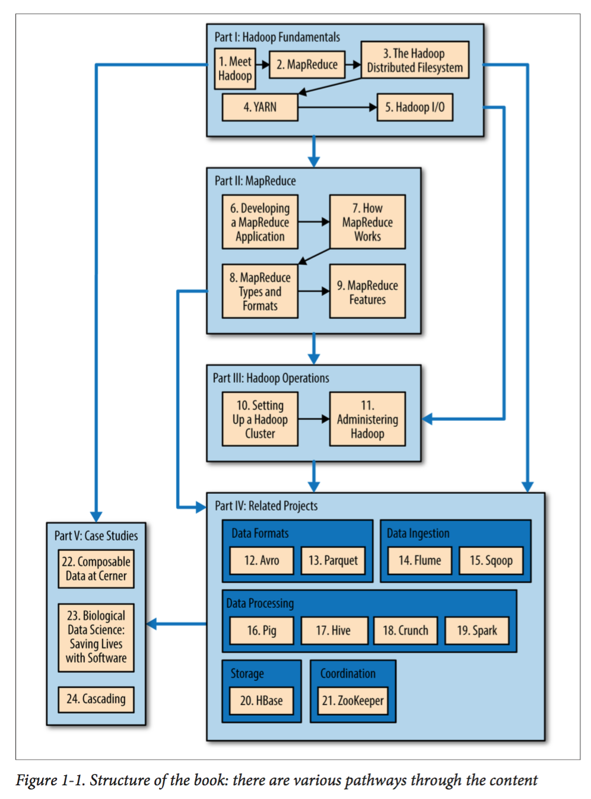

# 大数据理论与实践 - 推荐书籍

## 1. 《数据密集型应用设计》（Designing Data-Intensive Applications）

**基本信息**：

- **作者**: `Martin Kleppmann`
- **原书名**: `Designing Data-Intensive Applications: The Big Ideas Behind Reliable, Scalable, and Maintainable Systems`
- **出版年**: 2017-03
- **豆瓣链接**: [《数据密集型应用设计》](https://book.douban.com/subject/30329536/)
- **来源**: 豆瓣，访问日期：2025-12-10

**内容概览**：

本书是大数据领域的经典之作，被誉为**分布式系统设计**的**圣经**。全书系统性地介绍了构建可靠、可扩展、可维护的数据密集型应用系统的核心原理和最佳实践。

**深度解读资源**：

- **[《DDIA 逐章精读》小册](https://ddia.qtmuniao.com/#/)**：提供逐章详细解读，帮助读者深入理解书中的核心概念

---

## 2. 《Hadoop 权威指南》（Hadoop: The Definitive Guide）

**基本信息**：

- **作者**: `Tom White`
- **原书名**: `Hadoop: The Definitive Guide, 4th Edition`
- **出版年**: 2015-08
- **豆瓣链接**: [《Hadoop 权威指南》](https://book.douban.com/subject/27600204/)
- **来源**: 豆瓣，访问日期：2025-12-10

**内容概览**：

本书是 Hadoop 生态系统的权威指南，详细介绍了 Hadoop 框架的核心组件、运行原理、配置方法以及实际应用场景。它是学习和使用 Hadoop 平台的必备资源。

---

## 3. 《Fundamentals of Data Engineering》（Fundamentals of Data Engineering）

**基本信息**：

- **作者**: `Joe Reis` / `Matt Housley`
- **原书名**: `Fundamentals of Data Engineering`
- **出版年**: 2022-06
- **官方页面**: [O'Reilly](https://www.oreilly.com/library/view/fundamentals-of-data/9781098108298/)
- **来源**: O'Reilly，访问日期：2025-12-10

**内容概览**：

从架构与组织角度系统梳理现代数据平台的设计原则、数据生命周期、数据治理与可靠性工程，适合数据工程体系化学习与团队建设参考。

---

## 4. 《Streaming Systems》（Streaming Systems）

**基本信息**：

- **作者**: `Tyler Akidau` / `Slava Chernyak` / `Reuven Lax`
- **原书名**: `Streaming Systems: The What, Where, When, and How of Large-Scale Data Processing`
- **出版年**: 2018-07
- **官方页面**: [O'Reilly](https://www.oreilly.com/library/view/streaming-systems/9781491983874/)
- **来源**: O'Reilly，访问日期：2025-12-10

**内容概览**：

系统阐释流处理的时间语义、窗口、触发器与一致性模型，提出统一批流的 Beam 模型与实践方法，是理解现代流处理理论与工程权衡的权威读物。

---

## 5. 《Kafka 权威指南》（Kafka: The Definitive Guide, 2nd）

**基本信息**：

- **作者**: `Gwen Shapira` / `Todd Palino` / `Rajini Sivaram` / `Kelsey Jenkins`
- **原书名**: `Kafka: The Definitive Guide, 2nd Edition`
- **出版年**: 2021-11
- **官方页面**: [O'Reilly](https://www.oreilly.com/library/view/kafka-the-definitive/9781492043072/)
- **来源**: O'Reilly，访问日期：2025-12-10

**内容概览**：

全面覆盖 Kafka 架构、生产与消费、运维与监控、可靠性与安全实践，并扩展到 Connect、Streams、ksqlDB 等生态组件，适合平台工程与数据工程读者。

---

## 6. 《Stream Processing with Apache Flink》（Stream Processing with Apache Flink）

**基本信息**：

- **作者**: `Fabian Hueske` / `Vasiliki Kalavri`
- **原书名**: `Stream Processing with Apache Flink`
- **出版年**: 2019-04
- **官方页面**: [O'Reilly](https://www.oreilly.com/library/view/stream-processing-with/9781491974285/)
- **来源**: O'Reilly，访问日期：2025-12-10

**内容概览**：

面向实践的 Flink 指南，覆盖 DataStream、Table/SQL、窗口与状态、时间语义、容错与部署，适合作为 Flink 工程实现与优化的参考手册。

---

## 7. 《大数据处理框架 Apache Spark 设计与实现》

**基本信息**：

- **作者**: `许利杰` / `方亚芬`
- **出版社**: `电子工业出版社`
- **出版年**: 2020-08
- **豆瓣链接**: [《大数据处理框架 Apache Spark 设计与实现》](https://book.douban.com/subject/35140409/)
- **来源**: 豆瓣，访问日期：2025-12-10

**内容概览**：

本书是 Apache Spark 框架的权威技术专著，由中国科学院软件研究所的研究人员撰写。全书系统性地介绍了 Spark 框架的核心架构、设计原理、实现机制以及性能优化技术。本书分为四大部分，共 9 章内容，深入剖析了 Spark 的内部工作机制和最佳实践。

**深度解读资源**：

- **[SparkInternals 技术文档](https://github.com/JerryLead/SparkInternals)**：作者许利杰编写的 Spark 内部机制详解文档，被社区广泛关注（来源：GitHub，访问日期：2025-12-10）

---

## 8. 《Database Internals》（Database Internals）

**基本信息**：

- **作者**: `Alex Petrov`
- **原书名**: `Database Internals: A Deep Dive into How Distributed Data Systems Work`
- **出版年**: 2019-11
- **官方页面**: [O'Reilly](https://www.oreilly.com/library/view/database-internals/9781492040330/)
- **来源**: O'Reilly，访问日期：2025-12-10

**内容概览**：

深入解析数据库与分布式存储的内部原理，包括事务、索引、日志、复制与一致性协议，是夯实数据系统底层知识的优秀读物。

---

## 9. 《The Data Warehouse Toolkit（第三版）》(The Data Warehouse Toolkit, 3rd)

**基本信息**：

- **作者**: `Ralph Kimball` / `Margy Ross`
- **原书名**: `The Data Warehouse Toolkit: The Definitive Guide to Dimensional Modeling, 3rd Edition`
- **出版年**: 2013-07
- **官方页面**: [Wiley](https://www.wiley.com/en-us/The+Data+Warehouse+Toolkit%2C+3rd+Edition-p-9781118530801)
- **来源**: Wiley，访问日期：2025-12-10

**内容概览**：

数据仓库维度建模的经典著作，系统介绍星型模型、雪花模型与度量设计方法，与现代湖仓架构互补，适合数仓与 BI 方向读者。
