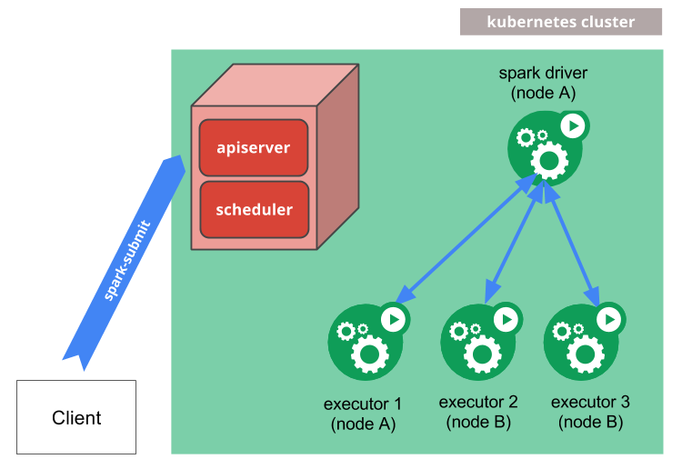
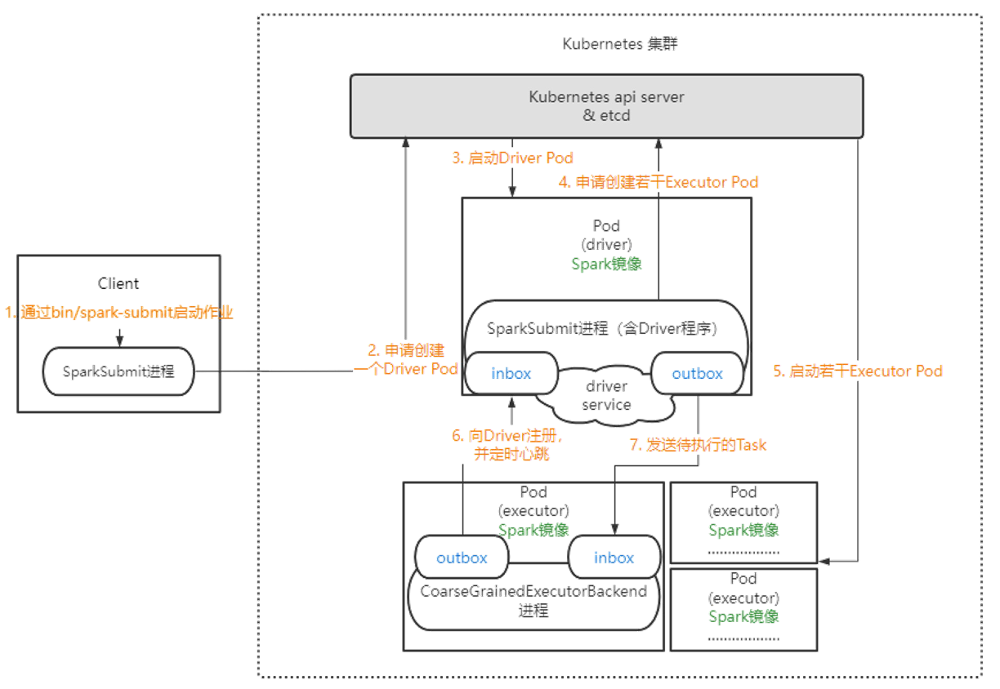

# Spark on Kubernetes 架构及组件介绍

## 1. 概述

Apache Spark 可以在 Kubernetes 集群上原生运行，利用 Kubernetes 的原生调度器来管理 Spark 应用程序的资源分配和执行。这种架构提供了容器化的部署方式，使得 Spark 应用程序能够更好地利用云原生环境的优势。

---

## 2. 架构概览

### 2.1 架构设计理念

Spark on Kubernetes 采用基于容器的主从架构设计，充分利用 Kubernetes 原生调度能力，实现计算资源的弹性管理和高效利用。该架构将传统的 Spark 集群组件完全容器化，通过 Kubernetes 的 Pod 抽象来管理 Spark 应用程序的生命周期。

### 2.2 Spark on Kubernetes 架构

Spark 官方提供了标准化的架构示意图，清晰展示了各组件间的交互关系：



**图 2-1: Spark on Kubernetes 官方架构图。**

### 2.3 核心组件职责

#### 2.3.1 Spark Submit Client

**主要职责**:

- 作为应用程序提交入口，通过 `spark-submit` 命令行工具与 `Kubernetes API Server` 交互
- 解析用户配置参数，构建完整的应用程序提交规范
- 监控应用程序执行状态，提供实时进度反馈
- 收集和展示应用程序日志及执行结果

#### 2.3.2 Kubernetes API Server

**核心功能**:

- 作为集群的统一管理入口，接收所有资源操作请求
- 认证和授权客户端请求，确保集群安全访问
- 维护集群状态信息，提供实时的资源可用性数据
- 协调 Pod 的创建、更新和删除操作

#### 2.3.3 Driver Pod

**核心职责**:

- **应用程序解析**: 加载用户应用程序代码，解析依赖关系
- **任务调度**: 将作业拆分为多个并行任务，优化调度策略
- **资源管理**: 动态请求和释放 Executor 资源，实现弹性伸缩
- **状态监控**: 实时收集任务执行状态，处理故障恢复
- **结果聚合**: 汇总各个 Executor 的计算结果，生成最终输出

#### 2.3.4 Executor Pods

**工作负载类型**:

- **独立 Pod 实例**: Executor 在 Kubernetes 中作为独立的 Pod 运行，而不是通过 Deployment 或 StatefulSet 管理
- **直接 Pod 创建**: Driver 通过 Kubernetes API 直接创建和删除 Executor Pod，实现细粒度的生命周期控制
- **动态资源管理**: 每个 Executor Pod 根据任务需求动态创建和销毁，支持按需资源分配

**执行功能**:

- **任务执行**: 运行具体的计算任务，支持多种数据处理模式
- **数据缓存**: 在内存中缓存中间计算结果，优化性能
- **资源隔离**: 提供独立的内存和 CPU 资源隔离
- **状态汇报**: 定期向 Driver 发送心跳和进度信息

**性能特征**:

- 支持多线程并行处理，提高计算效率
- 实现数据本地性优化，减少网络传输
- 提供内存管理机制，防止资源溢出

**架构优势**:

- **弹性伸缩**: 直接 Pod 管理使得 Spark 能够实现真正的动态资源分配，Executor 数量可以根据任务负载实时调整
- **快速响应**: 避免了 Deployment/StatefulSet 的副本数调整延迟，Executor 可以快速创建和销毁
- **精确控制**: Driver 对每个 Executor 的生命周期有完全的控制权，便于实现复杂的调度策略

### 2.4 架构优势分析

1. **云原生集成**: 完全基于 Kubernetes 生态，无缝集成 DevOps 流程
2. **资源效率**: 动态资源分配机制，提高集群资源利用率
3. **弹性伸缩**: 支持根据负载自动扩缩容，应对业务波动
4. **隔离性**: 应用程序级别资源隔离，避免相互干扰
5. **可观测性**: 集成完善的监控和日志体系，便于运维管理

### 2.5 与传统架构对比

| **特性维度**              | **Spark on Kubernetes**                | **Spark Standalone**            |
| ------------------------- | -------------------------------------- | ------------------------------- |
| 资源管理                  | 动态分配，弹性伸缩                     | 静态配置，固定分配              |
| 部署方式                  | 容器化部署，环境一致                   | 物理机/虚拟机部署               |
| **调度策略（1）**         | Kubernetes 原生调度 + 支持自定义调度器 | Spark 内置调度器                |
| 资源隔离                  | 容器级别强隔离                         | 进程级别隔离                    |
| 扩展性                    | 云原生无限扩展                         | 受限于集群规模                  |
| 运维复杂度                | 低，标准化运维                         | 高，需要定制化                  |
| **Shuffle 服务支持（2）** | 支持动态分配无需外部 Shuffle 服务      | 需要部署和维护外部 Shuffle 服务 |

**1. 调度器支持说明**:

- **Spark on Kubernetes**: 支持使用 Kubernetes 原生调度器，同时可以通过 `spark.kubernetes.executor.scheduler.name` 配置指定自定义调度器（如 Volcano、Kube-batch 等批量调度器），Executor Pod 可以配置不同的调度策略。Driver Pod 可以通过 Pod 模板文件 (`spark.kubernetes.driver.podTemplateFile`) 实现更复杂的调度需求。
- **Spark Standalone**: 使用 Spark 内置的 FIFO 或 FAIR 调度器，调度策略相对固定，无法利用底层基础设施的高级调度能力。

**2. Shuffle 服务支持说明**:

- **Spark on Kubernetes**: 支持动态资源分配而无需外部 Shuffle 服务。通过启用 `spark.dynamicAllocation.shuffleTracking.enabled=true` 配置，Spark 可以跟踪 Executor 中的 shuffle 数据，允许 Executor 在存储活跃作业的 shuffle 数据时保持存活。这是 Kubernetes 特有的功能，因为 Kubernetes 目前不支持外部 Shuffle 服务（**Future work**）。

  > 注意：由于没有 shuffle service，executor 还需要负责给其他 executor 提供 shuffle 数据，资源释放效率低

- **Spark Standalone**: 需要部署和维护独立的外部 Shuffle 服务，增加了运维复杂度。Executor 移除时会删除其写入的 shuffle 文件，需要外部 Shuffle 服务来保留这些文件。

---

## 3. 任务提交流程



**任务提交流程概述[5]:**

1. **用户提交任务**: 用户在客户端执行 `/bin/spark-submit` 命令提交 Spark 应用
2. **Driver Pod 创建**: SparkSubmit 进程通过 fabric8 Kubernetes Client 向 Kubernetes API Server 发起请求，创建 Driver Pod
3. **Executor 资源申请**: Driver Pod 启动后，Driver 进程通过 Kubernetes API Server 按需动态申请 Executor Pod 资源
4. **资源清理与状态保留**: 作业完成后，Driver 负责清理所有 Executor Pod。Driver Pod 保持 Completed 状态便于日志查看和状态监控

### 3.1 镜像准备阶段

首先需要构建 Spark Docker 镜像：

```bash
# 构建基础镜像
$ ./bin/docker-image-tool.sh -r <registry> -t <tag> build

# 构建 PySpark 镜像
$ ./bin/docker-image-tool.sh -r <registry> -t <tag> -p kubernetes/dockerfiles/spark/bindings/python/Dockerfile build

# 推送镜像到仓库
$ ./bin/docker-image-tool.sh -r <registry> -t <tag> push
```

### 3.2 应用程序提交

使用 spark-submit 提交应用程序：

```bash
$ ./bin/spark-submit \
    --master k8s://https://<api-server>:6443 \
    --deploy-mode cluster \
    --name spark-pi \
    --class org.apache.spark.examples.SparkPi \
    --conf spark.executor.instances=3 \
    --conf spark.executor.memory=2g \
    --conf spark.executor.cores=1 \
    --conf spark.driver.memory=1g \
    --conf spark.kubernetes.container.image=<spark-image> \
    --conf spark.kubernetes.namespace=spark-apps \
    --conf spark.kubernetes.authenticate.driver.serviceAccountName=spark \
    --conf spark.kubernetes.driver.pod.name=spark-pi-driver \
    local:///opt/spark/examples/jars/spark-examples.jar
```

### 3.3 执行流程详解

1. **客户端验证**: Spark Submit 验证参数和集群访问权限
2. **Driver Pod 创建**: 在 Kubernetes 中创建 Driver Pod
3. **应用程序启动**: Driver 启动并初始化 SparkContext
4. **Executor 分配**: Driver 请求 Kubernetes 创建 Executor Pods
5. **任务执行**: Executors 连接 Driver 并执行任务
6. **状态监控**: Driver 监控任务进度和资源使用情况
7. **结果收集**: Driver 聚合计算结果并输出
8. **资源清理**: 应用程序完成后清理 Executor Pods

---

## 4. 任务监控与日志查看

本章节介绍如何监控运行中的 Spark 应用程序、访问用户界面以及查看日志信息。

### 4.1 访问日志

可以通过 Kubernetes API 和 `kubectl` CLI 访问日志。当 Spark 应用程序运行时，可以使用以下命令流式传输应用程序日志：

```bash
kubectl -n=<namespace> logs -f <driver-pod-name>
```

如果集群中安装了 [Kubernetes dashboard](https://kubernetes.io/docs/tasks/access-application-cluster/web-ui-dashboard/)，也可以通过仪表板访问相同的日志。

对于生产环境，如果部署了集中式日志收集方案（如 EFK/ELK Stack），可以通过统一的日志平台查看所有 Pod 的日志，类似于 Spark on YARN 通过 ResourceManager Web UI 查看日志的方式。

### 4.2 访问 Driver UI

可以使用 [`kubectl port-forward`](https://kubernetes.io/docs/tasks/access-application-cluster/port-forward-access-application-cluster/#forward-a-local-port-to-a-port-on-the-pod) 在本地访问任何应用程序的 UI：

```bash
kubectl port-forward <driver-pod-name> 4040:4040
```

然后可以在 `http://localhost:4040` 访问 Spark driver UI。

### 4.3 调试与故障排查

如果遇到应用程序运行错误，通常最好的调查方式是通过 Kubernetes CLI。

要获取有关驱动程序 Pod 调度决策的基本信息，可以运行：

```bash
kubectl describe pod <spark-driver-pod>
```

如果 Pod 遇到运行时错误，可以使用以下命令进一步探测状态：

```bash
kubectl logs <spark-driver-pod>
```

失败执行器 Pod 的状态和日志可以用类似的方式检查。删除驱动程序 Pod 将清理整个 Spark 应用程序，包括所有执行器、相关服务等。驱动程序 Pod 可以被视为 Spark 应用程序的 Kubernetes 表示形式。

---

## 5. 未来工作规划

根据 Apache Spark 官方文档，Spark on Kubernetes 目前正在开发或计划开发以下几个重要功能，这些功能预计将在未来的 Spark-Kubernetes 集成版本中提供：

### 5.1 外部 Shuffle 服务 (External Shuffle Service)

**当前状态**: Spark on Kubernetes 目前不支持外部 Shuffle 服务，而是通过 Shuffle 跟踪功能 (`spark.dynamicAllocation.shuffleTracking.enabled`) 来实现动态资源分配。

**未来规划**: 社区正在探索在 Kubernetes 上实现外部 Shuffle 服务的方案，可能通过 DaemonSet 或专用的 Shuffle 服务 Pod 来提供更稳定和高效的 Shuffle 数据管理。

### 5.2 作业队列和资源管理 (Job Queues and Resource Management)

**当前状态**: 当前主要依赖 Kubernetes 原生调度器进行资源分配。

**未来规划**: 计划开发更高级的作业队列管理和资源分配机制，可能集成第三方调度器（如 Volcano、Kube-batch 等）来提供更细粒度的资源管理和作业调度能力。

### 5.3 其他改进方向

- **性能优化**: 进一步提升容器启动速度和资源分配效率
- **监控集成**: 增强与 Prometheus、Grafana 等监控系统的集成
- **安全增强**: 完善身份认证和访问控制机制
- **存储优化**: 改进持久化存储和 shuffle 数据管理

---

## 6. Spark Operator 介绍

### 6.1 概述

Spark Operator 是 Kubernetes 上用于管理 Apache Spark 应用程序生命周期的专用 Operator。该项目最初由 Google 于 2017 年开发，2018 年开源发布，随后在 2018-2019 年期间逐步捐赠给 Kubeflow 社区。这一战略捐赠旨在通过社区驱动的模式确保项目的长期维护和发展，同时更好地集成到 Kubeflow 的机器学习生态系统中，为 Spark on Kubernetes 提供更原生、更易用的管理方式。

### 6.2 核心特性

Spark Operator 提供了以下核心功能：

- **声明式应用管理**: 通过 Kubernetes 自定义资源 (Custom Resource Definitions, CRDs) 定义 Spark 应用程序
- **自动化任务提交**: 自动运行 `spark-submit` 操作，简化应用程序部署流程
- **原生定时任务支持**: 内置 cron 支持，可调度周期性 Spark 作业
- **高级 Pod 定制**: 通过 Mutating Admission Webhook 支持复杂的 Pod 配置
- **自动重启策略**: 支持配置化的应用程序重启策略
- **Prometheus 监控集成**: 支持应用程序级别和 Executor 级别的指标导出

### 6.3 架构设计

Spark Operator 采用标准的 Kubernetes Operator 模式：

1. **自定义资源定义**: 定义 `SparkApplication` 和 `ScheduledSparkApplication` CRDs
2. **控制器模式**: 监听自定义资源变化并协调应用程序状态
3. **Webhook 支持**: 提供 Pod 定制和验证功能
4. **指标导出**: 集成 Prometheus 监控指标

### 6.4 快速入门示例

#### 6.4.1 安装 Spark Operator

```bash
# 添加 Helm 仓库
helm repo add --force-update spark-operator https://kubeflow.github.io/spark-operator

# 安装 Operator
helm install spark-operator spark-operator/spark-operator \
    --namespace spark-operator \
    --create-namespace \
    --wait
```

#### 6.4.2 创建 Spark 应用程序

```yaml
apiVersion: "sparkoperator.k8s.io/v1beta2"
kind: SparkApplication
metadata:
  name: spark-pi
  namespace: default
spec:
  type: Scala
  mode: cluster
  image: "gcr.io/spark-operator/spark:v3.1.1"
  imagePullPolicy: Always
  mainClass: org.apache.spark.examples.SparkPi
  mainApplicationFile: "local:///opt/spark/examples/jars/spark-examples_2.12-3.1.1.jar"
  restartPolicy:
    type: OnFailure
    onFailureRetries: 3
    onFailureRetryInterval: 10
    onSubmissionFailureRetries: 5
    onSubmissionFailureRetryInterval: 20
  driver:
    cores: 1
    coreLimit: "1200m"
    memory: "512m"
    labels:
      version: "3.1.1"
    serviceAccount: spark
  executor:
    cores: 1
    instances: 1
    memory: "512m"
    labels:
      version: "3.1.1"
```

#### 6.4.3 部署和管理

```bash
# 部署应用程序
kubectl apply -f spark-pi.yaml

# 查看应用程序状态
kubectl get sparkapp spark-pi

# 查看详细状态
kubectl describe sparkapp spark-pi

# 删除应用程序
kubectl delete sparkapp spark-pi
```

### 6.5 与传统方式的对比

| **特性**     | **原生 Spark on Kubernetes** | **Spark Operator**   |
| ------------ | ---------------------------- | -------------------- |
| 部署方式     | 手动 `spark-submit`          | 声明式 YAML 配置     |
| 生命周期管理 | 手动管理 Pod                 | 自动化管理           |
| 定时任务     | 需要外部调度器               | 内置 cron 支持       |
| 配置复杂度   | 命令行参数复杂               | YAML 配置清晰        |
| 运维复杂度   | 较高                         | 较低                 |
| 监控集成     | 需要手动配置                 | 内置 Prometheus 支持 |

### 6.6 适用场景

Spark Operator 特别适用于以下场景：

- **生产环境部署**: 需要稳定可靠的 Spark 应用程序管理
- **批量作业调度**: 需要定时执行的周期性 Spark 作业
- **多租户环境**: 需要细粒度的资源管理和隔离
- **DevOps 流程**: 需要集成到 CI/CD 流水线中
- **监控告警**: 需要完善的监控和告警机制

---

## 参考资料

1. [Apache Spark 官方文档](https://spark.apache.org/)
2. [Kubernetes 官方文档](https://kubernetes.io/docs/concepts/)
3. [Kubeflow Spark Operator GitHub](https://github.com/kubeflow/spark-operator)
4. [Spark on Kubernetes](https://spark.apache.org/docs/latest/running-on-kubernetes.html)
5. [Spark on K8s 在阿里云上的实践](http://fanyilun.me/2022/06/11/Spark%20on%20K8s%E5%9C%A8%E9%98%BF%E9%87%8C%E4%BA%91%E4%B8%8A%E7%9A%84%E5%AE%9E%E8%B7%B5/)
6. [YARN 和 K8s 调度 Spark 作业的对比](http://fanyilun.me/2022/06/02/YARN%E5%92%8CK8s%E8%B0%83%E5%BA%A6Spark%E4%BD%9C%E4%B8%9A%E7%9A%84%E5%AF%B9%E6%AF%94/)

---
