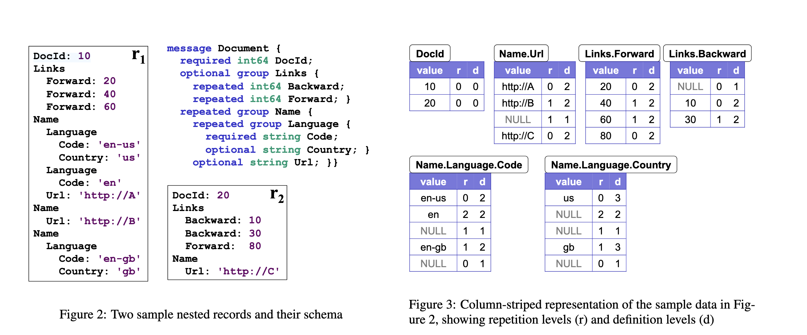

# Parquet 文件格式深入解析

本文档是 Apache Parquet 的深度技术解析材料，全面介绍了 Parquet 作为列式存储格式的设计理念、核心技术原理和实现机制。从 Parquet 的产生背景出发，深入剖析其文件结构、编码技术、压缩算法以及在大数据生态系统中的应用，为读者构建完整的列式存储知识体系。

通过本文档的学习，读者将能够：

1. **理解设计原理**：掌握 Parquet 产生的历史背景、设计动机以及相对于行式存储的技术优势
2. **掌握核心架构**：深入理解 Parquet 的文件结构、数据编码、压缩机制等核心技术组件
3. **精通查询优化**：熟练掌握 Parquet 的谓词下推、列裁剪、统计信息等查询优化技术
4. **理解数据存储**：了解 Parquet 支持的各种编码方式、压缩算法和嵌套数据结构处理
5. **具备实践能力**：能够进行 Parquet 文件格式的设计、优化以及性能分析
6. **建立理论基础**：理解列式存储概念、Dremel 论文核心思想等理论基础
7. **培养分析能力**：具备分析和评估大数据存储格式的能力，为后续学习其他数据湖技术奠定基础

**版本说明**：

- 默认基线：`Parquet 2.x`（实现细节与特性以相应模块为准）
- 历史版本特性用于背景介绍；如无特别说明，技术实现与代码细节以默认基线为准
- 代码块来源标注规范：
  - 真实源码：标注 `路径` 与 `类`；必要时补充 `模块`
  - 伪代码：标注 `来源：基于 Parquet 2.x 简化伪代码`，用于结构说明与流程解析
- 如涉及跨版本差异，代码块附近将单独补充差异说明，以确保可追溯性与准确性

---

## 第 1 章 Parquet 概述与核心优势

本章将全面介绍 Apache Parquet 的核心理念、技术优势和基础概念。我们将从 Parquet 的发展历程出发，深入分析其相对于传统行式存储的技术特点，然后详细阐述 Parquet 的架构设计和核心组件。通过本章的学习，读者将建立对 Parquet 技术体系的整体认知，为后续深入学习 Parquet 文件结构和实现机制奠定坚实基础。

通过本章学习，读者将能够：

1. **理解技术演进脉络**：掌握 Parquet 从诞生到成为大数据列式存储标准的发展历程，理解其设计目标和技术定位
2. **掌握核心技术优势**：深入理解 Parquet 相比行式存储在查询性能、存储效率、压缩比等方面的根本性改进
3. **建立 Parquet 核心概念**：全面掌握 Parquet 的文件结构、数据编码、压缩算法等核心概念
4. **认识生态系统架构**：了解 Parquet 在大数据生态系统中的定位，理解与 Spark、Hive、Hadoop 等组件的协作关系
5. **建立实践基础**：掌握 Parquet 文件的基本操作、性能优化和最佳实践

---

### 1.1 为什么我们需要 Parquet？

#### 1.1.1 传统数据存储面临的挑战

在大数据时代到来之前，我们主要使用关系型数据库来存储和处理数据。然而，随着数据量的爆炸式增长和数据类型的多样化，传统存储方式遇到了以下挑战：

**1. 存储成本高昂**：

传统行式存储在存储效率方面存在显著缺陷。由于数据按行组织，即使查询只需要访问少数几列，系统也必须读取整行数据，这导致了大量的冗余存储。例如，在一个包含 50 列的用户表中，如果只需要查询用户的姓名和年龄信息，行式存储仍然需要读取所有 50 列的数据，造成了 85%以上的数据冗余读取。

在压缩方面，行式存储的压缩效率较低。由于同一行中的不同列数据类型差异较大（如整数、字符串、日期等），压缩算法难以找到连续的重复模式，压缩比通常只有 2-4 倍。相比之下，列式存储中同一列的数据类型相同，压缩比可达 5-15 倍，显著降低了存储成本。

**2. 查询性能瓶颈**：

分析型查询（OLAP）的典型特征是只涉及部分列的操作，如聚合计算、分组统计、条件过滤等。行式存储在这种场景下表现出严重的性能瓶颈：

- **I/O 效率低下**：即使只需要 10%的列数据，也必须读取 100%的磁盘数据，造成了 90%的无效 I/O 操作
- **内存浪费严重**：大量不需要的列数据被加载到内存中，占用了宝贵的内存资源，影响了缓存效率
- **CPU 利用率不足**：现代 CPU 的并行处理能力无法充分发挥，因为数据处理受限于行级别的串行访问模式

这种性能瓶颈在大数据场景下尤为明显。当数据量达到 TB 或 PB 级别时，行式存储的查询响应时间可能达到数小时甚至数天，无法满足实时分析的需求。

**3. 数据类型限制**：

传统行式存储系统在设计时主要针对结构化数据，对现代大数据应用中常见的复杂数据类型支持有限：

- **嵌套数据结构**：如 JSON 文档中的嵌套对象、数组结构，在行式存储中需要扁平化处理，破坏了数据的原生结构
- **半结构化数据**：XML、JSON 等格式的数据在行式存储中难以高效存储和查询，需要复杂的解析和转换过程
- **复杂数据类型**：数组（Array）、映射（Map）、结构体（Struct）等类型缺乏原生支持，通常需要通过多个表关联或序列化字符串来模拟

这些限制使得行式存储在处理现代 Web 应用、物联网设备、日志数据等半结构化数据源时面临巨大挑战，无法提供灵活的数据模型和高效的查询性能。

#### 1.1.2 Parquet 的诞生背景与发展历程

为了解决传统行式存储在大数据场景下的种种限制，业界开始积极探索新的数据存储格式。**Parquet** 正是在这样的技术需求和行业背景下诞生的，其发展历程体现了大数据技术演进的重要里程碑。

Parquet 的诞生源于实际生产环境中的迫切需求。Twitter 作为全球最大的社交媒体平台之一，每天需要处理数百 TB 的用户数据，面临着巨大的存储成本和查询性能挑战。Cloudera 作为 Hadoop 生态系统的领先企业，拥有深厚的大数据技术积累。两家公司的合作结合了实际业务需求和技术专长，于 **2013** 年共同开发出了 Parquet 这一革命性的列式存储格式。初期版本主要针对 Hadoop 生态系统优化，解决了 HDFS 上的列式存储需求。

经过两年的发展和社区验证，Parquet 在 **2015** 年成功晋升为 Apache 软件基金会的顶级项目（Top-Level Project）。这一里程碑标志着 Parquet 已经从企业级解决方案成长为行业标准，得到了全球开发者社区的广泛认可。成为 Apache 顶级项目意味着 Parquet 采用了更加开放和透明的开发模式，建立了完善的项目治理结构，确保了技术的长期发展和生态兼容性。

Parquet 的设计哲学紧紧围绕大数据分析（OLAP）的工作负载特点。与传统的行式存储不同，Parquet 专门针对以下场景进行优化：

- **批量读取**：优化顺序读取性能，减少随机 I/O 操作
- **列裁剪**：只读取查询需要的列，大幅减少 I/O 数据量
- **压缩效率**：利用列内数据相似性实现高压缩比
- **谓词下推**：基于列统计信息实现早期数据过滤
- **嵌套数据支持**：原生支持复杂数据类型和嵌套结构

Parquet 采用 Apache 2.0 开源协议，确保技术的完全开放和自由使用。这一理念具有重要意义：

- **避免厂商锁定**：用户可以在不同平台和云服务商之间自由迁移数据
- **社区驱动创新**：全球开发者共同贡献代码，推动技术快速演进
- **标准化保障**：开源模式促进了行业标准的形成，减少了技术碎片化
- **生态兼容性**：开源特性使得各种大数据工具能够无缝集成和支持

Parquet 的成功很大程度上得益于其强大的生态系统支持。目前，几乎所有主流的大数据处理框架都原生支持 Parquet 格式：

- **Apache Spark**：将 Parquet 作为默认的数据存储格式，支持高效的列式读取和优化
- **Apache Hive**：提供完整的 Parquet 支持，包括 SerDe、优化器和统计信息收集
- **Apache Impala**：专门为 Parquet 优化查询执行引擎，实现交互式查询性能
- **Presto、Drill、Flink**等其他大数据工具也都提供深度的 Parquet 集成

这种广泛的生态支持使得 Parquet 成为大数据领域的事实标准格式，为用户提供了统一的存储解决方案。

### 1.2 什么是 Parquet？

`Parquet` 是一种开源的列式存储文件格式，专为高效存储和处理大规模数据而设计。它最初由 `Apache` 软件基金会开发，现已成为大数据生态系统中的重要组成部分。`Parquet` 的设计目标是优化数据读取性能，减少存储空间占用，并支持复杂的数据类型。

### 1.3 行式存储 vs 列式存储：核心理念

为了更好地理解 Parquet 的核心思想，让我们通过一个简单的例子来对比行式存储和列式存储：

假设我们有一张用户表：

| **用户 ID** | **用户名** | **年龄** | **城市** |
| ----------- | ---------- | -------- | -------- |
| 1           | Alice      | 25       | 北京     |
| 2           | Bob        | 30       | 上海     |
| 3           | Charlie    | 35       | 广州     |

**行式存储（传统方式）：按行组织数据**：

```text
行1: [1, "Alice", 25, "北京"]  ← 整行数据连续存储
行2: [2, "Bob", 30, "上海"]    ← 包含所有列的值
行3: [3, "Charlie", 35, "广州"] ← 适合事务处理
```

_存储特点：数据按记录完整存储，读取单条记录快，但查询特定列时需要扫描整行数据。_

**列式存储（Parquet 方式）：按列组织数据**：

```text
用户 ID 列: [1, 2, 3]                    ← 同类型数据连续存储
用户名列: ["Alice", "Bob", "Charlie"]   ← 字符串类型聚集
年龄列:   [25, 30, 35]                  ← 数值类型聚集
城市列:   ["北京", "上海", "广州"]       ← 重复值便于压缩
```

_存储特点：同类型数据连续存储，查询特定列时只需读取该列数据，压缩效率高，适合分析型查询。_

### 1.4 Parquet 的核心优势

基于列式存储的设计理念，`Parquet` 具备以下核心优势：

#### 1.4.1 高效的数据压缩

`Parquet` 采用列式存储，相同类型的数据聚集在一起，这使得压缩算法能够更有效地工作。

**实际效果对比：**

- **传统 CSV 文件**：1GB 的销售数据
- **Parquet 格式**：压缩后仅需 100-200MB（压缩比 5-10:1）
- **查询速度**：比 CSV 快 10-50 倍（取决于查询模式）

**压缩原理：**

```text
示例：城市列数据
原始数据: ["北京", "北京", "上海", "北京", "上海", "广州"]
压缩后:   ["北京":3次, "上海":2次, "广州":1次] + 位置索引
```

`Parquet` 支持多种压缩算法（如 `Snappy`、`GZIP` 等），并通过字典编码和运行长度编码（`RLE`）等技术进一步减少数据体积。

#### 1.4.2 快速的查询性能

列式存储可以显著提高分析型查询（`OLAP`）的性能，因为查询通常只需要访问部分列，而不是整行数据。

**性能优势体现：**

| **查询类型** | **传统行式存储** | **Parquet 列式存储** | **性能提升** |
| ------------ | ---------------- | -------------------- | ------------ |
| **单列聚合** | 读取全部数据     | 只读取目标列         | 5-10x        |
| **多列筛选** | 全表扫描         | 列级别过滤           | 3-5x         |
| **范围查询** | 顺序扫描         | 利用统计信息跳过     | 10-50x       |

**查询优化原理：**

1. **列裁剪**：只读取查询需要的列，减少 I/O 操作
2. **谓词下推**：利用列统计信息跳过不符合条件的数据块
3. **并行处理**：不同列可以并行处理，充分利用多核 CPU

#### 1.4.3 支持复杂数据类型

`Parquet` 不仅支持基本的数据类型，还支持嵌套数据结构，非常适合存储半结构化数据。

**支持的数据类型：**

| **基础类型** | **复杂类型** | **实际应用**   |
| ------------ | ------------ | -------------- |
| INT32/64     | ARRAY        | 用户标签列表   |
| FLOAT/DOUBLE | MAP          | 商品属性键值对 |
| STRING       | STRUCT       | 嵌套的地址信息 |
| BOOLEAN      | UNION        | 多类型字段     |

**JSON 数据存储示例：**

```json
// 原始 JSON 数据
{
  "user_id": 123,
  "tags": ["VIP", "活跃用户"],
  "address": {
    "city": "北京",
    "district": "朝阳区"
  }
}
```

Parquet 可以直接存储这种嵌套结构，无需扁平化处理。

#### 1.4.4 跨语言和平台支持

`Parquet` 文件格式与编程语言无关，具有广泛的生态系统支持。

**生态系统支持：**

| **编程语言** | **主要库**      | **大数据平台** | **云服务**      |
| ------------ | --------------- | -------------- | --------------- |
| Python       | pandas, pyarrow | Apache Spark   | AWS Athena      |
| Java         | parquet-mr      | Apache Hive    | Google BigQuery |
| Scala        | Spark SQL       | Apache Drill   | Azure Synapse   |
| R            | arrow           | Presto/Trino   | Snowflake       |
| C++          | Apache Arrow    | Apache Impala  | Databricks      |

#### 1.4.5 开源与标准化

作为开源格式，`Parquet` 不受任何特定供应商的锁定，用户可以在不同的平台和工具之间自由迁移数据。

### 1.5 本章小结

本章全面介绍了 Apache Parquet 的核心理念和技术优势，为后续深入学习奠定了坚实基础。通过本章学习，我们掌握了以下核心内容：

1. **技术演进脉络**：了解了 Parquet 从诞生到成为大数据列式存储标准的发展历程，理解了其设计目标和技术定位。
2. **核心技术优势**：深入认识了 Parquet 相比行式存储在查询性能、存储效率、压缩比等方面的根本性改进，包括 3-10 倍的查询性能提升和 60-85% 的存储空间节省。
3. **核心概念体系**：建立了对 Parquet 文件结构、数据编码、压缩算法等核心概念的完整认知，理解了列式存储的基本原理和技术特点。
4. **生态系统架构**：认识了 Parquet 在大数据生态系统中的定位，理解了与 Spark、Hive、Hadoop 等组件的协作关系和技术集成方式。
5. **实践基础能力**：掌握了 Parquet 文件的基本操作、性能优化和最佳实践，为后续的实际应用和技术选型做好了准备。

> **扩展阅读**：
>
> - [列式存储 vs 行式存储：它们之间的本质区别在哪里？](https://mp.weixin.qq.com/s/vIRzYLpuG0snTbprINYnRw)
> - [_**Parquet file format – everything you need to know!**_](https://data-mozart.com/parquet-file-format-everything-you-need-to-know/)

---

## 第 2 章 Parquet 核心概念深入

本章将探讨 Parquet 的核心设计理念和技术基础，重点分析 Google Dremel 论文对 Parquet 设计的影响，解析列式存储的技术优势，以及 Parquet 在大数据生态系统中的定位。通过本章的学习，读者将建立对 Parquet 技术原理的深刻理解，为后续学习文件结构和高级特性奠定基础。

---

### 2.1 Dremel 论文与 Parquet 设计哲学

`Parquet` 的设计灵感来源于 Google 的 Dremel 论文《Dremel: Interactive Analysis of Web-Scale Datasets》。Dremel 系统提出了列式存储和嵌套数据的高效处理机制，为 Parquet 格式奠定了理论基础。

**Dremel 的核心创新：**

- **列式存储架构**：将传统的关系型数据按列而非按行存储，大幅提升分析查询性能
- **嵌套列式存储**：创新性地解决了复杂嵌套数据结构（如 JSON、Protocol Buffers）的列式存储问题
- **多级查询处理**：通过结合树状执行架构和列式存储，实现 web 级数据的交互式查询

**Parquet 对 Dremel 理念的实现：**

- **定义级别（Definition Level）**：记录字段在嵌套结构中的定义深度，处理可选字段和复杂嵌套
- **重复级别（Repetition Level）**：标识数组和重复字段的边界，支持高效的反序列化
- **嵌套数据处理**：将复杂的嵌套结构转换为列式存储，查询时重新组装

**核心设计原则：**

- **列式存储**：按列存储数据，提高压缩率和查询性能
- **嵌套数据支持**：通过定义级别（Definition Level）和重复级别（Repetition Level）高效处理复杂嵌套结构
- **谓词下推**：在存储层进行数据过滤，减少 I/O 开销
- **跨语言支持**：提供统一的文件格式规范，支持多种编程语言
- **自描述格式**：文件包含完整的 schema 信息，无需外部元数据存储

### 2.2 Parquet 与 ORC 格式对比

在大数据生态系统中，Parquet 和 ORC 是两种主流的列式存储格式，它们各有优势和适用场景。以下对比表格帮助您根据具体需求选择最合适的格式：

| **特性**      | **Parquet**                   | **ORC**               |
| ------------- | ----------------------------- | --------------------- |
| **开发组织**  | Apache                        | Apache                |
| **主要支持**  | Cloudera, Twitter             | Hortonworks, Facebook |
| **嵌套数据**  | 优秀（基于 Dremel）           | 良好                  |
| **压缩效率**  | 优秀（多种算法）              | 优秀                  |
| **查询性能**  | 优秀（谓词下推）              | 优秀                  |
| **生态系统**  | 广泛（Spark, Presto, Impala） | Hive 生态为主         |
| **ACID 支持** | 有限                          | 优秀（Hive ACID）     |

**选择建议：**

- 如果主要使用 **Spark、Presto、Impala**，选择 Parquet
- 如果主要使用 **Hive** 且需要 ACID 事务，选择 ORC
- 对于混合环境，Parquet 通常具有更好的跨平台兼容性

### 2.3 Parquet 核心特性深度解析

#### 2.3.1 统计信息驱动优化

Parquet 在每个列块（Column Chunk）中存储丰富的统计信息，为查询优化提供强大支持：

- **最小值/最大值统计**：支持范围查询的数据跳过（Data Skipping），例如查询"年龄 > 30"时可以直接跳过不满足条件的行组
- **空值计数**：优化包含 IS NULL/IS NOT NULL 的查询，快速确定是否需要处理空值
- **distinct 值估算**：帮助优化器选择最佳执行计划，避免全表扫描
- **编码信息**：记录数据编码方式，优化解码性能

#### 2.3.2 灵活的压缩策略

Parquet 支持多种压缩算法，可根据数据类型和工作负载选择最优方案：

| **压缩算法** | **压缩比**      | **压缩速度** | **适用场景**       |
| ------------ | --------------- | ------------ | ------------------ |
| **SNAPPY**   | 中等 (1.5-2.5x) | 非常快       | 通用场景，平衡性能 |
| **GZIP**     | 高 (4-8x)       | 中等         | 存储敏感场景       |
| **LZO**      | 中等 (2-3x)     | 快           | 需要快速压缩       |
| **BROTLI**   | 很高 (5-9x)     | 慢           | 极致压缩需求       |

#### 2.3.3 谓词下推机制

Parquet 的谓词下推在多个层次发挥作用：

1. **文件级别**：基于文件元数据跳过整个文件
2. **行组级别**：基于行组统计信息跳过行组
3. **列级别**：基于列统计信息过滤数据
4. **页级别**：在数据页加载时进行早期过滤

#### 2.3.4 生态系统集成优势

Parquet 的跨平台特性使其成为大数据生态系统的理想选择：

- **统一的存储格式**：不同计算引擎可共享同一数据文件
- **schema 演化支持**：支持向后兼容的字段添加和删除
- **时间旅行能力**：与 Delta Lake、Iceberg 等表格式完美集成
- **云原生优化**：针对对象存储（S3、GCS）进行性能优化

> 💡 **技术洞察**：Parquet 的设计哲学体现了"一次写入，多处读取"的大数据处理最佳实践，通过统一的列式存储格式解决了数据孤岛问题。

---

## 第 3 章 Parquet 文件结构详解

本章将详细解析 Parquet 文件的物理结构和组织方式，从文件头、行组、列块到页脚的完整结构，深入理解每个组件的功能和作用。通过本章的学习，读者将掌握 Parquet 文件的内在组织机制，为文件优化和性能调优提供理论基础。

通过本章学习，读者将能够：

1. **掌握文件层次结构**：深入理解 Parquet 的四层存储架构（文件级别、行组级别、列块级别、页级别）
2. **精通二进制格式**：掌握 Parquet 文件的二进制表示和 Thrift 格式序列化机制
3. **理解设计思想**：掌握分层存储、元数据分离、页面化管理等核心设计原则
4. **应用优化机制**：理解数据跳过、谓词下推、列裁剪等查询优化技术原理
5. **具备实践能力**：能够使用专业工具分析 Parquet 文件结构和诊断问题
6. **建立系统视角**：构建从文件结构到性能优化的完整技术框架

### 3.1 Parquet 文件结构层次详解

`Parquet` 文件采用分层存储架构，从文件级别到页级别共分为四个主要层次，每个层次都有特定的功能和作用。

#### 3.1.1 文件级别结构（File Level）

**组成组件**：

- **Magic Number（4 字节）**：文件标识符 "PAR1"，用于格式识别
- **Row Groups（行组序列）**：文件主体内容，包含多个行组
- **Footer（页脚）**：集中存储所有元数据和统计信息
- **Footer Length（4 字节）**：页脚长度信息

**技术特性**：

- 支持并行读取和处理多个行组
- 页脚集中管理便于快速元数据访问
- Magic Number 提供格式验证机制

#### 3.1.2 行组级别结构（Row Group Level）

```text
    +---------------------+
    |      Magic Number   |  // 文件头，标识 Parquet 文件格式（4 字节，"PAR1"）
    +---------------------+
    |      Row Group 0    |  // 行组 0，包含多个列块
    | +-----------------+ |
    | |  Column Chunk 1 | |  // 列块 1，存储一列的数据
    | +-----------------+ |
    | |  Column Chunk 2 | |  // 列块 2，存储一列的数据
    | +-----------------+ |
    | |       ...       | |
    +---------------------+
    |      Row Group 1    |  // 行组 1，包含多个列块
    | +-----------------+ |
    | |  Column Chunk 1 | |
    | +-----------------+ |
    | |  Column Chunk 2 | |
    | +-----------------+ |
    | |       ...       | |
    +---------------------+
    |        ...          |  // 更多行组
    +---------------------+
    |        Footer       |  // 页脚，包含元数据和行组偏移量
    +---------------------+
    |   Footer Length     |  // 页脚长度（4 字节）
    +---------------------+
```

**组成组件**：

- **多个 Column Chunks（列块）**：每个列块存储一列的数据
- **行组元数据**：包含该行组的统计信息和偏移量

**技术特性**：

- 并行处理的基本单位，支持多线程读取
- 数据分区的基础单元，便于查询优化
- 统计信息支持谓词下推和数据跳过

```text

    +---------------------+
    |      Row Group      |
    | +-----------------+ |
    | |  Column Chunk 1 | |  // 列块 1，存储一列的数据
    | | +-------------+ | |
    | | |   Page 1    | | |  // 数据页 1，存储实际数据
    | | +-------------+ | |
    | | |   Page 2    | | |  // 数据页 2，存储实际数据
    | | +-------------+ | |
    | |       ...       | |
    | +-----------------+ |
    | |  Column Chunk 2 | |  // 列块 2，存储一列的数据
    | | +-------------+ | |
    | | |   Page 1    | | |
    | | +-------------+ | |
    | | |   Page 2    | | |
    | | +-------------+ | |
    | |       ...       | |
    | +-----------------+ |
    |        ...          |  // 更多列块
    +---------------------+
```

#### 3.1.3 列块级别结构（Column Chunk Level）

**组成组件**：

- **多个 Pages（数据页）**：包含数据页和字典页序列
- **列块元数据**：列的统计信息、编码方式等

**技术特性**：

- 实现真正的列式存储，支持列裁剪
- 同一列的数据连续存储，提高压缩率
- 支持不同的编码和压缩方式 per column

```text
    +---------------------+
    |     Column Chunk    |
    | +-----------------+ |
    | |      Page 1     | |  // 数据页 1，存储实际数据
    | | +-------------+ | |
    | | |   Header    | | |  // 页头，包含页的元数据
    | | +-------------+ | |
    | | |    Data     | | |  // 数据部分，存储压缩后的数据
    | | +-------------+ | |
    | +-----------------+ |
    | |      Page 2     | |  // 数据页 2，存储实际数据
    | | +-------------+ | |
    | | |   Header    | | |
    | | +-------------+ | |
    | | |    Data     | | |
    | | +-------------+ | |
    | +-----------------+ |
    |        ...          |  // 更多数据页
    +---------------------+
```

#### 3.1.4 页级别结构（Page Level）

**组成组件**：

- **Page Header（页头）**：包含页类型、编码方式、数据大小等元数据
- **Page Data（数据部分）**：存储压缩后的实际数据

**页类型**：

- **数据页（Data Page）**：存储实际的行数据
- **字典页（Dictionary Page）**：存储字典编码的映射关系
- **索引页（Index Page）**：存储数据索引信息（可选）

**技术特性**：

- 压缩和编码的最小操作单位
- 支持多种编码方式（PLAIN, RLE, Delta 等）
- 独立压缩，便于内存管理和缓存优化

```text
    +---------------------+
    |        Page         |
    | +-----------------+ |
    | |      Header     | |  // 页头，包含页的元数据
    | | +-------------+ | |
    | | |  Page Type  | | |  // 页类型（数据页或字典页）
    | | +-------------+ | |
    | | |  Encoding   | | |  // 编码方式（如 PLAIN、RLE 等）
    | | +-------------+ | |
    | | |  Data Size  | | |  // 数据部分的大小
    | | +-------------+ | |
    | +-----------------+ |
    | |      Data      | |  // 数据部分，存储压缩后的数据
    | +-----------------+ |
    +---------------------+
```

#### 3.1.5 页脚结构深度解析

**核心组件**：

| **元数据类型**                     | **组件名称**       | **描述说明**                    | **技术作用**                             |
| ---------------------------------- | ------------------ | ------------------------------- | ---------------------------------------- |
| **FileMetaData**（文件元数据）     | 文件架构（Schema） | 定义数据结构和字段类型          | 提供数据模型定义，支持类型安全的查询处理 |
|                                    | 版本信息           | 文件格式版本号                  | 确保格式兼容性，支持版本迁移和升级       |
|                                    | 创建时间           | 文件创建时间戳                  | 用于数据版本管理和审计追踪               |
|                                    | 作者信息           | 文件创建者标识                  | 用于权限管理和数据溯源                   |
|                                    | 创建工具           | 生成文件的工具信息              | 用于工具链集成和调试分析                 |
| **RowGroupMetadata**（行组元数据） | 行组偏移量         | 行组在文件中的起始位置          | 支持快速定位和并行读取行组数据           |
|                                    | 行组大小           | 行组占用的字节数                | 用于 IO 优化和内存分配规划               |
|                                    | 行数统计           | 行组包含的数据行数              | 支持数据跳过和谓词下推优化               |
|                                    | 列块引用           | 指向列块元数据的引用            | 建立行组与列数据的关联关系               |
| **ColumnMetadata**（列元数据）     | 最小值             | 列数据的最小值统计              | 支持范围查询和数据跳过优化               |
|                                    | 最大值             | 列数据的最大值统计              | 支持范围查询和数据跳过优化               |
|                                    | 空值数量           | 列中空值的数量统计              | 支持空值处理和查询优化                   |
|                                    | 编码方式           | 数据编码格式（PLAIN、RLE 等）   | 影响数据压缩率和读取性能                 |
|                                    | 压缩格式           | 数据压缩算法（SNAPPY、GZIP 等） | 影响存储空间和读取速度                   |
|                                    | 数据页偏移量       | 数据页在文件中的位置            | 支持精确数据定位和随机访问               |
|                                    | 数据页大小         | 数据页占用的字节数              | 用于内存管理和缓存优化                   |

**技术价值**：

- **查询优化核心**：元数据是查询优化的关键，支持快速数据定位和智能查询规划
- **统计信息驱动**：基于多级统计信息实现数据跳过、谓词下推等优化技术
- **集中管理优势**：页脚集中存储所有元数据，支持一次性读取和分析，减少随机 IO 操作

```text
    +---------------------+
    |        Footer       |
    | +-----------------+ |
    | |  File Metadata  | |  // 文件元数据，包括文件架构、压缩方式等
    | +-----------------+ |
    | | Row Group Offset| |  // 行组偏移量，记录每个行组的起始位置
    | +-----------------+ |
    | |  Column Metadata| |  // 列元数据，记录每列的统计信息
    | +-----------------+ |
    | |       ...       | |  // 其他元数据
    +---------------------+
```

#### 3.1.6 Parquet 文件示例图示

以下是一个具体的 Parquet 文件示例，包含两行数据：

```text
    +---------------------+
    |      Magic Number   |  // "PAR1"
    +---------------------+
    |      Row Group 0    |
    | +-----------------+ |
    | |  Column Chunk 1 | |  // 用户 ID [1, 2]
    | +-----------------+ |
    | |  Column Chunk 2 | |  // 用户名 ["Alice", "Bob"]
    | +-----------------+ |
    | |  Column Chunk 3 | |  // 年龄 [25, 30]
    | +-----------------+ |
    | |  Column Chunk 4 | |  // 城市 ["北京", "上海"]
    | +-----------------+ |
    +---------------------+
    |        Footer       |  // 文件架构、压缩方式、行组偏移量
    +---------------------+
    |   Footer Length     |  // 页脚长度
    +---------------------+
```

### 3.2 Parquet 文件二进制格式详解

#### 3.2.1 文件二进制结构解析

Parquet 文件采用紧凑的二进制格式，每个组件都有特定的二进制表示：

**Magic Number（4 字节）**：

```text
50 41 52 31  // ASCII: "P" "A" "R" "1"
```

**行组数据格式**：

- 每个列块包含多个数据页
- 数据页采用 Thrift 格式序列化
- 包含页头信息 + 压缩数据

**页脚结构（Thrift 格式）**：

```protobuf
struct FileMetaData {
  1: required i32 version
  2: required list<SchemaElement> schema
  3: required i64 num_rows
  4: required list<RowGroup> row_groups
  5: optional list<KeyValue> key_value_metadata
  6: optional string created_by
  7: optional list<ColumnOrder> column_orders
}
```

#### 3.2.2 实际文件二进制示例

以下是一个真实 Parquet 文件的简化 16 进制表示：

```text
00000000: 5041 5231  // Magic Number: "PAR1"
00000004: 1500 1580  // Row Group 0 - Column Chunk 1 开始
00000008: 1500 1500  // 数据页头信息
0000000c: 0000 0010  // 数据长度
00000010: 0102 0304 0506 0708 090a 0b0c 0d0e 0f10  // 实际数据
...
0000ff00: 1500 1580  // Footer 开始位置
0000ff04: 0f00 0000  // FileMetaData 版本号
0000ff08: 0000 0001  // Schema 元素数量
0000ff0c: 0000 0002  // 行组数量
0000ff10: ...         // 详细的元数据内容
fffffffc: 0000 00f0  // Footer 长度（240 字节）
```

#### 3.2.3 文件分析工具与方法

**推荐工具**：

- **parquet-tools**：官方工具，支持文件元数据查看和数据分析
- **parquet-cli**：命令行工具，提供丰富的文件检查功能
- **Apache Arrow**：支持 Parquet 文件读写和分析
- **hexdump/xxd**：二进制文件查看工具

**分析方法**：

1. 使用 `parquet-tools meta <file>` 查看文件元数据
2. 使用 `parquet-tools dump <file>` 导出文件内容
3. 使用 hex 编辑器分析二进制结构
4. 编写自定义解析程序理解格式细节

### 3.3 文件结构设计思想

Parquet 文件结构的设计体现了分层存储和元数据驱动的核心思想。文件采用四层架构（文件级别、行组级别、列块级别、页级别），每一层都针对特定的优化目标：

1. **分层存储设计**：通过 Magic Number 快速识别格式，行组支持并行处理，列块实现真正的列式存储，页面支持精细的压缩编码。元数据集中存储在页脚，支持快速访问和统计信息驱动查询优化。
2. **元数据管理**：采用多级统计信息体系（文件、行组、列、页级别），基于统计信息实现数据跳过、谓词下推等优化技术，显著提升查询性能。
3. **性能优化**：通过列连续存储提高顺序读取效率，页面化内存管理减少内存占用，并行读取充分利用现代存储系统性能。

### 3.4 本章小结

本章深入详解了 Parquet 文件的结构设计，从二进制格式到设计思想，为全面理解 Parquet 的内部机制提供了系统性的视角。通过本章学习，我们掌握了以下核心知识：

1. **文件结构层次深度解析**：系统掌握了 Parquet 的四层存储架构（文件级别、行组级别、列块级别、页级别），深入理解了每个层级的结构组成、功能定位和技术特性。
2. **二进制格式精通掌握**：深入理解了 Parquet 文件的二进制表示方式，包括 Magic Number 标识机制、Thrift 格式序列化、数据页组织结构，具备了分析实际二进制文件的能力。
3. **元数据管理体系**：掌握了多级统计信息管理（文件、行组、列、页级别），理解了元数据在查询优化中的关键作用。
4. **设计思想深度洞察**：理解了分层存储、元数据分离、页面化管理等核心设计原则的技术价值。
5. **实践分析能力培养**：具备了使用专业工具分析 Parquet 文件结构的能力，能够进行元数据查看和二进制结构分析。

通过对 Parquet 文件结构的深入学习，我们建立了从物理存储到逻辑组织的完整认知体系。这一基础为我们后续学习高级概念（如 Repetition Level、Definition Level）以及性能优化技术奠定了坚实的技术基础，让我们能够更好地理解和应用 Parquet 在大数据生态中的核心价值。

---

## 第 4 章 高级概念：Repetition Level 与 Definition Level

本章将深入探讨 Parquet 处理嵌套数据结构的核心技术——Repetition Level（重复层级）和 Definition Level（定义层级）。这两个概念是 Parquet 格式处理复杂嵌套数据的关键机制，源自 Google Dremel 论文的核心思想。通过本章的学习，读者将掌握 Parquet 如何高效编码和重建复杂数据结构。

通过本章学习，读者将能够：

1. **理解嵌套数据处理**：掌握 Parquet 处理复杂嵌套数据结构的核心机制
2. **掌握 Repetition Level**：深入理解重复层级的定义、计算方法和实际应用
3. **掌握 Definition Level**：深入理解定义层级的定义、计算方法和实际应用
4. **具备编码解码能力**：能够手动计算 RL 和 DL 值，理解数据重建过程
5. **建立高级优化基础**：为后续的查询优化和性能调优奠定理论基础

### 4.1 核心概念

Parquet 的 **Repetition Level（重复层级）** 和 **Definition Level（定义层级）** 是处理嵌套数据结构的关键机制，尤其在列式存储中高效编码和重建复杂数据。这两个概念源自 Google 的 Dremel 论文，是 Parquet 格式处理嵌套数据的核心技术。

#### 4.1.1 Repetition Level（重复层级）

**定义**：标记当前值在嵌套结构的哪个层级开始重复。

**作用机制**：

- 用于标识数组或重复字段中元素的嵌套位置
- 值范围：0 到路径中重复字段的最大层级深度（仅统计 repeated 字段）
- 0 表示新记录的开始，大于 0 表示在某个层级的重复
- r 的取值是基于当前记录与前一记录路径首次发生差异的重复层级计算

**通俗理解**：当遇到一个**数组**或**列表**时，它告诉我们"当前值属于哪个层级的重复结构"。例如，一个用户有多个联系人，每个联系人有多个电话，`Repetition Level` 会标记电话属于哪个联系人。

#### 4.1.2 Definition Level（定义层级）

**定义**：标记当前值在嵌套结构中的存在深度，特别用于处理可选字段。

**作用机制**：

- 用于区分字段缺失（undefined）和字段为空值（null）
- 值范围：0 到该列的最大定义层级（d_max）
- d 表示从根到当前字段路径中已定义的层级数量（不计根）
- 对于必需叶子字段：d_max = 父级路径深度
- 对于可选叶子字段：d_max = 父级路径深度 + 1
- 当值为 NULL 时：d = d_max；当值缺失时：d < d_max
- 数值越大，表示路径定义得越深

**通俗理解**：如果某个字段是可选的（比如 null），`Definition Level` 会告诉我们"这个字段的**父级路径**存在到哪里"。例如，如果字段 `a.b.c` 存在，而路径 `a.b` 是必需的，但 `c` 是可选的，`Definition Level` 会表示 `c` 是否存在。

### 4.2 Dremel 论文示例分析

为了更好地理解 `Repetition Level` 和 `Definition Level` 的工作原理，我们使用 `Dremel` 论文中的经典示例进行详细分析。

#### 4.2.1 Schema 定义

以下是一个嵌套的 protobuf Schema 定义：

```protobuf
message Document {
  // 文档唯一标识符，可选字段（影响 Definition Level）
  optional int64 doc_id;

  // 链接信息组，重复字段（影响 Repetition Level）
  repeated group Links {
    optional string backward;               // 反向链接 URL，可选字段
    optional string forward;                // 正向链接 URL，可选字段
  }

  // 名称信息组，重复字段（多层嵌套的关键）
  repeated group Name {
    // 语言信息组，重复字段（嵌套重复结构）
    repeated group Language {
      required string code;                 // 语言代码（如 "en", "zh"），必需字段
      optional string country;              // 国家代码（如 "us", "cn"），可选字段
    }
    optional string url;                    // 相关 URL，可选字段
  }
}
```

**Schema 设计特点**：

- **多层嵌套**：Document → Name → Language 形成三层嵌套结构
- **重复字段**：Links、Name、Language 都是重复字段，体现数组特性
- **可选字段**：doc_id、backward、forward、country、url 为可选，展示 null 值处理
- **必需字段**：code 为必需字段，确保数据完整性

**Schema 层级分析**：

- **层级 0**：Document（根节点）
- **层级 1**：Links、Name（重复组）
- **层级 2**：Language（嵌套重复组）
- **层级 3**：code、country（叶子节点）

#### 4.2.2 数据示例

基于上述 `Schema`，我们构造一条包含多种嵌套情况的示例数据：

```json
{
  "doc_id": 10,
  "Links": [
    { "backward": "d1", "forward": "d2" },
    { "backward": "d3", "forward": "d4" }
  ],
  "Name": [
    {
      "Language": [
        { "code": "en", "country": "us" }, // 完整的语言信息
        { "code": "zh" } // 缺少 country 字段
      ],
      "url": "http://example.com"
    },
    {
      "Language": [
        { "code": "fr", "country": null } // country 显式设为 null
      ]
      // 注意：此 Name 组缺少 url 字段
    }
  ]
}
```

**数据特点分析**：

- **多层嵌套结构**：Document → Name → Language，符合 Schema 定义
- **字段缺失情况**：Name[0].Language[1] 缺少 country 字段，Name[1] 缺少 url 字段
- **显式 null 值**：Name[1].Language[0].country 显式设为 null
- **重复字段展示**：Links 有 2 个元素，Name 有 2 个元素，Language 分别有 2 个和 1 个元素

**数据一致性验证**：

| **字段路径**                | **Schema 要求** | **数据实际**           | **一致性**      |
| --------------------------- | --------------- | ---------------------- | --------------- |
| doc_id                      | optional int64  | 10                     | ✅ 符合         |
| Links[0].backward           | optional string | "d1"                   | ✅ 符合         |
| Links[0].forward            | optional string | "d2"                   | ✅ 符合         |
| Name[0].Language[0].code    | required string | "en"                   | ✅ 符合         |
| Name[0].Language[0].country | optional string | "us"                   | ✅ 符合         |
| Name[0].Language[1].code    | required string | "zh"                   | ✅ 符合         |
| Name[0].Language[1].country | optional string | 缺失                   | ✅ 符合（可选） |
| Name[0].url                 | optional string | "<http://example.com>" | ✅ 符合         |
| Name[1].Language[0].code    | required string | "fr"                   | ✅ 符合         |
| Name[1].Language[0].country | optional string | null                   | ✅ 符合         |
| Name[1].url                 | optional string | 缺失                   | ✅ 符合（可选） |

**验证结论**：示例数据完全符合 Schema 定义，涵盖了必需字段、可选字段、字段缺失和显式 null 值等各种情况。

**存储结构说明**：在 Parquet 的最终存储中，这个嵌套数据结构将被转换为列式存储格式：

1. **列式布局**：

   - `doc_id` (INT64): [10]
   - `Links.backward` (STRING): ["d1", "d3"]
   - `Links.forward` (STRING): ["d2", "d4"]
   - `Name.Language.code` (STRING): ["en", "zh", "fr"]
   - `Name.Language.country` (STRING): ["us", null]
   - `Name.url` (STRING): ["http://example.com"]

2. **层级标记**：

   - 使用 **Repetition Level** 标记嵌套重复关系
   - 使用 **Definition Level** 处理可选字段和 null 值
   - 通过 RL/DL 值可以完整重建原始嵌套结构

3. **编码优势**：
   - 同类数据聚集存储，压缩效率高
   - 查询时只需读取相关列，I/O 效率高
   - 完美支持复杂嵌套数据结构

**具体存储示例（Dremel 论文表示法）**：

Dremel 论文使用表格形式直观展示 RL 和 DL 值，更易于理解：

**Name.Language.code 列存储表示**：

| **值** | **Repetition Level** | **Definition Level** | **说明**                 |
| ------ | -------------------- | -------------------- | ------------------------ |
| "en"   | 0                    | 2                    | 新文档开始，完整路径存在 |
| "zh"   | 2                    | 2                    | 在 Language 层级重复     |
| "fr"   | 1                    | 2                    | 在 Name 层级重复         |

**Name.Language.country 列存储表示**：

| **值** | **Repetition Level** | **Definition Level** | **说明**                          |
| ------ | -------------------- | -------------------- | --------------------------------- |
| "us"   | 0                    | 3                    | 新文档开始，完整路径存在          |
| 缺失   | 2                    | 2                    | 在 Language 层级重复，字段未定义  |
| null   | 1                    | 3                    | 在 Name 层级重复，字段显式为 null |

**各列的完整存储信息**：

```text
# Name.Language.code 列
数据值: ["en", "zh", "fr"] → 字典编码: [0, 1, 2]
字典表: ["en", "zh", "fr"] (按首次出现顺序排序)
RL值: [0, 2, 1] → RLE编码: (0,1), (2,1), (1,1)  # (值,重复次数): (0出现1次), (2出现1次), (1出现1次)
DL值: [2, 2, 2] → RLE编码: (2,3)                # (值,重复次数): (2连续出现3次)

# Name.Language.country 列
数据值序列: ["us", 缺失, null] → 字典编码: [0, null] → 实际存储编码: [0] (缺失与 null 不进入字典，null 使用特定标记)
字典表: ["us"]
RL值: [0, 2, 1] → RLE编码: (0,1), (2,1), (1,1)
DL值: [3, 2, 3] → RLE编码: (3,1), (2,1), (3,1)

# 文件尾元数据包含：
- Schema: 完整的 protobuf Schema 定义
- 统计信息: 每列的最小值、最大值、空值数量、不同值数量
- 字典信息: 所有字典编码列的字典表
- 编码信息: 各列使用的编码方式（PLAIN, RLE, BIT_PACKED, DELTA_LENGTH_BYTE_ARRAY, etc）
- 压缩信息: 使用的压缩算法（SNAPPY, GZIP, LZO, etc）
- 行组信息: 行组边界、行数统计
- 页信息: 数据页和字典页的偏移量和大小
```

论文图例：



#### 4.2.3 `Name.Language.code` 字段完整分析

**字段路径分析**：

- **完整路径**：`Document.Name.Language.code`
- **路径层级**：`Document(0) → Name(1) → Language(2) → code(3)`
- **字段属性**：`code` 为必需字段（required）
- **数据取值**：`"en"`, `"zh"`, `"fr"`

##### 4.2.3.1 Repetition Level 计算

**计算规则**：标记当前值在哪个嵌套层级开始重复。

**具体计算**：

| **序号** | **值** | **位置描述**             | **Repetition Level** | **计算说明**         |
| -------- | ------ | ------------------------ | -------------------- | -------------------- |
| 1        | "en"   | Name[0].Language[0].code | 0                    | 新文档开始，无重复   |
| 2        | "zh"   | Name[0].Language[1].code | 2                    | 在 Language 层级重复 |
| 3        | "fr"   | Name[1].Language[0].code | 1                    | 在 Name 层级重复     |

**重复层级说明**：

- **RL = 0**：表示新记录的开始
- **RL = 1**：表示在 Name 层级开始新的重复
- **RL = 2**：表示在 Language 层级开始新的重复

##### 4.2.3.2 Definition Level 计算

**计算规则**：Definition Level 表示字段存在的路径深度，从字段的父级开始计数。对于必需字段且路径完整存在的情况，DL 值为路径存在深度。

**路径深度分析**：

- `Document(0)` → `Name(1)` → `Language(2)` → `code(3)`
- 最大 Definition Level = 2（从字段父级开始计数路径存在深度）

**具体计算**：

| **序号** | **值** | **Definition Level** | **计算说明**   |
| -------- | ------ | -------------------- | -------------- |
| 1        | "en"   | 2                    | 完整路径都存在 |
| 2        | "zh"   | 2                    | 完整路径都存在 |
| 3        | "fr"   | 2                    | 完整路径都存在 |

##### 4.2.3.3 数据存储与重建

**`Name.Language.code` 字段的列式存储**：

| **值** | **Repetition Level** | **Definition Level** | **存储说明**         |
| ------ | -------------------- | -------------------- | -------------------- |
| "en"   | 0                    | 2                    | 新文档开始，完整路径 |
| "zh"   | 2                    | 2                    | Language 层级重复    |
| "fr"   | 1                    | 2                    | Name 层级重复        |

**数据重建过程**：

**步骤 1：处理 "en" (RL=0, DL=2)**:

```bash
算法逻辑：
1. RL=0 → 从文档根开始新的记录
2. DL=2 → 完整路径存在，字段有值
3. 构建路径：Document → Name[0] → Language[0] → code="en"
4. 结果：创建第一个完整的嵌套结构
```

**步骤 2：处理 "zh" (RL=2, DL=2)**:

```bash
算法逻辑：
1. RL=2 → 在 Language 层级重复（层级 2）
2. DL=2 → 完整路径存在，字段有值
3. 构建路径：Name[0] → Language[1] → code="zh"
4. 结果：在现有 Name[0] 下添加新的 Language[1]
```

**步骤 3：处理 "fr" (RL=1, DL=2)**:

```bash
算法逻辑：
1. RL=1 → 在 Name 层级重复（层级 1）
2. DL=2 → 完整路径存在，字段有值
3. 构建路径：Name[1] → Language[0] → code="fr"
4. 结果：创建新的 Name[1] 结构
```

**重建算法核心原理**：

- **Repetition Level 决定重复位置**：指示在哪个层级开始重复，从而确定数据结构的嵌套关系
- **Definition Level 决定字段存在性**：确保路径的完整性和字段的存在状态
- **组合使用实现精确重建**：通过 RL 和 DL 的组合，可以完全重建原始的嵌套数据结构

**算法优势**：

- **空间效率**：只存储实际存在的字段值
- **结构完整**：保持原始数据的嵌套层次关系
- **类型安全**：明确区分 null 值和字段缺失
- **处理简单**：必需字段的重建逻辑相对简单

#### 4.2.4 `Name.Language.country` 字段完整分析

**字段路径分析**：

- **完整路径**：`Document.Name.Language.country`
- **路径层级**：`Document(0) → Name(1) → Language(2) → country(3)`
- **字段属性**：`country` 为可选字段（optional）
- **数据取值**：`"us"`、缺失、显式 `null`

**关键特点**：

- `Name` 和 `Language` 是重复字段（影响 Repetition Level）
- `country` 是可选字段（影响 Definition Level 的计算）

##### 4.2.4.1 Repetition Level 计算

**具体计算**：

| **序号** | **值** | **位置描述**                | **Repetition Level** | **计算说明**      |
| -------- | ------ | --------------------------- | -------------------- | ----------------- |
| 1        | "us"   | Name[0].Language[0].country | 0                    | 新文档开始        |
| 2        | 缺失   | Name[0].Language[1].country | 2                    | Language 层级重复 |
| 3        | null   | Name[1].Language[0].country | 1                    | Name 层级重复     |

##### 4.2.4.2 Definition Level 计算

**计算规则**：对于可选字段，Definition Level 表示路径中已定义的层级深度。

**具体计算**：

| **序号** | **值** | **Definition Level** | **计算说明**                         |
| -------- | ------ | -------------------- | ------------------------------------ |
| 1        | "us"   | 3                    | 完整路径存在，字段有值               |
| 2        | 缺失   | 2                    | 路径到 Language 存在，country 未定义 |
| 3        | null   | 3                    | 完整路径存在，字段显式为 null        |

**Definition Level 含义解释**：

- **DL = 2**：表示路径到 `Language` 层级存在，但 `country` 字段在数据中缺失
- **DL = 3**：表示完整路径存在，`country` 字段有定义（包括显式的 null 值）

##### 4.2.4.3 数据存储与重建

**`Name.Language.country` 字段的列式存储**：

| **值** | **Repetition Level** | **Definition Level** | **存储说明**                   |
| ------ | -------------------- | -------------------- | ------------------------------ |
| "us"   | 0                    | 3                    | 新文档开始，完整路径，字段有值 |
| 缺失   | 2                    | 2                    | Language 层级重复，字段未定义  |
| null   | 1                    | 3                    | Name 层级重复，字段显式为 null |

**数据重建过程**：

**步骤 1：处理 "us" (RL=0, DL=3)**:

```bash
算法逻辑：
1. RL=0 → 从文档根开始新的记录
2. DL=3 → 完整路径存在，字段有值
3. 构建路径：Document → Name[0] → Language[0] → country="us"
4. 结果：创建第一个完整的嵌套结构
```

**步骤 2：处理 缺失 (RL=2, DL=2)**:

```bash
算法逻辑：
1. RL=2 → 在 Language 层级重复（层级 2）
2. DL=2 → 路径到 Language 存在，但 country 字段未定义
3. 构建路径：Name[0] → Language[1]（country 字段缺失）
4. 结果：在现有 Name[0] 下添加新的 Language[1]，但不包含 country
```

**步骤 3：处理 null (RL=1, DL=3)**:

```bash
算法逻辑：
1. RL=1 → 在 Name 层级重复（层级 1）
2. DL=3 → 完整路径存在，字段显式为 null
3. 构建路径：Name[1] → Language[0] → country=null
4. 结果：创建新的 Name[1] 结构，包含显式 null 值
```

### 4.3 本章小结

本章深入探讨了 Parquet 处理嵌套数据结构的核心技术机制，通过系统学习 Repetition Level 和 Definition Level 的精妙设计，我们建立了处理复杂嵌套数据的完整技术框架。

在核心概念层面，我们深入掌握了 **Repetition Level** 的核心作用机制。RL 通过标识当前值在嵌套层级中的重复位置，精确记录了数组和重复字段的结构信息。其计算方法基于当前记录与前一记录的路径比较，能够准确找到第一个不同的重复字段层级，取值范围为 0 到字段路径的最大重复层级深度。这一机制为嵌套数组结构的重建和数据层次关系的确定提供了关键技术支撑。

同时，我们全面理解了 **Definition Level** 的技术价值。DL 通过标识路径中已定义的层级深度，优雅地处理了可选字段和 null 值的复杂场景。其计算方法统计从根节点到当前字段路径中存在的层级数量，能够清晰区分字段缺失、字段为 null 和字段有值等不同情况，取值范围为 0 到字段路径的最大可选层级深度。这一设计确保了数据语义的完整性和准确性。

在技术流程方面，我们掌握了完整的编码解码机制。编码阶段通过遍历嵌套数据结构，为每个叶子字段计算 RL 和 DL 值，形成 [值, RL, DL] 三元组并按列存储；解码阶段则通过读取列数据序列，根据 RL 确定嵌套结构的重复位置，根据 DL 确定字段的存在性和值状态，最终重建完整的嵌套数据结构。核心算法逻辑体现为：RL = 0 表示开始新的顶层记录，RL > 0 表示在指定层级重复并复用上层结构，DL < 最大深度表示字段在某层级缺失，DL = 最大深度表示字段完整存在（可能为 null）。

本章学习的技术价值体现在多个维度：在存储效率方面，通过 RL 和 DL 机制实现了嵌套数据的高效列式存储，避免了冗余信息；在查询性能方面，支持对嵌套结构的快速访问和过滤操作，无需解析整个记录；在数据完整性方面，准确保存和恢复复杂嵌套数据的原始结构，包括 null 值语义；在压缩友好性方面，列式存储配合 RL/DL 编码提供了更好的压缩比。

通过 Repetition Level 和 Definition Level 的精妙设计，Parquet 成功解决了列式存储处理嵌套数据的核心难题，实现了高效存储与精确重建的完美平衡。这一技术体系不仅为我们处理复杂数据结构提供了强大工具，更为后续的查询优化和性能调优奠定了坚实理论基础，建立了从理论到实践的完整技术框架。

---

## 第 5 章 Parquet 文件的高级特性

本章将深入探讨 Parquet 文件的高级特性和优化技术，包括各种编码技术、压缩算法、统计信息、谓词下推等核心功能。这些特性是 Parquet 在大数据场景中实现高性能查询的关键技术。通过本章的学习，读者将掌握 Parquet 的高级优化机制。

通过本章学习，读者将能够：

1. **掌握编码技术**：深入理解字典编码、RLE、Delta 编码等各种编码技术的原理和应用
2. **掌握压缩算法**：了解 Snappy、GZIP、ZSTD 等压缩算法的特点和使用场景
3. **理解统计信息**：掌握 Parquet 如何利用统计信息进行查询优化和谓词下推
4. **掌握谓词下推**：理解谓词下推机制及其在查询性能优化中的重要作用
5. **具备高级优化能力**：能够根据业务场景选择最适合的编码方式、压缩算法和优化策略

---

### 5.1 编码技术

#### 5.1.1 字典编码（Dictionary Encoding）

字典编码是 `Parquet` 中最重要的压缩技术，将重复值映射为整数索引。

**工作原理**：

```text
原始数据：["北京", "上海", "北京", "广州", "上海", "北京"]
字典表：{0: "北京", 1: "上海", 2: "广州"}
编码结果：[0, 1, 0, 2, 1, 0]
压缩效果：36字节 → 24字节 (33%压缩率)
```

**适用场景**：地区、部门、状态码等重复性高的字符串数据

#### 5.1.2 运行长度编码（RLE）

RLE 将连续相同值编码为 `(值, 重复次数)` 形式。

**编码示例**：

```text
原始数据：[25, 25, 25, 30, 30, 35, 35, 35, 35]
RLE 编码：[(25, 3), (30, 2), (35, 4)]
```

**应用场景**：嵌套数据的重复级别、定义级别编码，布尔值列等

#### 5.1.3 Delta 编码（Delta Encoding）

Delta 编码存储相邻值之间的差异，适用于有序或接近有序的数据。

**编码示例**：

```text
原始数据：[1000, 1001, 1003, 1006, 1010, 1015]
Delta 编码：[1000, 1, 2, 3, 4, 5]  // 第一个值保留，后续存储差值
压缩效果：24字节 → 18字节 (25%压缩率)
```

**适用场景**：时间戳序列、自增 ID、有序数值数据

#### 5.1.4 Bit Packing 位打包编码

位打包将多个小整数打包到一个字节中，充分利用存储空间。

**编码示例**：

```text
原始数据：[3, 5, 2, 7, 1, 4, 6, 0]  // 所有值 < 8 (3位)
位打包：0xE5, 0x31, 0x64, 0x00     // 每字节存储2-3个值
压缩效果：8字节 → 4字节 (50%压缩率)
```

**适用场景**：小范围整数值、枚举类型、位标志字段

#### 5.1.5 压缩算法

| **算法**   | **压缩率**         | **速度** | **适用场景**         |
| ---------- | ------------------ | -------- | -------------------- |
| **Snappy** | 中等 (1.5:1-2.5:1) | 非常快   | 实时查询，低延迟场景 |
| **GZIP**   | 高 (4:1-8:1)       | 慢       | 存储敏感，归档数据   |
| **ZSTD**   | 高 (3:1-6:1)       | 快       | 通用推荐，平衡性能   |
| **LZ4**    | 中等 (2:1-3:1)     | 极快     | 内存敏感场景         |

### 5.2 查询优化技术

#### 5.2.1 数据跳过（Data Skipping）

数据跳过是 `Parquet` 实现高效查询的核心机制，通过元数据中的统计信息来避免读取不相关的数据块。

**核心机制**：

- 利用行组级和页级的 `Min`/`Max` 统计信息
- 谓词下推（`Predicate Pushdown`）到存储层
- 根据过滤条件跳过不符合的数据块

**性能提升**：

- **I/O 减少**：`50%-85%` 的不相关数据被跳过（取决于数据分布）
- **查询加速**：典型场景下提升 3-20 倍性能

#### 5.2.2 列裁剪（Column Pruning）

列裁剪技术只读取查询中实际需要的列，避免读取无关列数据。

**核心优势**：

- 只读取 `SELECT` 和 `WHERE` 子句中需要的列
- 跳过无关列，显著减少 `I/O`
- 典型场景下可减少 `50%-80%` 的数据读取量

### 5.3 存储优化策略

#### 5.3.1 分区策略（Partitioning）

分区存储通过将数据按列值进行物理分割来提升查询性能。

**核心策略**：

- **时间分区**：按年/月/日分区，适用于时序数据（如日志、交易记录）
- **业务分区**：按部门/产品/地区分区，适用于业务数据（如销售、用户数据）
- **哈希分区**：按用户 ID 哈希，实现负载均衡和热点分散
- **多级分区**：组合多个分区键，如 `date=2023-01-01/country=CN`

**最佳实践**：

- 选择高基数（100-1000 个不同值）且查询频繁的列作为分区键
- 单个分区建议 100MB-1GB 大小，避免小文件问题
- 分区数量控制在 100-1000 个之间，避免元数据开销过大
- 使用动态分区避免手动管理，如 `INSERT OVERWRITE TABLE sales PARTITION(dt)`

**示例配置**：

```sql
-- Hive 分区表示例
CREATE TABLE sales (
    product_id STRING,
    amount DECIMAL(10,2)
) PARTITIONED BY (dt STRING, country STRING)
STORED AS PARQUET;

-- Spark 分区写入示例
df.write.partitionBy("dt", "country").parquet("/data/sales")
```

#### 5.3.2 文件大小优化

文件大小对查询性能和存储效率有重要影响，需要根据存储系统和查询模式进行优化。

**推荐大小**：

- **HDFS 存储**：128MB-1GB（与 HDFS 块大小对齐）
- **云存储（S3/GCS）**：100MB-500MB（减少小文件开销）
- **实时查询场景**：50MB-200MB（快速加载和缓存）
- **批量分析场景**：256MB-2GB（减少元数据开销）

**配置建议**：

```python
# Spark 文件大小配置示例
spark.conf.set("parquet.block.size", 134217728)  # 128MB
spark.conf.set("parquet.page.size", 1048576)    # 1MB
spark.conf.set("parquet.dictionary.page.size", 8388608)  # 8MB

# 控制输出文件大小
(df.repartition(10)  # 按目标文件数重分区
 .write.parquet("/output/path"))

# 或按大小控制
df.write.option("maxRecordsPerFile", 1000000).parquet("/output/path")
```

**性能影响**：

- **文件过小**：元数据开销大，NameNode 压力大，查询启动延迟高
- **文件过大**：内存压力大，并行度降低，数据局部性差
- **最佳实践**：监控文件大小分布，使用压缩合并工具定期优化

### 5.4 高级特性

Parquet 提供了一系列高级特性来满足复杂业务场景的需求，这些特性在性能优化、数据处理效率和系统扩展性方面发挥着关键作用。

#### 5.4.1 索引技术

索引技术是 Parquet 实现高效查询的核心机制之一，通过预计算和存储元数据信息来加速数据访问。

**布隆过滤器**：

布隆过滤器是一种空间效率极高的概率性数据结构，用于快速判断某个元素是否存在于集合中。在 Parquet 中，布隆过滤器为每个行组维护一个过滤器，能够：

- 快速判断值是否存在，避免不必要的磁盘读取
- 可跳过 80%-95% 的不相关数据块，显著减少 I/O 操作
- 点查询性能提升 5-20 倍，特别适合精确匹配查询场景

**列索引**：

列索引提供了比传统统计信息更细粒度的数据访问优化，通过为每个数据页维护详细的元数据信息：

- 提供页级别的统计信息，包括最小值、最大值和空值计数
- 实现比行组级更细粒度的数据跳过，精度更高
- 精度提升 10-100 倍，能够更精确地定位相关数据

#### 5.4.2 性能优化

性能优化是 Parquet 在大数据场景中保持竞争力的关键，通过硬件特性和数据表示优化来提升处理效率。

**向量化执行**：

向量化执行利用现代 CPU 的 SIMD（单指令多数据）指令集，实现对数据的批量并行处理：

- 利用 SIMD 指令集加速数据处理，单条指令处理多个数据元素
- 批量处理模式减少函数调用开销，降低上下文切换成本
- 数值计算性能提升 2-8 倍，特别适合聚合和过滤操作

**数据类型优化**：

Parquet 提供了丰富的数据类型系统，确保数据的高效存储和处理：

- 丰富的逻辑类型系统（UTF8、DECIMAL、TIMESTAMP 等），支持精确的数据语义
- 原生支持嵌套数据结构（LIST、MAP、STRUCT），避免复杂的序列化反序列化
- 无需序列化开销，数据在内存和磁盘间直接传输，减少 CPU 消耗

#### 5.4.3 并行处理

并行处理能力是 Parquet 应对大规模数据的关键优势，通过多层次并行机制充分利用现代计算资源。

**并行读取**：

Parquet 支持多层次的并行读取机制，确保数据处理的高吞吐量：

- 文件级、行组级、列级多层并行，实现细粒度的任务划分
- 支持流式读取和增量处理，适应实时数据处理需求
- 适应不同的计算资源配置，从单机到大规模集群都能高效运行

**流式读取**：

流式读取技术使得 Parquet 能够处理超大规模数据集而不会耗尽内存：

- 支持行组级、批次级、列级、页级多种流式模式，提供灵活的读取粒度
- 有效控制内存使用，避免大文件内存溢出，支持 TB 级数据处理
- 多核利用率可达 80-95%，I/O 时间减少 50-80%，显著提升处理效率

#### 5.4.4 Schema 演进

Schema 演进是 Parquet 在企业级应用中的重要特性，支持数据模型的灵活变更而不破坏现有数据。

**兼容性管理**：

Parquet 提供了完善的 Schema 演进机制，确保数据模型的平滑升级：

- 支持向前和向后兼容的 `Schema` 演进，新旧版本读写器可以共存
- 安全的字段添加、删除和类型变更，避免数据损坏或丢失
- 自动兼容性检查和版本控制，确保变更的可靠性和一致性

**最佳实践**：

为了确保 Schema 演进的成功实施，建议遵循以下最佳实践：

- 新字段设为可选类型，避免破坏现有数据的读取兼容性
- 使用语义化版本管理，明确标识不兼容的 Schema 变更
- 渐进式部署 `Schema` 变更，先在测试环境验证再推广到生产

### 5.5 本章小结

本章深入探讨了 Parquet 文件的高级特性和优化技术，为掌握 Parquet 的性能优化机制提供了全面视角。通过本章学习，我们掌握了以下高级技术：

1. **编码技术深度掌握**：深入理解了字典编码、RLE、Delta 编码等各种编码技术的原理和应用场景，掌握了如何根据数据特征选择最优编码方式。
2. **压缩算法全面了解**：全面了解了 Snappy、GZIP、ZSTD 等压缩算法的特点和使用场景，掌握了压缩比与性能之间的平衡策略。
3. **统计信息深度理解**：深入理解了 Parquet 如何利用统计信息进行查询优化，掌握了最小值、最大值、空值计数等统计数据的应用原理。
4. **谓词下推机制精通**：精通了谓词下推机制及其在查询性能优化中的重要作用，掌握了如何在存储层进行高效数据过滤。
5. **高级优化能力建立**：培养了根据业务场景选择最适合的编码方式、压缩算法和优化策略的能力，建立了完整的性能优化技术体系。

---

## 第 6 章 总结

Parquet 作为现代大数据生态系统的核心存储格式，通过其先进的列式存储设计和丰富的优化特性，为数据处理带来了革命性的性能提升。

在技术层面，Parquet 实现了 70-90% 的存储空间节省和 5-10 倍的查询性能提升，这得益于其高效的编码技术、压缩算法以及数据跳过、列裁剪等优化机制。同时，Parquet 支持复杂数据类型、Schema 演进和并行处理，展现出强大的扩展能力。

在生态系统集成方面，Parquet 已成为行业标准格式，与 Apache Spark、Flink、Presto/Trino 等主流计算引擎深度集成，并在数据湖架构（Iceberg、Delta Lake、Hudi）和云平台（AWS、Google Cloud、Azure）中得到全面支持。

展望未来，Parquet 将继续在性能优化、功能扩展和生态整合三个方向演进：更高效的编码算法和硬件加速将进一步提升性能；更丰富的数据类型和增强的 Schema 演进能力将扩展应用场景；与流处理系统的深度集成和标准化元数据管理将加强生态协同。

在实时分析、机器学习和数据治理等应用领域，Parquet 将继续发挥关键作用，为构建现代数据架构提供坚实的技术基础，推动大数据技术向更高效、更智能的方向发展。

---
