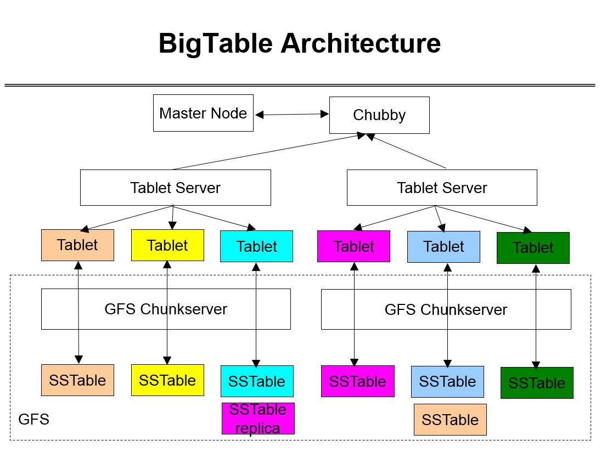

# Bigtable: 分布式结构化数据存储系统深度解析与架构实现

本文档是对 Google BigTable 论文的深度技术解析，系统性地分析 BigTable 的核心数据模型、分布式架构、存储引擎和实现机制。通过研读本文档，读者将全面掌握 BigTable 的设计理念、技术实现和对现代分布式系统的影响，为深入理解分布式存储系统奠定坚实基础。

通过本文档的学习，读者将能够：

1. **理解设计原理**：掌握 BigTable 产生的历史背景、设计动机以及相对于传统数据库的技术革新
2. **掌握核心数据模型**：深入理解 BigTable 的列族存储、行键设计、时间戳版本控制和稀疏数据存储的设计思想
3. **精通体系架构**：熟练掌握 Master 服务器、Tablet 服务器、GFS 和 Chubby 的职责分工和协作机制
4. **理解存储引擎**：了解 SSTable 格式、MemTable 管理、压缩机制和读写路径优化的原理
5. **具备分析能力**：能够分析 BigTable 的设计权衡、技术局限性和对后续系统的影响
6. **建立理论基础**：理解分布式存储的一致性模型、容错机制和扩展性理论在 BigTable 中的体现
7. **培养工程思维**：具备从论文到实际系统的转化能力，为分布式系统设计提供参考

**版本说明**：

- 本文基于原始论文："Bigtable: A Distributed Storage System for Structured Data" (OSDI 2006)
- 所有技术实现细节以原始论文描述为准
- 代码示例和伪代码用于说明核心算法和数据结构
- 数据与结论的来源均标注参考文献，确保准确性和可追溯性

---

## 第 1 章 引言与论文背景

本章将全面介绍 BigTable 论文的核心价值、历史背景和技术定位。我们将从论文的发表背景出发，深入分析 BigTable 解决的技术挑战，详细阐述其对分布式存储领域的革命性贡献。通过本章的学习，读者将建立对 BigTable 技术体系的整体认知，为后续深入分析技术细节奠定基础。

通过本章学习，读者将能够：

1. **理解历史背景**：掌握 BigTable 产生的技术环境和解决的核心问题
2. **认识论文价值**：理解 BigTable 论文对分布式系统领域的深远影响
3. **掌握核心贡献**：识别 BigTable 的主要技术创新和设计突破
4. **建立技术关联**：理解 BigTable 与后续开源实现（如 HBase）的技术传承关系
5. **培养学术思维**：掌握从学术论文中提取关键技术信息的方法

---

### 1.1 论文基本信息

**Bigtable: A Distributed Storage System for Structured Data** 是 Google 团队在 2006 年 OSDI（操作系统设计与实现研讨会）上发表的里程碑式论文。这篇论文由 Fay Chang、Jeffrey Dean 等 Google 核心工程师撰写，首次详细披露了 Google 内部的大规模分布式存储系统设计。

**关键元数据**：

- **发表会议**：第七届 OSDI（Operating Systems Design and Implementation）
- **发表时间**：2006 年 11 月
- **作者团队**：Google 核心基础设施团队
- **论文地位**：分布式系统领域的经典之作，被引用数千次

### 1.2 历史背景与意义

在 2000 年代初期，Google 面临着前所未有的数据存储挑战：

1. **数据规模爆炸**：网页索引、用户数据、日志文件达到 PB 级别
2. **写入吞吐要求**：需要支持每秒数百万次的写入操作
3. **扩展性需求**：必须能够线性扩展以应对业务增长
4. **成本约束**：需要在廉价硬件上构建可靠系统

传统关系数据库在这些场景下表现出明显局限性：

- 水平扩展困难
- 写入性能瓶颈
- 模式僵化不适应半结构化数据
- 硬件成本高昂

Bigtable 的提出正是为了解决这些核心问题，为互联网规模的应用提供新的存储范式。

### 1.3 论文核心贡献

Bigtable 论文的主要贡献体现在四个层面：

1. **新型数据模型**：提出列族（Column Family）存储概念，支持稀疏数据结构
2. **分布式架构**：基于 GFS 和 Chubby 构建可扩展的分布式系统
3. **高性能引擎**：采用 LSM-tree 实现高吞吐写入
4. **一致性方案**：在分布式环境下提供合理的一致性保证

---

## 第 2 章 数据模型详解

本章将深入解析 BigTable 的核心数据模型，详细阐述其独特的列族存储设计、行键排序机制、时间戳版本控制和稀疏数据存储特性。Bigtable 的数据模型设计源于 Google 对大规模半结构化数据存储的需求，旨在提供高可扩展性、高性能和灵活的数据模式（论文第 2 节）。

通过本章学习，读者将能够：

1. **掌握核心概念**：深入理解行键、列族、列限定符、时间戳和单元的设计原理及其背后的设计哲学
2. **理解模型特性**：掌握稀疏性、多维性和有序性的技术实现及其在大规模系统中的优势
3. **进行对比分析**：能够系统比较 BigTable 与关系数据库的差异，理解不同数据模型的适用场景
4. **设计数据模式**：具备基于 BigTable 数据模型设计应用的能力，合理利用其特性优化性能
5. **评估适用场景**：能够判断 BigTable 在不同应用场景下的适用性，做出正确的技术选型

---

### 2.1 核心概念解析

Bigtable 的数据模型可以表述为一个多维映射（论文第 2.1 节）：

```typescript
// BigTable 数据模型函数签名（基于论文描述）
// row: string - 行键，任意字符串，最大长度64KB，支持字典序排序
// column: string - 列名，格式为"列族:列限定符"，支持动态创建
// time: int64 - 时间戳，微秒精度，64位整数，用于多版本控制
// → string - 返回值，存储的字符串值（单元内容）
(row: string, column: string, time: int64) → string
```

#### 2.1.1 行键（Row Key）

**设计原理**：行键的设计基于字典序排序特性，使得相关数据在物理存储上相邻，极大优化了范围查询性能（论文第 2.1 节）。

- **任意字符串**：最大长度 64KB，支持任意二进制数据
- **字典序排序**：天然支持高效的范围扫描和前缀查询
- **局部性优化**：通过巧妙设计行键，将访问模式相似的数据存储在相邻位置
- **设计示例**：将域名反转 "com.google.www" 的设计使得：
  - 相同顶级域名的网站数据物理相邻
  - 支持高效的域名范围查询
  - 优化了基于域名的数据分析场景

**为什么这样设计**：传统的哈希分布虽然均衡但无法支持范围查询，Bigtable 选择字典序排序是为了在保持数据分布相对均衡的同时，为范围查询和数据分析场景提供原生支持。

#### 2.1.2 列族（Column Family）

**设计原理**：列族的概念将相关的列组织在一起，使得同一列族的数据具有相同的存储特性和访问模式，优化了存储效率和访问性能（论文第 2.1 节）。

- **逻辑分组**：将语义相关的列组织在一起，如 "content:", "anchor:"
- **类型一致性**：同一列族的数据通常具有相似的类型和访问模式
- **访问控制**：权限控制在列族级别，简化了安全管理
- **存储优化**：每个列族可以独立配置压缩算法、内存缓存策略

**为什么这样设计**：列族的设计允许应用程序在不修改表结构的情况下动态添加新列，同时为不同的数据类型提供差异化的存储优化策略。

#### 2.1.3 列限定符（Column Qualifier）

**设计原理**：列限定符的动态创建特性使得 Bigtable 能够高效存储半结构化数据，避免了传统数据库需要预定义模式的限制（论文第 2.1 节）。

- **动态创建**：无需预先定义，支持运行时动态添加新列
- **命名规范**：列族:限定符（如 "content:html", "anchor:cnnsi.com"）
- **稀疏存储**：不存在的列不占用任何存储空间，极大节省存储成本
- **灵活模式**：支持每行拥有不同的列结构，适合半结构化数据

**为什么这样设计**：互联网应用通常需要存储大量半结构化数据，动态列设计避免了频繁的 schema 变更，同时稀疏存储特性优化了存储效率。

#### 2.1.4 时间戳（Timestamp）

**设计原理**：时间戳支持实现了数据的多版本管理，为数据审计、版本回溯和时序数据分析提供了基础能力（论文第 2.1 节）。

- **64 位整数**：微秒级精度，支持高精度时间记录
- **版本控制**：每个单元支持存储多个时间版本，默认保留最新版本
- **自动清理**：支持基于时间（保留最近 N 个版本）和基于空间（自动删除旧版本）的垃圾回收
- **降序排列**：时间戳按降序排列，新的版本在前，优化了最新数据访问性能

**为什么这样设计**：多版本支持使得应用程序能够实现数据版本管理、审计追踪和时序分析，同时自动清理机制确保了存储空间的有效利用。

### 2.2 数据模型特性

Bigtable 的数据模型具有以下显著特性，这些特性共同构成了其在大规模数据存储中的独特优势（论文第 2.1 节）：

#### 2.2.1 稀疏性

**设计原理**：稀疏性设计使得 Bigtable 能够高效存储半结构化数据，避免了传统关系数据库中大量 NULL 值的存储开销。这种设计特别适合互联网应用中数据模式频繁变化的场景。

```python
# BigTable 稀疏数据表示示例（基于论文第 2.1 节描述）
# 不同行可以有不同的列结构，完美支持半结构化数据存储

# 用户1：包含基本信息和年龄（传统应用用户）
row1 = {
    "basic:name": "Alice",           # 姓名列，basic列族
    "basic:age": 30,                 # 年龄列，basic列族
    "basic:gender": "female"         # 性别列，basic列族
}

# 用户2：包含基本信息和社交媒体信息（现代应用用户）
row2 = {
    "basic:name": "Bob",             # 姓名列，basic列族
    "social:twitter": "@bob",       # Twitter账号，social列族
    "social:github": "bob-dev"       # GitHub账号，social列族
}

# 用户3：物联网设备，只包含设备元数据和遥测信息
row3 = {
    "metadata:device_id": "sensor-001",  # 设备ID
    "telemetry:temperature": 23.5,        # 温度读数
    "telemetry:humidity": 45.2           # 湿度读数
}
```

**为什么这样设计**：互联网应用的数据模式往往随着业务发展而不断变化，稀疏性设计避免了频繁的数据库 schema 变更，同时为 A/B 测试、功能灰度发布等场景提供了天然支持。

#### 2.2.2 多维性

**设计原理**：多维数据模型通过四个坐标轴精确定位每个数据单元，提供了比传统二维表结构更丰富的数据组织能力（论文第 2.1 节）。

数据通过四个维度精确定位：

1. **行键（Row Key）**：数据分片和分布的主要维度，支持范围查询
2. **列族（Column Family）**：逻辑分组维度，用于组织相关数据和配置存储策略
3. **列限定符（Column Qualifier）**：具体的数据字段标识，支持动态创建
4. **时间戳（Timestamp）**：时间维度，支持多版本数据和时序分析

**多维访问示例**：

- 按行键范围扫描特定用户的数据
- 按列族批量读取相关数据（如所有用户的基本信息）
- 按时间戳查询特定时间段的数据版本
- 组合多个维度进行复杂数据检索

**为什么这样设计**：多维模型为复杂的数据访问模式提供了统一的抽象，同时保持了接口的简洁性，使得应用程序能够以一致的方式处理各种类型的数据查询。

#### 2.2.3 有序性

**设计原理**：有序性设计优化了数据的物理存储布局，使得相关的数据在存储介质上相邻，极大提升了范围查询和顺序访问的性能（论文第 2.1 节）。

- **行键字典序排列**：使得具有相同前缀的行键在物理存储上相邻

  - 示例："user001", "user002", "user003" 存储在一起
  - 优化效果：范围查询 "user001" 到 "user100" 只需顺序扫描

- **列按列族和限定符排序**：同一列族的数据存储在一起

  - 示例：所有 "content:" 列族的数据物理相邻
  - 优化效果：批量读取特定列族数据时性能最佳

- **时间戳按降序排列**：新的数据版本在前，旧的版本在后
  - 设计原因：大多数应用更频繁访问最新数据
  - 优化效果：读取最新版本数据时无需遍历所有版本

**为什么这样设计**：有序性充分利用了存储介质的顺序访问特性（特别是磁盘的顺序读写性能远高于随机访问），通过精心设计的数据布局，将逻辑上的数据相关性映射为物理存储的相邻性，从而最大化 I/O 效率。

### 2.3 与关系数据库对比

Bigtable 的数据模型设计针对大规模半结构化数据存储场景，与关系数据库有着根本性的设计差异（论文第 1 节引言部分）：

| **特性**       | **关系数据库**              | **Bigtable**                     | **设计原理差异**                                                                          |
| -------------- | --------------------------- | -------------------------------- | ----------------------------------------------------------------------------------------- |
| **数据模型**   | 固定表结构，预定义 schema   | 灵活列族结构，动态列             | Bigtable 针对半结构化数据，支持动态模式演进；关系数据库强调数据完整性和结构一致性         |
| **扩展性**     | 垂直扩展为主，有限水平扩展  | 水平线性扩展，支持 PB 级数据     | Bigtable 设计初衷就是解决海量数据存储问题，采用分布式架构；关系数据库传统上服务于事务处理 |
| **一致性模型** | 强一致性（ACID 事务）       | 最终一致性，支持单行事务         | Bigtable 在一致性上做出妥协以换取更好的可用性和扩展性，符合 CAP 理论权衡                  |
| **查询能力**   | 丰富 SQL 查询，复杂联接操作 | 简单 API（Get/Put/Scan/Delete）  | Bigtable 优化了大规模扫描和范围查询，牺牲复杂查询能力以保持高性能                         |
| **适用场景**   | 事务处理，复杂业务逻辑      | 海量数据存储，日志处理，时序数据 | 设计目标不同：关系数据库服务于 OLTP；Bigtable 服务于海量数据存储和分析                    |
| **存储效率**   | 固定列存储，NULL 值占用空间 | 稀疏存储，不存在列不占空间       | Bigtable 的稀疏性设计极大优化了存储效率，特别适合属性不完全相同的半结构化数据             |
| **模式变更**   | 需要 DDL 操作，可能锁表     | 动态添加列，无需预定义           | Bigtable 支持运行时模式演进，避免了传统数据库模式变更的复杂性和停机时间                   |
| **数据局部性** | 基于索引的随机访问          | 基于行键排序的顺序访问           | Bigtable 利用字典序排序优化范围查询性能；关系数据库依赖索引优化点查询                     |

---

## 第 3 章 系统架构设计

本章将深入分析 BigTable 的分布式系统架构，详细阐述其 Master 服务器、Tablet 服务器、GFS 和 Chubby 的职责分工和协作机制。通过本章的学习，读者将全面掌握 BigTable 的架构设计理念，理解其如何实现高可用性、可扩展性和容错性。

通过本章学习，读者将能够：

1. **理解整体架构**：掌握 BigTable 三层架构的设计原理
2. **掌握组件职责**：深入理解各核心组件的功能定位
3. **分析协作机制**：理解组件间的通信和协调方式
4. **评估设计权衡**：能够分析架构设计中的技术选择和权衡
5. **设计分布式系统**：具备基于 BigTable 架构设计分布式存储系统的能力

---

### 3.1 整体架构概述

Bigtable 采用经典的分层架构设计（论文第 4 节），构建在 Google 分布式基础设施之上，实现海量数据的可扩展存储和管理。



#### 3.1.1 架构层次与组件

Bigtable 的系统架构包含五个核心层次，每个层次承担特定的职责：

**1. 客户端层 (Client Layer)**：

- **应用程序集成**：支持 Google Search、Google Earth、Google Analytics 等应用
- **客户端库**：提供 Get/Put/Delete/Scan 等 API 接口，实现 Tablet 位置信息缓存
- **定位机制**：通过三级索引（Chubby → Root Tablet → METADATA Tablet → User Tablet）高效定位数据

**2. Tablet 服务器层 (Tablet Server Layer)**：

- **Tablet 分片**：数据分片单元，每个包含连续的行键范围（通常 100-200MB）
- **内存管理**：Memtable 有序键值对结构支持快速写入操作
- **磁盘存储**：SSTable 不可变有序文件采用 LSM-tree 结构组织
- **并发控制**：支持行级原子性操作，优化单行事务性能

**3. Master 服务器层 (Master Server Layer)**：

- **高可用架构**：主备模式设计，一个活跃 Master 和多个备用 Master
- **元数据管理**：维护 Tablet 到 Tablet 服务器的映射关系
- **负载均衡**：实时监控负载情况并动态迁移 Tablet
- **故障恢复**：检测 Tablet 服务器故障并协调重新分配
- **资源清理**：负责清理已删除的 SSTable 文件，释放存储空间

**4. 协调服务层 (Chubby Layer)**：

- **Leader 选举**：通过 Chubby 确保只有一个活跃的 Master 服务器
- **服务注册**：Tablet 服务器注册 ephemeral 节点实现自动故障检测
- **元数据存储**：存储 Root Tablet 位置和集群引导配置信息
- **分布式协调**：提供细粒度锁服务协调并发操作和 Schema 变更

**5. 持久化存储层 (GFS Layer)**：

- **数据持久化**：SSTable 文件存储在 GFS 中，利用三副本复制确保可靠性
- **故障恢复**：Write-Ahead Log (WAL) 机制保障数据一致性
- **存储优化**：定期执行 Compaction 操作合并小文件，优化读取性能

#### 3.1.2 关键设计理念

基于论文第 4 节的架构设计，Bigtable 遵循以下核心设计理念：

1. **水平扩展性**：通过增加 Tablet 服务器实现存储容量的线性扩展（论文第 4.1 节）
2. **高可用保障**：Master 主备选举机制和 Tablet 自动迁移确保服务连续性（论文第 4.2 节）
3. **一致性权衡**：提供行级原子性但牺牲跨行事务，在一致性和性能间取得平衡（论文第 4.4 节）
4. **性能优化**：LSM-tree 实现高吞吐写入，结合客户端缓存和 Bloom filter 优化读取性能（论文第 4.5 节）
5. **容错机制**：GFS 三副本复制和 WAL 日志确保数据持久性和故障恢复能力（论文第 4.6 节）

#### 3.1.3 架构设计权衡

论文第 4.1 节详细阐述了 Bigtable 的架构设计权衡：

- **去中心化控制**：Tablet 服务器自主处理大多数数据请求，Master 专注于元数据管理，避免单点性能瓶颈
- **内存磁盘平衡**：Memtable 提供内存级写入速度，SSTable 确保磁盘级持久化存储，通过 Compaction 机制平衡两者性能
- **扩展性优先**：牺牲强一致性事务支持，专注于海量数据的水平扩展和系统吞吐量优化
- **智能缓存策略**：客户端缓存 Tablet 位置信息减少元数据查询开销，服务器端缓存热点数据提升读取性能

### 3.2 核心组件详解

#### 3.2.1 Master 服务器

Master 服务器采用"轻量级集中管理"设计理念（论文第 4.3 节），主要负责集群元数据管理而非数据处理，避免成为系统性能瓶颈。其核心设计基于三个关键原则：

- **单一活跃实例**：通过 Chubby 选举机制确保只有一个 Master 处理管理任务，保证决策一致性
- **无状态设计**：所有元数据存储在 Chubby 和 GFS 中，支持快速故障恢复和实例替换
- **最小化干预**：Tablet 服务器自主处理大多数数据请求，最大限度减少与 Master 的交互

**核心功能与管理机制**：

Master 服务器维护 Tablet 到 Tablet Server 的映射关系（存储在 Chubby 中），通过心跳机制（每秒一次）监控 Tablet Server 的健康状态。它负责处理列族创建、删除等 schema 变更操作，确保整个集群的元数据一致性。

在 Tablet 分配方面，Master 根据服务器负载情况智能分配新 Tablet，基于 CPU、内存、磁盘 IO 等负载指标动态调整 Tablet 分布。系统能够检测并迁移访问频率异常的 Tablet（热点处理），并在 Tablet 服务器故障时将其 Tablet 重新分配到健康服务器。

**资源管理与清理**：

Master 负责识别并删除不再被引用的 SSTable 文件，清理 GFS 中因服务器故障遗留的未引用数据文件（孤儿文件处理）。定期执行压缩操作的后续清理工作，有效释放存储空间，维护系统存储效率。

**高可用性保障**（论文第 5.2 节）：

- **主备模式**：备用 Master 通过 Chubby 租约持续监控活跃 Master 状态
- **快速故障切换**：活跃 Master 故障时，备用 Master 可在几秒内完成接管，确保服务连续性
- **操作安全性**：所有关键管理操作通过 Chubby 分布式锁确保原子性和一致性，避免竞态条件

#### 3.2.2 Tablet 服务器

每个 Tablet 服务器采用"_自主数据处理_"设计理念（论文第 4.2 节），管理多个 Tablet（通常 10-1000 个），承担 Bigtable 系统中绝大部分的数据读写操作。其核心设计基于三个关键原则：

- **数据自治**：Tablet 服务器自主处理数据请求，最大限度减少对 Master 的依赖，提高系统扩展性
- **内存优化**：利用 Memtable 实现高速写入，通过 Compaction 机制优化读取性能
- **本地性优先**：尽可能在存储对应数据的 GFS chunkserver 上部署 Tablet 服务器，减少网络传输开销

**核心功能与处理机制**：

Tablet 服务器负责直接处理客户端的读写请求，支持行级原子操作。它维护内存中的 Memtable（有序键值数据结构）用于快速写入，同时管理磁盘上的 SSTable（不可变有序文件）提供持久化存储。服务器定期执行 Minor 和 Major Compaction 操作，优化存储效率和读取性能。

在请求处理方面，Tablet 服务器解析客户端 API 调用（Get/Put/Delete/Scan），转换为内部操作序列，实施基于 Chubby 的访问控制确保数据安全，并优化数据序列化和网络传输以减少响应延迟。通过 Bloom filter 减少不必要的磁盘访问，利用客户端缓存降低网络开销。

**故障恢复与监控机制**：

Tablet 服务器持续监控本地硬件状态，检测磁盘故障和内存错误。通过 WAL（Write-Ahead Log）实现故障后的数据恢复，确保数据一致性。服务器定期向 Master 发送心跳信号（每秒一次），报告负载状态和健康信息。在部分组件故障时，系统能够优雅降级继续提供服务，确保整体可用性。

**性能优化策略**（论文第 4.5 节）：

- **批量处理**：合并多个小写入请求，显著减少磁盘 IO 操作次数
- **预取优化**：基于访问模式预测性加载可能访问的数据，减少读取延迟
- **智能压缩**：根据数据特性和访问模式选择最优压缩算法（Snappy、Zlib 等）
- **资源隔离**：将重要应用的 Tablet 分配到专用资源池，避免性能干扰

#### 3.2.3 分布式基础设施

Bigtable 构建在 Google 的分布式基础设施之上，充分利用 GFS 和 Chubby 提供的核心服务，实现计算与存储分离的架构设计：

**GFS 集成与存储管理**：

所有 SSTable 文件存储在 GFS 中，提供可靠的持久化保障和数据高可用性。GFS 的三副本复制机制确保数据容错性，其大文件顺序读写优化特性完美匹配 Bigtable 的 SSTable 存储模式和 Compaction 操作需求。Tablet 服务器优先部署在存储其数据的 GFS chunkserver 上，实现数据本地性访问，减少网络传输开销。

**Chubby 分布式协调服务**：

Chubby 为 Bigtable 提供关键的分布式协调功能（论文第 5.2 节）。通过 ephemeral 节点实现 Master 服务器选举和 Tablet 服务器注册，支持快速的故障检测和恢复。Chubby 存储集群引导配置、Root Tablet 位置信息，并提供细粒度分布式锁服务协调并发操作和 Schema 变更。租约机制通过超时检测实现服务器故障的自动发现。

**基础设施协同工作原理**：

在系统启动阶段，Tablet 服务器向 Chubby 注册 ephemeral 节点，Master 通过 Chubby 选举产生。正常运行期间，Tablet 服务器直接与 GFS 交互处理数据读写，最大限度减少协调开销。当发生故障时，Chubby 通过 ephemeral 节点自动删除检测到异常，Master 协调进行 Tablet 重新分配和数据恢复，通过 GFS 副本和 WAL 日志确保数据一致性和持久性。

**架构设计优势**：

- **模块化分离**：计算（Tablet 服务器）和存储（GFS）职责清晰分离，支持独立扩展和优化
- **可靠性继承**：直接继承底层基础设施（GFS、Chubby）的高可用性和容错特性
- **性能最优化**：计算存储分离架构实现最优资源利用，本地性感知部署减少网络开销
- **线性扩展性**：每个组件都可以独立水平扩展，支持超大规模集群部署
- **协调轻量化**：Chubby 提供强一致性保证的同时，确保大多数数据操作不需要协调服务参与

### 3.3 Tablet 定位机制

Bigtable 采用层次化的三级索引结构定位 Tablet（论文第 5.1 节），这种设计在保证扩展性的同时最小化元数据查询开销。

#### 3.3.1 定位流程与层次结构

Tablet 定位采用三级索引层次结构，从引导到数据访问的完整流程如下：

1. **Chubby 查询（引导阶段）**：客户端首先从 Chubby 服务获取根 Tablet（Root Tablet）的位置信息。Chubby 存储 Root Tablet 的位置作为整个定位过程的起点，利用 Chubby 的高可用性确保引导信息的可靠性。

2. **根 Tablet 访问（一级索引）**：根 Tablet 是一个特殊的 METADATA Tablet，包含所有 METADATA Tablet 的位置映射。Root Tablet 存储 METADATA Tablet 的位置信息但不直接存储用户数据，通过层次化索引支持大规模 Tablet 管理，避免单点瓶颈。

3. **METADATA Tablet 查询（二级索引）**：METADATA Tablet 存储用户 Tablet 的具体位置信息和元数据。每个 METADATA Tablet 管理约 1GB 用户数据对应的 Tablet 元数据，采用分布式元数据管理支持线性扩展。

4. **用户 Tablet 访问（数据访问）**：最终定位到实际存储用户数据的 Tablet 服务器。客户端直接与 Tablet 服务器通信进行数据操作，减少中间环节以优化访问性能。

5. **缓存优化机制**：客户端缓存 Tablet 位置信息以减少后续访问的元数据查询开销。位置信息缓存有效期为 60 秒，平衡一致性和性能需求，通过缓存减少对 Chubby 和 METADATA Tablet 的访问压力。

#### 3.3.2 关键组件功能说明

| **组件类型**        | **角色描述**                                     | **存储内容**                            |
| ------------------- | ------------------------------------------------ | --------------------------------------- |
| **根 Tablet**       | 特殊的 METADATA Tablet，位置固定存储在 Chubby 中 | 所有 METADATA Tablet 的位置信息         |
| **METADATA Tablet** | 存储用户 Tablet 的元数据和位置映射信息           | Tablet 服务器地址、行键范围、状态信息等 |
| **用户 Tablet**     | 实际存储用户数据的 Tablet 分片                   | 用户表数据，按行键范围划分              |

#### 3.3.3 设计优势与优化机制

**层次化索引设计优势**：

- **可扩展性**：支持管理数百万个 Tablet 的元数据，满足超大规模集群需求
- **性能优化**：大多数请求只需要 1-2 次网络往返，得益于客户端缓存机制
- **容错性**：METADATA Tablet 也采用复制机制确保可用性，避免单点故障
- **负载分布**：元数据查询负载分布到多个 METADATA Tablet 上，实现负载均衡

**系统优化特性**：

- **层次化结构**：三级索引支持大规模 Tablet 的高效管理，降低元数据管理复杂度
- **智能缓存**：客户端缓存减少对 Chubby 和 METADATA Tablet 的访问压力，提升系统吞吐量
- **容错机制**：METADATA Tablet 采用复制和故障恢复机制确保高可用性
- **线性扩展**：层次化设计支持集群规模的线性扩展，适应业务增长需求

---

## 第 4 章 Tablet 分布式架构解析

本章将深入分析 BigTable 的核心分布式架构组件——Tablet，详细阐述其作为数据分片单元的设计原理、负载均衡机制、故障恢复策略和性能优化技术。通过本章的学习，读者将全面掌握 BigTable 如何通过 Tablet 实现数据的水平扩展和高可用性。

通过本章学习，读者将能够：

1. **理解 Tablet 概念**：掌握 Tablet 作为数据分片单元的设计原理
2. **掌握负载均衡**：理解 Tablet 分配和负载均衡的实现机制
3. **分析故障恢复**：深入理解 Tablet 故障检测和恢复策略
4. **评估性能优化**：能够分析 Tablet 性能优化的技术手段
5. **设计分布式存储**：具备基于 Tablet 架构设计分布式存储系统的能力

---

### 4.1 Tablet 核心概念与设计原理

#### 4.1.1 Tablet 作为数据分片单元

Tablet 是 BigTable 的核心数据分片单元（论文第 4.1 节），具有以下设计特性：

- **数据范围划分**：每个 Tablet 负责连续的行键范围，确保数据有序性
- **独立管理**：Tablet 可以独立地在不同服务器间迁移，支持动态负载均衡
- **动态调整**：Tablet 大小根据数据量动态调整，平衡存储效率和访问性能
- **并行处理**：多个 Tablet 可以并行处理读写请求，实现水平扩展

#### 4.1.2 生命周期管理与负载均衡

BigTable 通过精细的 Tablet 生命周期管理实现负载均衡（论文第 4.2-4.3 节）：

```text
# Tablet 分布式管理架构（基于论文第4.2节）
+----------------------------------------------------------------+
|                      Tablet 生命周期管理                         |
+----------------------------------------------------------------+
         | 创建Tablet                 | 监控负载
         ↓                           ↓
+----------------+      +----------------+      +----------------+
|   Tablet创建    |      |   负载监控      |      |   性能分析      |
|  - 初始大小     |      |  - CPU使用率    |      |  - 读写延迟     |
|  - 行键范围     |      |  - 内存使用      |      |  - 吞吐量      |
|  - 列族配置     |      |  - 磁盘IO       |      |  - 热点检测     |
+----------------+      +----------------+      +----------------+
         |                     |                        |
         | 达到阈值             | 检测热点                 | 需要优化
         ↓                     ↓                        ↓
+----------------+       +----------------+       +----------------+
|   Tablet分裂    |       |   负载均衡      |       |   Tablet合并    |
|  - 按中点分裂    |       |  - 迁移Tablet  |       |  - 合并小文件    |
|  - 保持有序性    |       |  - 平衡负载     |       |  - 减少元数据    |
|  - 更新元数据    |       |  - 避免热点     |       |  - 优化性能      |
+----------------+       +----------------+       +----------------+
         |                       |                         |
         | 分裂完成               | 迁移完成                  | 合并完成
         ↓                       ↓                         ↓
+----------------------------------------------------------------+
|                      正常服务状态                                |
+----------------------------------------------------------------+
```

#### 4.1.3 大小控制策略

**大小控制策略详细说明**（基于论文第 4.3 节）：

- **初始大小**：新 Tablet 通常为 100MB 左右，避免过大影响迁移效率
- **增长机制**：随着数据写入自然增长，保持数据局部性
- **分裂阈值**：配置为 100-200MB，平衡元数据开销和迁移成本
- **分裂算法**：按行键范围的中点分裂，确保数据均匀分布
- **合并条件**：相邻小 Tablet（<50MB）自动合并，减少元数据开销

#### 4.1.4 负载均衡机制

**负载均衡机制详细说明**（基于论文第 4.4 节）：

- **监控指标**：CPU 使用率、内存占用、磁盘 IO、网络带宽、请求延迟
- **热点检测**：识别访问频率异常高的 Tablet（热点 Tablet）
- **迁移策略**：基于负载预测选择目标服务器，考虑数据本地性
- **优先级调度**：系统 Tablet（如 METADATA）优先分配到高性能服务器

#### 4.1.5 自动分裂与合并机制

BigTable 实现了智能的 Tablet 分裂和合并机制（论文第 4.3 节）：

**分裂机制**：

- **基于大小**：当 Tablet 数据量超过阈值时自动分裂
- **基于负载**：检测到热点 Tablet 时进行分裂以分散负载
- **手动触发**：支持管理员手动触发分裂操作

**合并机制**：

- **空间优化**：合并小 Tablet 以减少元数据开销
- **性能优化**：减少需要访问的 Tablet 数量
- **定期执行**：系统定期扫描并合并合适的小 Tablet

### 4.2 分布式协调与元数据管理

#### 4.2.1 Chubby 分布式锁服务

Chubby 在 Tablet 分布式架构中扮演关键协调角色（论文第 3.2 节）：

1. **Master 选举**：确保只有一个活动的 Master 服务器，避免脑裂问题
2. **Tablet 服务器注册**：Tablet 服务器在 Chubby 中注册 ephemeral 节点
3. **引导信息存储**：存储集群的引导配置信息和系统状态
4. **分布式锁服务**：提供分布式锁协调并发操作和资源访问

#### 4.2.2 层次化元数据架构

BigTable 采用三层层次化的元数据管理架构（论文第 4.5 节）：

1. **根 Tablet（Root Tablet）**：

- **存储位置**：固定存储在 Chubby 中，确保高可用性
- **内容功能**：包含所有 METADATA Tablet 的位置信息
- **访问模式**：客户端首先访问根 Tablet 定位 METADATA Tablet

**2. METADATA Tablet**：

- **数量规模**：多个 Tablet，存储用户 Tablet 的详细元数据
- **内容结构**：Tablet 位置映射、状态信息、负载指标等
- **管理功能**：记录用户 Tablet 的分布和状态信息

**3. 用户 Tablet**：

- **数据存储**：大量用户 Tablet 存储实际应用数据
- **位置管理**：由 METADATA Tablet 记录位置映射信息
- **访问流程**：客户端通过三层索引定位目标 Tablet

#### 4.2.3 元数据访问优化

BigTable 通过多种技术优化元数据访问性能：

- **客户端缓存**：缓存 Tablet 位置信息，减少元数据访问次数
- **批量预取**：预取相关 Tablet 的元数据，优化范围查询
- **压缩编码**：元数据采用紧凑编码格式，减少存储和传输开销
- **异步更新**：元数据更新采用异步机制，避免阻塞数据操作

### 4.3 故障检测与恢复机制

#### 4.3.1 故障检测策略

BigTable 实现了多层次的故障检测机制：

1. **心跳检测**：Tablet 服务器定期向 Master 发送心跳（每秒一次）
2. **租约机制**：Tablet 服务器从 Chubby 获取租约（ephemeral 节点）
3. **超时检测**：Master 检测心跳超时的服务器（默认超时时间 30 秒）
4. **健康检查**：定期检查 Tablet 服务器的健康状态和负载指标

#### 4.3.2 组件交互时序图

基于论文第 3.2 节和第 4.4 节描述的 Master 选举和 Tablet 分配机制，以下是核心组件交互的详细时序图：

```text
+----------+     +----------+        +----------+        +----------+     +----------+
|  Client  |     |  Master  |        | TabletSvr|        |  Chubby  |     |   GFS    |
+----------+     +----------+        +----------+        +----------+     +----------+
     |                |                   |                   |                |
     |---1. 写请求---->|                   |                   |                |
     |                |---2. 定位Tablet--->|                   |                |
     |                |<---3. Tablet位置---|                   |                |
     |---4. 直接写---->|                   |                   |                |
     |                |                   |---5. 追加WAL----------------------->|
     |                |                   |<---6. WAL确认-----------------------|
     |                |                   |---7. 更新MemTable------------------>|
     |<--8. 写成功-----|                   |                   |                |
     |                |                   |                   |                |
     |                |---9. 心跳检测----->|                   |                |
     |                |<--10. 心跳响应-----|                   |                |
     |                |                   |---11. 租约续期---->|                |
     |                |                   |<--12. 租约确认-----|                |
     |                |                   |                   |                |
     |                |---13. 检测超时---->|                   |                |
     |                |---14. 检查租约---->|                   |                |
     |                |<--15. 租约失效-----|                   |                |
     |                |---16. 标记故障---->|                   |                |
     |                |-17. 重新分配Tablet->|                  |                |
     |                |                   |---18. 加载Tablet->|                 |
     |                |                   |---19. 读取WAL---------------------->|
     |                |                   |<--20. WAL数据-----------------------|
     |                |                   |---21. 恢复MemTable->|               |
     |                |                   |---22. 服务就绪---->|                 |
     |                |<--23. 恢复完成-----|                   |                 |
     |                |---24. 更新元数据-->|                   |                 |
```

#### 4.3.3 自动恢复流程

当检测到 Tablet 服务器故障时，系统自动执行恢复：

1. **故障检测**：Master 检测到 Tablet 服务器心跳超时（默认 30 秒超时）
2. **租约验证**：Master 检查 Chubby 中该服务器的 ephemeral 节点租约状态
3. **租约失效**：Chubby 租约过期，确认服务器故障（双重确认机制）
4. **Tablet 重新分配**：Master 将故障服务器的 Tablet 重新分配到其他健康服务器
5. **日志恢复**：新的 Tablet 服务器从 GFS 读取 WAL 日志恢复 MemTable 状态
6. **服务恢复**：Tablet 加载完成并开始服务读写请求
7. **元数据更新**：更新 METADATA Tablet 中的 Tablet 位置映射信息
8. **客户端感知**：客户端缓存失效，重新从 METADATA Tablet 获取新位置

### 4.4 性能优化与负载均衡

#### 4.4.1 读写性能优化

BigTable 通过多种技术优化 Tablet 的读写性能：

1. **MemTable 优化**：内存中维护有序数据结构加速写入
2. **SSTable 索引**：磁盘文件建立块索引加速读取
3. **布隆过滤器**：减少不必要的磁盘访问
4. **缓存机制**：多级缓存优化热点数据访问

#### 4.4.2 负载均衡策略

系统采用智能的负载均衡策略：

- **基于指标**：综合考虑 CPU、内存、磁盘 IO、网络带宽
- **预测性迁移**：根据历史负载模式预测未来负载
- **优先级调度**：重要 Tablet 优先分配到高性能服务器
- **成本感知**：考虑迁移成本避免频繁迁移

---

## 第 5 章 存储引擎与 LSM 树实现

本章将深入分析 BigTable 的核心存储引擎技术——LSM 树（Log-Structured Merge-Tree），详细阐述其设计原理、MemTable 管理、SSTable 格式、压缩机制和读写路径优化。通过本章的学习，读者将全面掌握 LSM 树如何实现高吞吐写入和高效读取，理解其在大规模分布式存储系统中的核心价值。

通过本章学习，读者将能够：

1. **理解 LSM 原理**：掌握 LSM 树的基本设计思想和核心机制
2. **掌握 MemTable**：深入理解内存中写缓冲的设计和实现
3. **分析 SSTable**：理解磁盘文件格式和索引结构
4. **评估压缩策略**：能够分析不同压缩策略的优缺点
5. **优化读写性能**：具备基于 LSM 树优化存储性能的能力

### 5.1 LSM 树基本原理

#### 5.1.1 Log-Structured Merge Tree 设计思想

LSM 树是 BigTable 实现高吞吐写入的核心技术，其基本设计思想是将随机写入转换为顺序写入：

1. **写入阶段**：所有写入操作先追加到内存中的 Memtable（有序数据结构）
2. **刷写阶段**：Memtable 达到阈值时，批量刷写到磁盘成为 SSTable 文件
3. **合并阶段**：定期将多个小 SSTable 合并为更大的文件，优化读取性能
4. **清理阶段**：通过 Compaction 回收存储空间，删除过期数据

#### 5.1.2 内存与磁盘的层次化存储

##### 5.1.2.1 LSM 树工作流程

**LSM 树采用层次化的存储架构**：

```text
+----------------------------------------------------------------+
|                     LSM 树存储引擎工作流程                        |
+----------------------------------------------------------------+
         | 写入请求                   | 读取请求
         ↓                           ↓
+----------------+       +----------------+       +----------------+
|   写入路径      |       |    读取路径      |       |  后台压缩       |
|  - 追加WAL      |      |  - 查询Memtable |       |  - 选择文件      |
|  - 写入Memtable |      |  - 查询SSTable  |       |  - 合并排序      |
|  - 批量刷写     |       |  - 多版本合并    |       |  - 生成新文件    |
+----------------+       +----------------+       +----------------+
         |                       |                        |
         | Memtable满            | 数据找到                 | 压缩完成
         ↓                       ↓                        ↓
+----------------+       +----------------+       +----------------+
|  刷写操作       |       |  返回结果        |       |  清理旧文件     |
|  - 创建SSTable  |       |  - 数据聚合     |       |  - 空间回收     |
|  - 写入Level 0  |       |  - 版本选择     |       |  - 元数据更新   |
|  - 清空Memtable |       |  - 缓存优化     |       |  - 性能统计     |
+----------------+       +----------------+       +----------------+
         |                        |                       |
         | 刷写完成                | 请求完成                | 清理完成
         ↓                        ↓                       ↓
+----------------------------------------------------------------+
|                       正常存储状态                               |
+----------------------------------------------------------------+
```

##### 5.1.2.2 层次化存储结构

**LSM 树层次化存储结构**：

```text
+----------------+-----------------------------------------------------+
|    存储层      |                  详细说明                             |
+----------------+-----------------------------------------------------+
|   Memtable     | 内存中的跳表或平衡树结构，支持快速写入和有序迭代            |
|   (内存)       | - 写前日志（WAL）确保持久性                             |
|                | - 达到阈值（通常几个MB）时触发刷写                       |
+----------------+-----------------------------------------------------+
|   Level 0      | 最新刷写的SSTable文件，可能有重叠的键范围                 |
|   (磁盘)       | - 文件未经压缩，保持刷写顺序                             |
|                | - 读取时需要查询多个文件                                |
+----------------+-----------------------------------------------------+
|   Level 1      | 经过一次合并的SSTable，键范围有序且不重叠                 |
|   (磁盘)       | - 文件经过压缩，占用空间更小                             |
|                | - 布隆过滤器加速查询                                   |
+----------------+-----------------------------------------------------+
|   Level 2-N    | 经过多次合并的SSTable，数据高度有序和压缩                |
|   (磁盘)       | - 文件大小逐渐增大（从MB到GB级别）                       |
|                | - 查询效率最高，但写入代价最大                           |
+----------------+-----------------------------------------------------+
```

##### 5.1.2.3 关键组件详细说明

**1. Memtable（内存表）**:

- **数据结构**：通常使用跳表（Skip List）或平衡树，支持 O(log N)的插入和查询
- **并发控制**：支持多线程并发写入，通过细粒度锁或无锁数据结构
- **刷写触发**：基于大小阈值（如 4MB）或时间阈值（如 1 分钟）
- **WAL 保障**：所有写入先追加到 Write-Ahead Log，确保故障恢复

**2. SSTable（Sorted String Table）**:

- **文件格式**：包含数据块、索引块、布隆过滤器、元数据块
- **索引结构**：稀疏索引，每 64KB 数据一个索引项，加速范围查询
- **压缩格式**：支持 Snappy、LZ4、ZSTD 等压缩算法减少磁盘占用
- **布隆过滤器**：每个 SSTable 包含布隆过滤器，减少不必要的磁盘读取

**3. Compaction（压缩合并）**:

- **触发条件**：Level 0 文件数量超过阈值，或各级别大小比例失衡
- **合并策略**：
  - **Size-Tiered**：合并大小相近的文件
  - **Leveled**：每层文件大小相近，高层合并到低层
- **性能影响**：后台异步执行，避免影响前台请求，但可能引起写放大

**4. 缓存机制**:

- **BlockCache**：缓存最近访问的数据块，减少磁盘读取
- **KeyCache**：缓存索引块，加速 SSTable 查找
- **BloomFilter**：内存中维护布隆过滤器，快速判断键是否存在

**性能特征与优化**:

| **优化类别**     | **优化技术** | **实现机制**                           | **性能收益**                 |
| ---------------- | ------------ | -------------------------------------- | ---------------------------- |
| **写入性能优化** | 批量刷写     | 将随机写入转换为顺序写入               | 提高磁盘吞吐量               |
|                  | 写入放大控制 | Compaction 优化，通常 2-10 倍写放大    | 平衡写入性能与存储效率       |
|                  | 内存优化     | Memtable 使用内存友好数据结构          | 减少内存碎片，提高内存利用率 |
| **读取性能优化** | 多级缓存体系 | Memtable + BlockCache + OS PageCache   | 减少磁盘 I/O，提高读取命中率 |
|                  | 索引优化     | 稀疏索引 + 布隆过滤器                  | 减少磁盘访问次数             |
|                  | 并行查询     | 多个 SSTable 并行查询                  | 提高读取吞吐量               |
| **空间效率优化** | 数据压缩     | SSTable 支持多种压缩算法               | 空间节省 50-80%              |
|                  | 垃圾回收     | 通过 Compaction 删除过期数据和重复版本 | 回收存储空间                 |
|                  | 空间放大控制 | Compaction 优化未合并的重复数据        | 减少空间放大效应             |

#### 5.1.3 写入优化与读取权衡

LSM 树在写入和读取性能之间进行精心权衡，这种设计选择体现了存储系统设计的经典权衡：

**写入优势**：

- **顺序写入优势**：将随机写入转换为顺序写入，大幅提升磁盘吞吐量，这是 LSM 树最核心的设计优势
- **批量处理效率**：批量刷写机制显著减少磁盘寻址开销，提高整体写入效率
- **内存缓冲能力**：利用内存高速缓存有效吸收写入峰值，提供平滑的写入性能

**读取挑战**：

- **多文件访问开销**：读取操作需要检查多个 SSTable 文件才能找到目标数据，增加了查询复杂度
- **合并操作成本**：Compaction 操作会消耗额外的 CPU 和 IO 资源，可能影响前台请求性能
- **内存占用需求**：Memtable 需要足够内存来保证写入性能，对内存资源有一定要求

### 5.2 MemTable 设计与实现

#### 5.2.1 内存数据结构

##### 5.2.1.1 MemTable 内存结构

MemTable 采用高效的内存数据结构，以下是其核心架构和工作原理的可视化展示：

```text
+---------------------------------------------------------------+
|                        MemTable 内存结构                       |
+---------------------------------------------------------------+
|                                                               |
|  +---------------------+      +-------------------------+     |
|  |     WAL 日志         |      |   有序键值对数据结构       |     |
|  | (Write-Ahead Log)   |<---->| (Sorted Data Structure) |     |
|  +---------------------+      +-------------------------+     |
|         ^                              ^  ^                   |
|         |                              |  |                   |
|         | 1. 先写日志                   |  | 2. 更新内存         |
|         |                              |  |                   |
|  +------+------+               +-------+--+-------+           |
|  |  客户端写入  |-------------->|  内存使用量监控     |           |
|  +-------------+               +------------------+           |
|         |                              |                      |
|         | 3. 返回成功                   | 4. 检查阈值            |
|         |                              |                      |
|  +-------------+               +-------+----------+           |
|  |  客户端确认   |<--------------| 阈值检测机制       |           |
|  +-------------+               +------------------+           |
|                                      |                        |
|                                      | 达到阈值                 |
|                                      v                        |
|                                 +-----------------+           |
|                                 | 刷写调度器        |-----------------------> SSTable
|                                 +-----------------+           |
+---------------------------------------------------------------+
```

##### 5.2.1.2 数据组织结构（跳表示例）

数据组织结构（跳表示例）：

```text
Level 3: head --------------------------------------> 50
Level 2: head ------------> 30 ------------> 50
Level 1: head ----> 10 ----> 30 ----> 40 ----> 50
Level 0: head -> 5 -> 10 -> 20 -> 30 -> 40 -> 50 -> 60
```

#### 5.2.2 写入预写日志（WAL）

为了保证数据持久性，BigTable 使用预写日志（Write-Ahead Log）：

1. **日志记录**：每个写入操作先追加到 WAL 日志文件
2. **内存更新**：然后更新 MemTable 中的数据结构
3. **定期刷写**：定期将 WAL 日志刷写到持久化存储
4. **故障恢复**：故障时从 WAL 日志恢复 MemTable 状态

#### 5.2.3 刷写机制

MemTable 刷写到磁盘的触发条件：

- **大小阈值**：内存使用量达到配置阈值
- **时间阈值**：定期刷写避免数据在内存中停留过久
- **手动触发**：管理员可以手动触发刷写操作
- **系统关闭**：系统关闭前刷写所有 MemTable

### 5.3 SSTable 格式与组织

#### 5.3.1 SSTable 文件格式

SSTable（Sorted String Table）是 BigTable 的磁盘存储格式：

```text
# SSTable 文件结构
+----------------+
|  数据块         |  ← 存储有序的键值对数据
+----------------+
|  索引块         |  ← 数据块的索引信息
+----------------+
|  布隆过滤器      |  ← 快速判断键是否存在
+----------------+
|  文件尾部       |  ← 元数据汇总信息
+----------------+
```

#### 5.3.2 多级存储组织

SSTable 文件采用多级组织方式：

- **Level 0**：最新刷写的 MemTable 文件，可能有键范围重叠
- **Level 1**：经过一次合并的文件，键范围基本不重叠
- **Level 2+**：经过多次合并的文件，数据高度有序化
- **合并策略**：不同级别采用不同的合并频率和策略

### 5.4 Compaction 机制详解

#### 5.4.1 Compaction 类型

##### 5.4.1.1 Minor Compaction 机制

**Minor Compaction** 主要负责将内存中的 MemTable 刷写到磁盘：

- **主要作用**：将 MemTable 刷写到磁盘成为 SSTable
- **触发条件**：MemTable 大小达到预设阈值（通常 4-64MB）
- **性能影响**：对正常操作影响较小，短暂 I/O 增加
- **优化目标**：释放内存空间，保证写入连续性

##### 5.4.1.2 Merging Compaction 机制

**Merging Compaction** 负责合并多个小 SSTable 文件：

- **主要作用**：合并多个小 SSTable 文件
- **触发条件**：SSTable 数量或大小达到合并阈值
- **性能影响**：中等影响，消耗额外 CPU 和 I/O 资源
- **优化目标**：减少文件数量，优化读取性能

##### 5.4.1.3 Major Compaction 机制

**Major Compaction** 是完全合并所有 SSTable 文件的操作：

- **主要作用**：完全合并所有 SSTable 文件
- **触发条件**：定期执行（如每天一次）或手动触发
- **性能影响**：较大影响，消耗大量系统资源
- **优化目标**：彻底清理已删除数据，优化存储空间，减少空间放大

##### 5.4.1.4 Compaction 类型对比

以下是详细的 Compaction 策略分类和特性对比：

| **Compaction 类型**    | **主要作用**                       | **触发条件**                     | **性能影响**                       | **优化目标**                                   |
| ---------------------- | ---------------------------------- | -------------------------------- | ---------------------------------- | ---------------------------------------------- |
| **Minor Compaction**   | 将 MemTable 刷写到磁盘成为 SSTable | MemTable 大小达到预设阈值        | 对正常操作影响较小，短暂 I/O 增加  | 释放内存空间，保证写入连续性                   |
| **Merging Compaction** | 合并多个小 SSTable 文件            | SSTable 数量或大小达到合并阈值   | 中等影响，消耗额外 CPU 和 I/O 资源 | 减少文件数量，优化读取性能                     |
| **Major Compaction**   | 完全合并所有 SSTable 文件          | 定期执行（如每天一次）或手动触发 | 较大影响，消耗大量系统资源         | 彻底清理已删除数据，优化存储空间，减少空间放大 |

#### 5.4.2 Compaction 优化策略

系统采用多种优化策略减少 Compaction 开销：

- **优先级调度**：基于文件大小和访问频率调度 Compaction
- **增量合并**：分批合并减少单次操作的影响
- **资源限制**：限制 Compaction 使用的 CPU 和 IO 资源
- **自适应调整**：根据系统负载动态调整 Compaction 策略

### 5.5 读写路径优化

BigTable 通过精心设计的读写路径实现了高性能的数据访问，本节将详细分析写入和读取路径的优化机制。

#### 5.5.1 写路径优化

写操作经过多层优化，确保高吞吐量和数据持久性：

1. **客户端写入请求**：客户端应用程序发起 Put 操作，包含行键、列族、列限定符和时间戳
2. **Tablet 服务器选择**：根据行键的字典序范围，通过三级索引定位到负责该数据的 Tablet 服务器
3. **预写日志记录**：Tablet 服务器首先将操作追加到 Write-Ahead Log（WAL），确保持久性和故障恢复能力
4. **内存结构更新**：操作被应用到内存中的 MemTable（通常使用跳表数据结构），支持快速有序插入
5. **异步刷写机制**：当 MemTable 达到配置阈值（如 4MB）时，异步刷写到磁盘形成新的 SSTable 文件
6. **成功确认返回**：操作完成后向客户端返回成功响应，整个写入路径设计为高并发低延迟

**写入路径关键优化**：

- **批量顺序写入**：将随机写入转换为顺序追加写入，大幅提升磁盘吞吐量
- **内存缓冲优化**：利用 MemTable 作为写入缓冲区，吸收写入峰值
- **WAL 性能优化**：组提交和批量刷写减少 WAL 的磁盘 I/O 次数
- **并发控制机制**：细粒度锁或无锁数据结构支持高并发写入

#### 5.5.2 读路径优化

读操作采用多级查找和缓存优化策略，平衡延迟和吞吐量：

1. **内存优先查找**：首先查询内存中的 MemTable，利用其有序特性快速定位数据
2. **磁盘文件搜索**：按时间逆序检查各级 SSTable 文件（从最新到最旧）
3. **多版本数据处理**：合并不同时间戳的数据版本，根据时间戳返回正确版本
4. **结果聚合返回**：整合所有找到的数据版本，返回客户端请求的特定或最新版本

**核心优化技术详解**：

1. **多级缓存体系**：

   - **BlockCache**：缓存最近访问的数据块，减少磁盘读取延迟
   - **RowCache**：缓存整行数据，优化热点数据的访问性能
   - **OS PageCache**：利用操作系统页面缓存减少实际磁盘 I/O

2. **布隆过滤器加速**：

   - 每个 SSTable 包含布隆过滤器，快速判断键是否存在于该文件
   - 显著减少不必要的磁盘读取，尤其适合点查询场景
   - 可配置的误判率平衡内存使用和查询性能

3. **索引结构优化**：

   - **稀疏索引设计**：SSTable 使用稀疏索引，每 64KB 数据一个索引项
   - **二分查找加速**：索引有序排列，支持快速二分查找定位数据块
   - **索引缓存机制**：常访问的索引块缓存在内存中，减少磁盘寻址

4. **并行查询优化**：
   - 多个 SSTable 文件可以并行查询，充分利用多核 CPU
   - 查询调度器优化资源分配，避免单个慢查询阻塞整个系统
   - 自适应并发控制根据系统负载动态调整并行度

---

## 第 6 章 Bigtable 核心定位：分布式 KV 存储系统深度解析

本章将深入分析 Bigtable 的核心技术定位，澄清其作为分布式 KV（Key-Value）存储系统的本质特征。通过本章的学习，读者将准确理解 Bigtable 的设计哲学、技术边界及其在分布式存储体系中的独特定位。

通过本章学习，读者将能够：

1. **掌握核心定位**：准确理解 Bigtable 作为分布式 KV 存储系统的技术本质
2. **理解设计边界**：明确 Bigtable 的技术限制和设计取舍
3. **分析架构特征**：识别 KV 存储系统在 Bigtable 架构中的具体体现
4. **对比技术体系**：能够系统比较 Bigtable 与其他存储系统的差异
5. **评估适用场景**：基于 KV 存储特性判断 Bigtable 的适用场景

---

### 6.1 Bigtable 的核心定位：分布式 KV 存储系统

Google 在 2006 年发表《Bigtable: A Distributed Storage System for Structured Data》论文时，将其明确定位为：

**一个可扩展、高性能、稀疏、面向列族的分布式 KV 存储系统**。

#### 6.1.1 核心能力聚焦

Bigtable 不提供 SQL、不支持 JOIN、不提供复杂查询，只聚焦以下核心能力：

- **按 RowKey 排序存储**：基于字典序的行键排序，优化范围查询性能
- **基于 RowKey 的点查与范围查**：支持高效的键值查询和范围扫描
- **高吞吐写入**：采用 LSM 树实现每秒数百万次的写入操作
- **大规模水平扩展**：通过 Tablet 分片支持 PB 级数据存储
- **稀疏结构化数据存储**：支持动态列和半结构化数据模型

这完全符合 KV 存储系统的典型特征。

#### 6.1.2 宽列存储的 KV 本质

Bigtable 的数据模型虽然由多级结构组成：

```text
RowKey → Column Family → Column → Timestamp → Value
```

但它仍然是主键驱动的 KV 模型，这套结构被封装为"Value"的层级：

- **RowKey 是全局主键**：作为数据分布和查询的主要维度
- **列族与列只是逻辑结构**：提供数据组织和访问控制的逻辑分组
- **底层仍是 KV 排序存储**：所有数据最终以 (Key, Value) 形式存储

不同列族最终都是以 LSM-Tree 结构存储，并通过复合键（RowKey + CF + Column + Timestamp）排序。因此 Bigtable 属于 **Wide-Column KV Store**（宽列 KV 存储）。

#### 6.1.3 系统架构的 KV 特征

Bigtable 的三个核心组件都围绕 KV 访问路径设计：

| **组件**          | **KV 存储角色**    | **具体功能**                         |
| ----------------- | ------------------ | ------------------------------------ |
| **Tablet Server** | KV 引擎 + 数据分片 | 负责行范围（Tablet）的存储与读写操作 |
| **Master Server** | 元数据管理         | Tablet 分配、负载均衡、故障恢复      |
| **GFS/Colossus**  | 底层持久化存储     | 存放 SSTable/HFile 文件              |

**写入路径典型体现 KV 存储设计**：

```text
WAL → MemTable → SSTable（LSM 树）
```

这个结构就是典型的 KV 存储引擎设计，与 RocksDB、LevelDB 等单机 KV 存储引擎同源。

### 6.2 常见误解澄清

#### 6.2.1 为什么误认为是"数据库"

很多人误以为 Bigtable 是"数据库"，因为：

- **有类表结构**：具备行、列族、列等类似关系数据库的概念
- **上层系统集成**：能被 Spanner、F1 等系统作为存储层使用
- **大规模数据关联**：在 Google 内部与"大规模数据服务"紧密关联

#### 6.2.2 实际技术边界

但 Bigtable 本身不是完整的关系数据库，它：

- **没有 SQL**：不提供 SQL 查询接口
- **没有多表 JOIN**：不支持跨表关联查询
- **没有关系模型**：不遵循关系数据库的范式约束
- **没有跨行事务**：仅支持单行原子操作

**严格技术定义**：Bigtable 是一个可扩展、高可用的分布式 KV 引擎，只是采用了"宽列式"的逻辑抽象。

### 6.3 HBase：Bigtable 的开源实现

HBase 完全基于 Bigtable 架构设计，是 Bigtable 的开源实现：

| **组件对应**     | **Bigtable**  | **HBase**     | **功能一致性**           |
| ---------------- | ------------- | ------------- | ------------------------ |
| **数据服务器**   | Tablet Server | RegionServer  | 数据分片存储和读写操作   |
| **数据分片单元** | Tablet        | Region        | 连续行键范围的数据管理   |
| **磁盘文件格式** | SSTable       | HFile         | 有序键值对文件格式       |
| **内存数据结构** | MemTable      | MemStore      | 内存中的有序键值对结构   |
| **预写日志**     | WAL           | WAL           | 故障恢复和数据持久化机制 |
| **行键排序**     | RowKey sorted | RowKey sorted | 字典序排序支持范围查询   |
| **数据分布**     | range split   | range split   | 按行键范围自动分片       |
| **存储引擎**     | LSM 结构      | LSM 结构      | 日志结构合并树存储引擎   |

HBase = Open-Source Bigtable，兼容并强化了 Bigtable 模型。

### 6.4 与其他 KV 系统的技术对比

将大规模存储系统按模型归类对比：

| **系统**      | **类型**               | **核心特征**                    | **与 Bigtable 关系** |
| ------------- | ---------------------- | ------------------------------- | -------------------- |
| **Bigtable**  | 宽列 KV Store          | 范围查询 + 面向列族 + 水平扩展  | 参考设计原型         |
| **HBase**     | Bigtable-like KV Store | Hadoop 生态集成 + 宽列模型      | 开源实现与延伸       |
| **Cassandra** | Bigtable + Dynamo      | 宽列 KV + 无主架构 + 最终一致性 | 技术融合变种         |
| **RocksDB**   | 单机 KV 存储引擎       | LSM-Tree + 高性能单机存储       | 同源存储引擎         |
| **DynamoDB**  | KV/文档存储            | 主键查询 + 托管服务 + 按需扩展  | 云服务化实现         |

本质都是 KV 模型在不同方向的技术扩展。

### 6.5 精准技术定位总结

**结论**：Bigtable 是一个分布式 KV 存储系统，采用宽列（Column Family）模型来表达结构化数据。本质仍然是 RowKey 驱动的排序 KV 存储，是 HBase、Cassandra 等系统的设计蓝本。

**技术定位要点**：

1. **核心是 KV 存储**：所有操作基于键值对，复杂结构封装在值中
2. **宽列是逻辑抽象**：列族提供数据组织和访问控制的逻辑分组
3. **排序优化查询**：字典序排序天然支持高效范围查询
4. **分布式架构**：Tablet 分片实现水平扩展和高可用性
5. **工程实践验证**：在 Google 内部大规模部署验证了架构可行性

---

## 第 7 章 总结

本章将对 BigTable 论文进行全面总结，系统分析其技术贡献、设计权衡、实际应用效果以及对后续分布式存储系统的深远影响。

### 7.1 技术贡献总结

BigTable 论文的主要技术贡献体现在以下几个方面：

#### 7.1.1 数据模型创新

- **列族存储**：提出灵活的列族数据模型，支持半结构化数据
- **稀疏设计**：实现真正的稀疏存储，不存在的列不占用空间
- **多版本控制**：内置时间戳支持多版本数据管理
- **有序存储**：行键按字典序排序，支持高效范围查询

#### 7.1.2 架构设计突破

- **分布式 Tablet 管理**：Tablet 作为数据分片单元，支持水平扩展
- **层次化元数据**：三级索引结构高效管理大规模元数据
- **容错架构**：基于 Chubby 和 GFS 实现高可用性
- **负载均衡**：智能的 Tablet 分配和迁移策略

#### 7.1.3 存储引擎创新

- **LSM 树实现**：采用 LSM 树实现高吞吐写入性能
- **内存优化**：MemTable 高效内存数据结构
- **磁盘优化**：SSTable 多级存储和索引优化
- **压缩策略**：多级 Compaction 机制平衡性能和空间

#### 7.1.4 工程实践价值

- **大规模部署**：在 Google 内部成功支持 PB 级数据存储
- **实际验证**：经过多个重要业务系统的实际检验
- **性能指标**：实现每秒数百万次写入的高吞吐性能
- **可靠性证明**：在廉价硬件上实现高可靠性

### 7.2 设计权衡分析

BigTable 在设计中做出了重要的技术权衡：

#### 7.2.1 一致性模型选择

- **最终一致性**：选择最终一致性模型而非强一致性
- **读写优化**：优先保证写入吞吐量和读取性能
- **应用适配**：依赖上层应用处理一致性需求

#### 7.2.2 功能特性取舍

- **简单 API**：提供简单的 Get/Put/Scan 接口而非完整 SQL
- **事务限制**：不支持跨行事务，简化并发控制
- **查询能力**：牺牲复杂查询能力换取扩展性

#### 7.2.3 性能优化侧重

- **写入优先**：优化写入性能而非读取延迟
- **批量处理**：倾向批量处理而非实时响应
- **空间换时间**：通过多副本和 Compaction 换取性能

### 7.3 实际应用效果

#### 7.3.1 Google 内部应用

BigTable 在 Google 内部成功支持多个关键业务：

- **网页搜索**：存储网页索引和爬取数据
- **Google Earth**：存储地理空间数据和图像切片
- **Google Analytics**：存储用户行为分析数据
- **Gmail**：存储邮件元数据和索引信息

#### 7.3.2 性能表现

根据论文数据，BigTable 表现出优异的性能：

- **吞吐量**：单个集群支持每秒数百万次写入操作
- **扩展性**：支持从几台到数千台服务器的线性扩展
- **可靠性**：在廉价硬件上实现 99.84%的可用性
- **成本效益**：相比商业数据库大幅降低存储成本

### 7.4 对开源生态的影响

#### 7.4.1 HBase 项目

Apache HBase 是 BigTable 最著名的开源实现：

- **设计传承**：完全遵循 BigTable 的数据模型和架构
- **架构适配**：基于 Hadoop HDFS 替代 GFS，使用 ZooKeeper 替代 Chubby
- **功能扩展**：增加协处理器（Coprocessor）机制，支持自定义计算逻辑
- **生态集成**：与 Hadoop MapReduce、Spark、Hive 等深度集成
- **企业应用**：在 Facebook、Twitter、阿里巴巴等公司大规模部署

#### 7.4.2 其他开源实现

除了 HBase，BigTable 的设计理念还影响了多个开源项目：

- **Cassandra**：结合 BigTable 数据模型和 Amazon Dynamo 分布式架构
- **LevelDB/RocksDB**：专注于 LSM 树存储引擎的单机实现
- **TiDB**：结合 BigTable 架构和关系型数据库特性
- **CockroachDB**：基于 Spanner 论文，继承 BigTable 的分布式设计

#### 7.4.3 对现代数据库系统的影响

BigTable 的设计理念深刻影响了现代数据库系统的发展：

- **NoSQL 运动**：推动了非关系型数据库的兴起
- **云原生数据库**：为云数据库服务（如 Google Cloud Bigtable、Amazon DynamoDB）奠定基础
- **NewSQL 数据库**：启发了一批结合 NoSQL 扩展性和 SQL 特性的新型数据库
- **存储引擎标准化**：LSM 树成为现代存储引擎的重要选择

---

## 8. 参考文献

1. Chang, F., Dean, J., Ghemawat, S., Hsieh, W. C., Wallach, D. A., Burrows, M., ... & Gruber, R. E. (2006). Bigtable: A distributed storage system for structured data. _Google Research Publication_.
2. Apache HBase Project. (2023). _HBase Official Documentation_. <https://hbase.apache.org>
3. O'Neil, P., Cheng, E., Gawlick, D., & O'Neil, E. (1996). The log-structured merge-tree (LSM-tree). _Acta Informatica_, 33(4), 351-385.
4. Lakshman, A., & Malik, P. (2010). Cassandra: a decentralized structured storage system. _ACM SIGOPS Operating Systems Review_, 44(2), 35-40.
5. Google Cloud. (2023). _Cloud Bigtable Documentation_. <https://cloud.google.com/bigtable>
