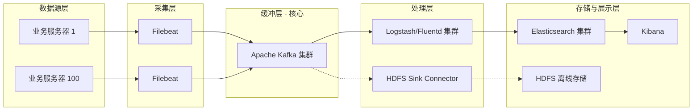

# Kafka 日志收集架构设计案例

本案例旨在为 100 台服务器规模的日志收集系统提供架构设计参考。方案基于业界成熟的 **EFK** (Elasticsearch, Filebeat, Kibana) 技术栈，重点阐述 Apache Kafka 在其中作为**核心中间件**的设计思想，以及如何基于流量模型进行科学的容量规划。

> **关联阅读**: 本设计案例基于 [Kafka 设计与实现](./Kafka%20设计与实现.md) 中的核心概念与架构原理。建议先阅读该文档以理解 Topic, Partition, Broker, Replica, KRaft 等基础术语。

---

## 1. 案例背景与需求分析

### 1.1 场景描述

在现代企业级架构中，分布式系统的日志管理是一个典型挑战。传统的“登录服务器查日志”模式已无法满足微服务架构下的运维需求。构建集中式的日志收集平台已成为基础设施的标准配置。

本案例假设我们需要为 **100 台业务服务器** 构建一个高可用的日志收集平台。这些服务器运行着核心业务应用，产生的日志数据对于故障排查、业务监控、安全审计和数据分析至关重要，要求系统具备高吞吐、低延迟和高可靠性。

此外，业务部门提出了新的**离线分析需求**：除了实时的日志检索（ES），还需要将全量日志归档到 **HDFS**，用于后续的 T+1 报表统计和深度挖掘（如使用 Spark/Hive）。这一需求突显了 Kafka 作为数据枢纽的核心价值。

### 1.2 关键指标假设

为了进行有效的架构设计，我们需要将模糊的业务需求转化为可量化的技术指标（教学场景下采用较高负载假设以突显设计难点）：

- **基础设施**: 100 台业务服务器 (Source)
- **日志产出率 (QPS)**: 单机平均 1,000 条/秒，峰值 3,000 条/秒
- **日志大小**: 平均 1 KB/条
- **数据生命周期**: Kafka 层保留 3 天（作为缓冲和短期回溯），ES 层保留 30 天（作为搜索和长期存储）

基于以上假设，我们可以推导出核心流量指标：

- **集群总写入 QPS**: 平均 100,000 QPS，峰值 300,000 QPS
- **集群总写入带宽**:
  - **平均流量**: 100 MB/s (约 800 Mbps)
  - **峰值流量**: 300 MB/s (约 2.4 Gbps)

### 1.3 核心技术挑战分析

基于上述指标，本系统面临以下三大技术挑战：

1. **网络瓶颈风险**: 峰值 300 MB/s 的写入流量，叠加 2 副本复制（Replication）产生的内部流量，集群总网络吞吐将达到 **600 MB/s (4.8 Gbps)**。千兆网络环境将无法支撑，必须规划万兆网络。
2. **I/O 压力巨大**: 持续的高并发写入对磁盘子系统提出严峻考验。如果磁盘 I/O 成为瓶颈，将导致 Kafka 写入延迟增加，进而阻塞生产端（Filebeat），影响业务服务器性能。
3. **波峰波谷效应**: 3 倍于平均值的峰值流量（3000 QPS/s）要求系统具备强大的**削峰填谷**能力，避免下游存储系统（Elasticsearch）被瞬间流量击穿。

---

## 2. 总体架构设计

基于挑战分析，我们采用 **Filebeat + Kafka + Logstash + Elasticsearch + Kibana** 的分层架构。

### 2.1 数据流向图 (Mermaid)



### 2.2 物理部署架构图

以下展示了在 100 台服务器规模下的具体物理部署与网络拓扑。考虑到 Kafka 3.6.x 基线版本，推荐使用 **KRaft 模式**（移除 ZooKeeper 依赖）以简化运维并提升元数据管理性能。

```text
Source: 100x Servers (Filebeat)
     │
     │ Log Streams (100-300 MB/s)
     ▼
[ Network: 10Gbps Switch Backbone ]
     │
     │ Distribution (Round Robin / Hash)
     ▼
+-----------------------------------------------------------------------------------------------------------------------------------+
|  Apache Kafka Cluster (KRaft Mode, 5 Nodes)                                                                                       |
|                                                                                                                                   |
|  +---------------------+   +---------------------+   +---------------------+   +---------------------+   +---------------------+  |
|  | Node-1              |   | Node-2              |   | Node-3              |   | Node-4              |   | Node-5              |  |
|  |                     |   |                     |   |                     |   |                     |   |                     |  |
|  |  [ Controller ] <=======> [ Controller ] <=======> [ Controller ]       |   |                     |   |                     |  |
|  |  (Quorum)           |   | (Quorum)            |   | (Quorum)            |   |                     |   |                     |  |
|  |      │ Metadata     |   |      │              |   |      │              |   |                     |   |                     |  |
|  |      ▼ Sync         |   |      ▼              |   |      ▼              |   |                     |   |                     |  |
|  |  [ Broker ]         |   |  [ Broker ]         |   |  [ Broker ]         |   |  [ Broker ]         |   |  [ Broker ]         |  |
|  |      │              |   |      │              |   |      │              |   |      │              |   |      │              |  |
|  |      ▼ Write        |   |      ▼ Write        |   |      ▼ Write        |   |      ▼ Write        |   |      ▼ Write        |  |
|  |  [ Partition-A ]    |   |  [ Partition-A ]    |   |  [ Partition-B ]    |   |  [ Partition-B ]    |   |  [ Partition-C ]    |  |
|  |  (Leader)  =========|=====> (Follower)        |   |  (Leader)  =========|=====> (Follower)        |   |  (Leader)           |  |
|  |                     |   |                     |   |                     |   |                     |   |                     |  |
|  +----------+----------+   +----------+----------+   +----------+----------+   +----------+----------+   +----------+----------+  |
|             │                         │                         │                         │                         │             |
|             ▼                         ▼                         ▼                         ▼                         ▼             |
|  [ Storage: SSD/RAID10 ]   [ Storage: SSD/RAID10 ]   [ Storage: SSD/RAID10 ]   [ Storage: SSD/RAID10 ]   [ Storage: SSD/RAID10 ]  |
|                                                                                                                                   |
+-----------------------------------------------------------------------------------------------------------------------------------+
     │                                      │
     │ Consumer Group A                     │ Consumer Group B (New)
     ▼                                      ▼
[ Logstash Cluster (20 Nodes) ]        [ HDFS Sink Connector / Flume ]
     │                                      │
     ▼                                      ▼
[ Elasticsearch ]                      [ HDFS / Data Lake ]
```

**各组件职责**：

- **Filebeat (Producer)**: 部署在业务服务器上的轻量级 Agent，负责“搬运”日志，不进行复杂处理，确保低资源占用。
- **Kafka (Broker)**: **核心缓冲层**。
  - **Topic**: 逻辑归类（如 `app-logs`）。
  - **Partition**: 物理分片，吞吐扩展的基础。
- **Logstash (Consumer A)**: 实时处理链路。负责从 Kafka 消费，执行 Grok 解析、脱敏、格式转换，最后入库 ES。
- **HDFS Sink (Consumer B)**: 离线分析链路。负责将原始日志或处理后的日志批量写入 HDFS，供 Spark/Hive 进行 T+1 分析。
- **Elasticsearch**: 搜索引擎，提供近实时的索引和查询能力。
- **Kibana**: 数据可视化仪表盘。

### 2.3 KRaft 模式下关键组件说明

1. **KRaft Controller Quorum (元数据管理)**:

   - 图中的 `Node-1`, `Node-2`, `Node-3` 组成了 Controller Quorum。
   - **作用**: 取代了传统的 ZooKeeper，负责管理集群元数据（如 Topic 配置、Partition 位置、ISR 列表）。KRaft 模式下，元数据存储在 Kafka 内部的主题中，读取更快，故障恢复更迅速。
   - **混合部署 (Combined Mode)**: 本方案中前 3 台机器同时扮演 Controller 和 Broker 角色。这种模式适合中等规模集群，能有效节省硬件成本。
   - **Metadata Sync**: Controller 通过 Raft 共识协议维护元数据一致性，并将元数据增量“推送”给集群内的所有 Broker。

2. **Broker (数据节点)**:

   - 所有 5 个节点均为 Broker。
   - **作用**: 负责处理 Produce/Consume 请求和数据持久化。
   - **负载均衡**: 5 个节点通过分区机制共同分担 300 MB/s 的峰值流量。

3. **Partition Leader/Follower (数据复制)**:
   - **Leader**: 核心读写节点。**Producer** 的写入请求**必须**发送给 Leader；**Consumer** 的读取请求**默认**也由 Leader 处理。
   - **Follower**: 数据冗余节点。核心职责是从 Leader 拉取数据保持同步。
     - _注_: Kafka 2.4+ 虽然支持 Consumer 从 Follower 读取数据（Follower Fetching）以降低跨可用区流量，但在本案例的局域网部署中，Follower 主要作为热备。
   - **Failover**: 当 Leader 宕机时，Controller 会从 ISR (In-Sync Replicas) 集合中选举新 Leader 实现故障转移。

---

## 3. Kafka 在 EFK 架构中的核心价值

在本架构中，Kafka 不仅仅是管道，更是系统的**稳定器**和**解耦器**。

### 3.1 削峰填谷 (Peak Shaving)

业务日志流量具有明显的“脉冲”特性（如整点秒杀）。

- **风险**: 若无 Kafka，峰值 300 MB/s 的流量直接冲击 Logstash（解析消耗 CPU）和 Elasticsearch（写入消耗 I/O），极易导致下游系统 OOM 或拒绝服务。
- **机制**: Kafka 基于磁盘顺序写，写入性能极高。它能以极低的延迟“吃下”峰值流量，让下游 Logstash 按照自己的最佳处理速率（如 100 MB/s）平滑消费，从而保护后端系统。

### 3.2 生产与消费解耦 (Decoupling)

- **维护隔离**: 当 Logstash 或 ES 需要停机维护/升级时，Filebeat 无需停止采集。数据会暂时堆积在 Kafka 的磁盘 Partition 中（支持 TB 级积压），待后端恢复后，消费者通过 Offset 机制自动追平数据。
- **多路分发 (Multi-Path Distribution)**:
  - **机制**: 利用 Kafka 的 **Consumer Group** 机制。
  - **原理**: Kafka 允许同一份数据被多个不同的 Consumer Group 订阅。每个 Group 维护自己独立的 Offset（消费进度）。
  - **应用**: 在本案中，Logstash 集群属于 `Group A`，HDFS Sink 属于 `Group B`。它们可以同时消费同一个 `app-logs` Topic，互不影响。即使 HDFS 写入变慢或停止，也不会影响 ES 的实时数据消费。

### 3.3 数据可靠性保障 (Reliability)

日志数据虽然不如交易数据敏感，但大规模丢失也会影响故障定界。

- **ACK 机制**: Producer 可配置 `acks=1` (Leader 确认) 或 `acks=all` (ISR 全部确认) 来平衡性能与可靠性。本场景建议 `acks=1` 兼顾吞吐与基础可靠性。
- **多副本机制**: 通过配置 `replication.factor=2`，确保任意一份数据都有两个副本。即使一台 Broker 磁盘损坏，数据依然可从副本恢复。

---

## 4. 容量规划与架构推演

如何设计 Kafka 集群以承载 **100 MB/s (平均) ~ 300 MB/s (峰值)** 的流量？

### 4.1 带宽与网络规划

- **需求**: 峰值写入带宽 300 MB/s。考虑到 2 副本复制（Replication Factor = 2），数据需要被复制一份，因此集群内部交换机流量会翻倍，达到约 **600 MB/s (4.8 Gbps)**。
- **设计**:
  - **必须使用万兆网卡 (10 Gbps)**。千兆网络 (1 Gbps ≈ 125 MB/s) 甚至无法承载单副本的峰值写入，会成为致命瓶颈。
  - **机架感知**: Broker 节点应尽量分布在不同的机架 (Rack) 上，利用 Kafka 的 `rack.id` 特性，防止因单个机架交换机故障导致所有副本同时不可用。

### 4.2 磁盘吞吐与容量规划

- **吞吐需求**: Kafka 虽然是顺序写，但在高并发下（多 Partition 同时写入）磁盘磁头调度仍有压力。
- **容量计算**:
  - **日增数据量**: `100 MB/s × 3600 × 24 ≈ 8.6 TB/天`
  - **基础存储 (3 天)**: `8.6 TB × 3 ≈ 25.8 TB`
  - **总容量 (含 2 副本)**: `25.8 TB × 2 = 51.6 TB`
- **设计**:
  - **磁盘类型**: 推荐使用 **SSD** 或多块 HDD 组建 **RAID 10**。虽然 Kafka 顺序写对 HDD 友好，但 SSD 能显著降低 ZooKeeper/KRaft 元数据操作延迟，并提升 Consumer 追赶数据的读取性能。
  - **单机容量**: 51.6 TB / 5 台 ≈ 10 TB/台。建议每台机器配置 12 TB 以上存储空间。

### 4.3 Broker 节点数量估算

经验公式：`Broker 数量 = max(流量需求 / 单机网卡上限, 存储需求 / 单机磁盘上限)`

- **流量视角**: 峰值 600 MB/s 总流量。若单机 10 Gbps (1.25 GB/s)，理论 1 台够用，但需预留 CPU 和 IOPS 给 OS 和业务处理。
- **高可用视角**: 3 台是最小高可用集群。
- **结论**: 建议 **5 台 Broker**。
  - **分摊压力**: 每台承担约 60 MB/s 写入，负载轻松。
  - **容灾能力**: 允许同时宕机 1-2 台而不影响服务集群可用性。

### 4.4 Topic 分区 (Partition) 设计

分区数是 Kafka **并发吞吐**的核心单位。

- **计算逻辑**:
  - 期望峰值吞吐: 300 MB/s。
  - 假设单个 Partition 的物理写入上限约为 10-20 MB/s (受限于单盘 I/O)。
  - `分区数 ≥ 总吞吐 / 单分区吞吐` => `300 / 15 ≈ 20`。
- **消费者并发**: 下游 Logstash 实例数通常与分区数 1:1 或 1:N 对应。
- **设计结论**: 建议设置 **20 ~ 30 个 Partition**。
  - 这既能满足 300 MB/s 的写入，也允许下游部署 20 个 Logstash 实例进行并行消费。
  - _注意_: 不要设置过大（如上千），过多的 Partition 会增加 Controller 的元数据管理负担和节点故障时的恢复时间。

---

## 5. 关键配置参数建议

为了匹配上述设计，Kafka 服务端 (`server.properties`) 需要关注以下优化参数：

| 参数项                            | 建议值  | 说明                                                                        |
| :-------------------------------- | :------ | :-------------------------------------------------------------------------- |
| `num.io.threads`                  | 8 ~ 16  | 负责磁盘 I/O 的线程数，建议设置为磁盘数或 CPU 核数的倍数                    |
| `num.network.threads`             | 6 ~ 9   | 负责处理网络请求的线程数，应对高并发连接                                    |
| `log.flush.scheduler.interval.ms` | 3000    | 适当延长刷盘间隔，充分利用 OS Page Cache 提升写入吞吐（Kafka 的高性能秘诀） |
| `socket.send.buffer.bytes`        | 1024000 | 增大网络发送缓冲区，适应高吞吐传输                                          |
| `socket.receive.buffer.bytes`     | 1024000 | 增大网络接收缓冲区                                                          |
| `auto.create.topics.enable`       | false   | **禁止自动创建 Topic**，防止异常 Topic 泛滥，强制规范化管理                 |
| `unclean.leader.election.enable`  | false   | **禁止非 ISR 选举**。宁可服务短时不可用，也不允许数据丢失（数据一致性优先） |
| `log.retention.hours`             | 72      | 强制数据保留 3 天，过期自动清理释放磁盘                                     |

---

## 6. 总结 (Summary)

针对 100 台服务器、峰值 300 MB/s 的日志收集需求，我们设计了一个高吞吐、高可用的架构方案：

1. **架构模式**: 采用 **KRaft 模式** 的 Kafka 集群，移除 ZooKeeper 依赖，简化运维。
2. **集群规模**: **5 节点** 混合部署（3 Controller + 5 Broker），兼顾性能与成本。
3. **网络设施**: 必须部署 **万兆网络 (10Gbps)** 以消除带宽瓶颈。
4. **存储规划**: 预留 **50 TB+** 容量，采用 2 副本策略保障数据安全。
5. **核心模型**: 设计 **20+ Partition**，充分利用 Kafka 的并行读写能力实现削峰填谷。

该方案能够稳健地承载业务流量洪峰，并为下游的日志分析提供可靠的数据管道。
