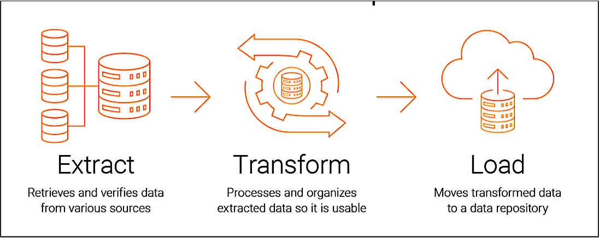

# 从 ETL 到流式计算：理论与实践入门

## 第一部分：基础概念篇

基础概念篇作为本课程的入门章节，旨在为学习者建立完整的流式计算理论体系和认知框架。本部分从典型应用案例出发，通过具体场景理解不同数据处理技术的实际应用，然后系统阐述从传统批处理到现代流式计算的理论变迁、技术突破和范式转换。

通过本部分的学习，读者将能够：

1. 通过典型案例理解不同数据处理技术的应用场景
2. 理解数据处理技术发展的历史必然性和内在逻辑
3. 掌握流式计算的核心概念和理论基础
4. 建立批处理与流式处理的对比分析框架
5. 为后续技术学习和实践应用奠定坚实的理论根基

本部分采用"从具体到抽象"的叙述逻辑，首先通过典型案例建立直观认识，然后回顾技术发展历程，最后深入核心概念。这种结构设计有助于读者构建系统化的知识体系。

## 第 1 章 典型应用案例解析

本章通过三个典型的实际应用案例，分别展示批处理、分布式批处理和流式计算在不同业务场景下的具体应用。每个案例都详细分析数据来源、ETL 处理流程、技术实现和业务价值，帮助读者建立对数据处理技术的直观认识和场景理解。

通过具体案例的学习，读者将能够更好地理解后续章节中技术演进的内在逻辑和理论价值，为深入学习流式计算奠定坚实的实践基础。

### 1.1 银行日终批处理系统案例

商业银行每日需要处理大量的金融交易数据，包括存款、取款、转账、贷款、信用卡交易等。这些交易数据需要在日终时进行完整的清算、对账和报表生成，确保财务数据的准确性和完整性。

以下是一个**典型的场景 - 跨行转账对账**：

某全国性商业银行每日处理超过 1000 万笔跨行转账交易，涉及金额超过 500 亿元人民币。这些交易通过银联、网联、央行支付系统等多个渠道进行，需要在日终时完成：

- 与各支付渠道的交易明细核对
- 内部账户的借贷平衡检查
- 手续费和结算资金的计算
- 监管报表的生成和报送
- 异常交易的排查和处理

此类批处理作业通常需要在 4-6 小时的夜间窗口期内完成，对数据处理的速度、准确性和可靠性要求极高。

> 说明：上述交易规模与金额为教学示例，用于说明典型处理压力与工程考量，具体数值因机构与业务而异。

#### 1.1.1 跨行转账对账数据来源分析

跨行转账对账涉及多个系统的数据整合，包括核心交易系统、各渠道系统、外部支付系统和基础数据系统。

**1. 核心交易系统 - 内部转账记录**：

- **来源系统**：银行核心业务系统（Oracle 数据库）
- **对账用途**：提供银行内部的跨行转账交易流水记录
- **关键数据表**：

  ```sql
  -- 核心系统转账交易表（实际生产表结构）
  CREATE TABLE core_transfer_transactions (
      trans_seq_no VARCHAR(24) PRIMARY KEY,   -- 交易流水号（银行内部）
      payer_acct_no VARCHAR(19),              -- 付款人账号
      payer_acct_name VARCHAR(60),            -- 付款人名称
      payee_acct_no VARCHAR(19),              -- 收款人账号
      payee_acct_name VARCHAR(60),            -- 收款人名称
      trans_amount DECIMAL(16,2),             -- 交易金额
      trans_currency CHAR(3),                 -- 交易币种
      trans_date CHAR(8),                     -- 交易日期（YYYYMMDD）
      trans_time CHAR(6),                     -- 交易时间（HHMMSS）
      channel_type CHAR(2),                   -- 渠道类型：01-柜面, 02-网银, 03-手机银行
      trans_status CHAR(1),                   -- 交易状态：S-成功, F-失败, P-处理中
      settle_date CHAR(8),                    -- 清算日期
      created_time TIMESTAMP                  -- 记录创建时间
  );
  ```

**2. 渠道系统 - 各渠道转账数据**：

- **来源系统**：网银系统、手机银行系统、ATM 系统
- **对账用途**：提供各渠道发起的跨行转账交易明细
- **数据接口示例**（手机银行系统提供的 TXT 文件）：

  ```text
  # 手机银行跨行转账文件格式
  HEAD|20231208|MOBILE_BANK|100025|20231208143000
  DETAIL|2023120800001|62220200010001|张三|62220200020002|李四|5000.00|CNY|20231208|143025|S|
  DETAIL|2023120800002|62220200030003|王五|62220200040004|赵六|3000.00|CNY|20231208|150112|S|
  TAIL|2|8000.00|
  ```

**3. 外部支付系统 - 清算机构对账文件**：

- **来源系统**：银联 CUPS 系统、网联 NUCC 系统、央行支付系统
- **对账用途**：提供支付清算机构的官方对账文件，用于核对交易
- **文件格式特点**：

  - 银联：ISO8583 二进制格式 + XML 对账文件
  - 网联：JSON/XML 实时接口 + CSV 对账文件
  - 央行：定长文本格式 + 专用加密协议
  - **示例（银联对账文件片段）**：

  ```xml
  <ReconciliationFile>
    <FileHeader>
      <Version>1.0</Version>
      <InstitutionCode>102100000099</InstitutionCode>
      <SettleDate>20231208</SettleDate>
    </FileHeader>
    <Transaction>
      <TransSeq>2023120800000001</TransSeq>
      <AcctNo>62220200010001</AcctNo>
      <TransAmt>5000.00</TransAmt>
      <TransTime>20231208143025</TransTime>
      <RespCode>00</RespCode>
    </Transaction>
  </ReconciliationFile>
  ```

**4. 基础数据 - 对账参考数据**：

- **来源系统**：客户信息系统、账户管理系统、费率管理系统
- **对账用途**：提供账户验证、客户信息匹配、手续费计算等基础数据
- **关键数据表**：

  ```sql
  -- 账户信息表（对账时用于账户验证）
  CREATE TABLE account_base_info (
      acct_no VARCHAR(19) PRIMARY KEY,       -- 账号
      acct_name VARCHAR(60),                 -- 账户名称
      acct_type CHAR(2),                     -- 账户类型：01-个人, 02-对公
      acct_status CHAR(1),                   -- 账户状态：A-正常, F-冻结, C-销户
      branch_no VARCHAR(9),                   -- 开户行号
      currency CHAR(3),                       -- 账户币种
      open_date DATE,                         -- 开户日期
      last_trans_date DATE                    -- 最后交易日期
  );
  ```

#### 1.1.2 跨行转账对账数据存储架构

跨行转账对账采用分层存储架构，包括操作型数据存储、对账处理数据库、数据仓库和文件存储系统，以满足不同的数据处理和存储需求。

**1. 操作型数据存储（ODS） - Oracle/MySQL 集群**：

- **用途**：整合来自核心系统、各渠道（网银、手机银行、ATM）、外部支付系统（银联、网联）的交易数据
- **具体实现**：
  - 建立统一的交易视图表：`ods_unified_transactions`
  - 按渠道和日期分表存储，支持快速查询
  - 保留最近 7 天的交易数据供对账使用

**2. 对账处理数据库 - PostgreSQL 集群**：

- **用途**：专门处理对账业务逻辑，存储对账中间结果和最终结果
- **具体实现**：
  - 对账任务表：`recon_tasks` - 管理对账任务状态和进度
  - 交易匹配表：`trans_match_results` - 存储内部交易与外部交易的匹配结果
  - 差异交易表：`diff_transactions` - 记录无法匹配的交易明细
  - 支持实时对账状态监控和重试机制

**3. 数据仓库 - Greenplum/Teradata**：

- **用途**：存储历史对账结果，支持监管报表和业务分析
- **具体实现**：
  - 事实表：`fact_reconciliation` - 存储每日对账汇总结果
  - 维度表：`dim_channel`, `dim_trans_type` - 支持多维分析
  - 保留至少 13 个月的历史数据；实际保留周期依监管与内控要求确定（在某些场景可能需要 5 年或更长）

**4. 文件存储 - HDFS 集群**：

- **用途**：归档原始对账文件和外部系统提供的对账文件
- **具体实现**：
  - 按`/reconciliation/原始文件/渠道/日期/`目录结构存储
  - 保留原始文件用于审计和争议处理
  - 支持 Spark 直接读取处理大批量文件

**对账核心表结构示例**：

```sql
-- 对账结果表
CREATE TABLE reconciliation_results (
    batch_date DATE,                     -- 对账批次日期
    channel VARCHAR(20),                 -- 交易渠道
    internal_count INT,                  -- 内部交易笔数
    external_count INT,                  -- 外部交易笔数
    internal_amount DECIMAL(18,2),       -- 内部交易金额
    external_amount DECIMAL(18,2),       -- 外部交易金额
    diff_count INT,                      -- 差异笔数
    diff_amount DECIMAL(18,2),           -- 差异金额
    recon_status VARCHAR(10),            -- 对账状态
    process_time TIMESTAMP               -- 处理时间
);
```

#### 1.1.3 ETL 处理流程详解

跨行转账对账的 ETL 处理流程遵循经典的数据集成范式，涵盖数据抽取（Extract）、转换（Transform）和加载（Load）三个核心阶段，构成完整的端到端数据处理链路：数据源系统 → 数据抽取 → 数据转换 → 数据加载 → 存储系统 → 业务应用输出。



**一. 抽取（Extract）阶段**：跨行转账对账的数据抽取需要从多个异构数据源获取交易数据。

1. **核心系统数据库抽取**：

   - 从 Oracle 核心系统数据库中抽取当日所有跨行转账交易记录
   - 使用 SQL 查询过滤出状态为成功的交易：`WHERE TRANS_STATUS = 'S' AND SETTLE_DATE = '20231208'`
   - 采用增量抽取策略，只抽取清算日期为当日的交易数据

2. **渠道系统文件抽取**：

   - 通过 SFTP 协议从各渠道系统（网银、手机银行）服务器下载对账文件
   - 文件命名规范：`渠道类型_对账日期.txt`，如 `MOBILE_BANK_20231208.txt`
   - 文件格式验证：检查文件头、记录数、金额汇总等完整性校验

3. **外部系统对账文件获取**：
   - 从银联、网联等支付清算机构下载官方对账文件
   - 支持多种格式：XML、CSV、定长文本文件
   - 文件解密和解压处理（如需）

**二、转换（Transform）阶段**：转换阶段是跨行转账对账的核心，主要包括以下处理步骤。

1. **数据清洗与标准化**：

   - 去除重复交易记录（基于交易流水号去重）
   - 过滤状态异常的交易（失败、冲正、撤销的交易）
   - 标准化数据格式：统一日期时间格式、金额格式、渠道编码

2. **币种转换处理**：

   - 所有外币交易统一转换为人民币（CNY）进行对账
   - 使用当日官方汇率进行货币兑换
   - 保留原始币种金额和转换后金额供审计使用

3. **交易数据关联**：

   - 关联交易数据与账户基本信息（账户状态验证）
   - 关联客户信息（反洗钱监控需要）
   - 关联费率信息（手续费计算）

4. **对账关键处理**：
   - 内部交易与外部交易流水号匹配
   - 金额一致性校验（允许 ±0.01 元的 rounding 差异）
   - 渠道交易汇总与外部对账文件汇总核对

**三、加载（Load）阶段**：加载阶段将对账结果持久化到不同的存储系统中。

1. **对账结果加载**：

   - 将对账汇总结果加载到对账结果表，供业务人员查询
   - 记录对账状态（平衡/不平衡）、差异金额、处理时间等信息

2. **数据仓库加载**：

   - 将明细交易数据加载到数据仓库 ODS 层
   - 更新数据仓库事实表和维度表
   - 生成历史数据归档

3. **监管报表生成**：

   - 生成人民银行要求的支付业务统计报表
   - 生成银监会要求的风险管理报表
   - 生成内部管理需要的业务分析报表

4. **异常处理加载**：
   - 将无法匹配的交易记录加载到差异交易表
   - 记录差异原因和处理状态
   - 供后续人工干预和异常处理使用

#### 1.1.4 ETL 实现工具与技术栈

在实际的银行日终批处理场景中，ETL 处理通常采用以下工具组合：

**1. 数据库工具**：

- **代表性工具**：Oracle Data Integrator, SQL Server SSIS
- **主要用途**：数据库之间的数据抽取和加载
- **跨行转账对账应用**：核心系统 Oracle 数据库与对账 PostgreSQL 数据库间数据同步

**2. 大数据工具**：

- **代表性工具**：`Apache Sqoop`, Apache NiFi, DataX
- **主要用途**：大数据平台与关系数据库之间的数据交换
- **跨行转账对账应用**：从核心系统 Oracle 数据库抽取千万级跨行转账交易数据

**3. 文件处理工具**：

- **代表性工具**：Apache Camel, MuleSoft
- **主要用途**：文件格式转换和传输处理
- **跨行转账对账应用**：处理银联 XML 对账文件转换为标准 CSV 格式供对账使用

**4. 调度工具**：

- **代表性工具**：`Apache Airflow`, DolphinScheduler
- **主要用途**：ETL 任务编排和自动化调度
- **跨行转账对账应用**：调度跨行转账对账全流程，管理文件下载、数据清洗、对账匹配等任务依赖

在跨行转账对账的具体实践中，我们可以采用如下工具组合：

1. **数据抽取层**：使用 Sqoop 从 Oracle/DB2 数据库抽取交易数据，SFTP 客户端获取渠道系统文件
2. **数据处理层**：采用 Python/Spark 进行数据清洗和转换，SQL 进行复杂业务逻辑处理
3. **任务调度层**：通过 Airflow 编排整个对账流程，管理任务依赖和错误重试

#### 1.1.5 技术实现特点以及局限性

基于跨行转账对账的业务场景，其 ETL 处理流程围绕数据抽取、转换和加载三个核心阶段构建，展现出以下关键的技术实现特征：

| **特性维度**   | **具体描述**                           | **技术影响**                               |
| -------------- | -------------------------------------- | ------------------------------------------ |
| **处理模式**   | 定时批量处理，通常在夜间业务低峰期执行 | 避免对在线业务系统产生影响，但导致处理延迟 |
| **处理窗口**   | 4-8 小时的处理时间窗口                 | 需要在有限时间内完成所有数据处理任务       |
| **数据规模**   | GB 到 TB 级别的日交易数据量            | 对存储和计算资源有较高要求                 |
| **可靠性要求** | 必须保证数据处理的完整性和准确性       | 需要完善的错误处理和重试机制               |
| **错误处理**   | 完善的异常处理和数据重跑机制           | 确保数据处理失败后能够重新执行             |

尽管传统 ETL 技术在批处理场景中表现成熟，但随着业务实时性要求的提升，其固有的技术局限性逐渐显现，主要体现在以下几个方面：

| **局限性类别**   | **具体表现**                   | **业务影响**         |
| ---------------- | ------------------------------ | -------------------- |
| **时效性局限**   | T+1 的数据处理延迟             | 无法实时反映业务状况 |
|                  | 无法实时反映业务状况           | 决策基于历史数据     |
| **资源利用局限** | 夜间集中处理导致资源使用峰值   | 资源利用率不均衡     |
|                  | 日间资源闲置，夜间资源紧张     | 硬件投资回报率低     |
| **灵活性局限**   | 处理逻辑变更需要重新开发部署   | 业务需求响应慢       |
|                  | 代码修改和测试周期长           | 无法快速适应市场变化 |
| **实时能力局限** | 无法支持实时风险监控和客户服务 | 错过实时业务机会     |
|                  | 缺乏实时数据处理能力           | 客户体验受限         |

正是由于传统 ETL 技术在实时性方面的这些局限性，催生了流式计算技术的发展。流式计算通过实时处理数据流，能够有效弥补批处理 ETL 的不足，为业务提供更及时的数据支持和决策依据。

### 1.2 电商用户行为分析案例

大型电商平台每日需要处理数亿级别的用户行为数据，包括页面浏览、商品点击、搜索查询、加购收藏、下单支付等全链路用户行为。这些数据需要通过分布式批处理技术进行分析，以支持用户行为分析、商品推荐优化、运营决策等核心业务场景。

以下是一个**典型的场景 - 用户行为离线分析**：

某头部电商平台每日产生超过 5 亿条用户行为日志，涉及 1 亿+活跃用户和 1000 万+商品 SKU。这些数据需要在夜间批处理窗口期内完成分析处理，以支持：

- 用户行为模式分析和用户分群
- 商品热度统计和关联规则挖掘
- 营销活动效果评估和优化
- 用户生命周期价值分析
- 业务报表和决策支持

此类数据处理作业需要在有限的时间内处理海量数据，对数据处理的吞吐量、可靠性和扩展性要求极高。

> 说明：上述数据规模为教学示例，旨在说明分布式批处理的工程挑战，实际规模依平台与业务差异较大。

#### 1.2.1 用户行为数据来源分析

用户行为分析涉及多个数据源的整合，包括用户行为日志、交易数据、用户画像和商品数据。

**1. 用户行为日志系统 - 点击流数据**：

- **来源系统**：Nginx/Apache Web 服务器日志、客户端埋点 SDK、移动端数据采集
- **分析用途**：提供用户的浏览、点击、搜索、加购、收藏等全链路行为数据
- **关键数据格式**：

  ```json
  // 用户行为事件格式（JSON）
  {
    "event_id": "20231208143025_123456789",
    "user_id": "u1000012345",
    "session_id": "s9876543210",
    "event_type": "page_view",
    "event_time": "2023-12-08T14:30:25.123Z",
    "page_url": "/product/1000001234",
    "referrer_url": "/search?q=手机",
    "device_type": "mobile",
    "browser": "Chrome",
    "ip_address": "192.168.1.100"
  }
  ```

**2. 交易数据系统 - 订单行为数据**：

- **来源系统**：订单系统、支付系统、售后系统数据库（MySQL/PostgreSQL）
- **分析用途**：提供用户的购买、支付、退款、退货等交易行为数据
- **关键数据表**：

  ```sql
  -- 订单事实表（生产环境结构）
  CREATE TABLE fact_orders (
      order_id BIGINT PRIMARY KEY,          -- 订单ID
      user_id VARCHAR(20),                  -- 用户ID
      product_id VARCHAR(20),               -- 商品ID
      order_amount DECIMAL(10,2),          -- 订单金额
      order_status VARCHAR(10),             -- 订单状态：pending/paid/shipped/completed/refunded
      order_time TIMESTAMP,                -- 下单时间
      pay_time TIMESTAMP,                   -- 支付时间
      channel VARCHAR(20),                  -- 渠道来源：web/app/mini_program
      promotion_id VARCHAR(20),             -- 促销活动ID
      coupon_amount DECIMAL(10,2),         -- 优惠券金额
      shipping_fee DECIMAL(10,2),           -- 运费
      actual_pay_amount DECIMAL(10,2)       -- 实付金额
  );
  ```

**3. 用户画像系统 - 用户特征数据**：

- **来源系统**：用户画像系统、CRM 系统、会员系统
- **分析用途**：提供用户的 demographic 信息、偏好标签、价值分层、行为特征
- **关键数据格式**：

  ```json
  // 用户画像数据格式
  {
    "user_id": "u1000012345",
    "demographic": {
      "age": 28,
      "gender": "male",
      "city": "北京",
      "education": "本科",
      "income_level": "middle"
    },
    "preference_tags": [
      { "tag": "electronics", "score": 0.85, "update_time": "2023-12-08" },
      { "tag": "sports", "score": 0.65, "update_time": "2023-12-07" }
    ],
    "shopping_behavior": {
      "avg_order_value": 256.5,
      "purchase_frequency": 2.3,
      "last_purchase_date": "2023-12-07",
      "favorite_categories": ["手机", "电脑", "运动装备"]
    },
    "lifetime_value": 12580.5
  }
  ```

**4. 商品数据系统 - 商品特征数据**：

- **来源系统**：商品管理系统、库存系统、类目系统、价格系统
- **分析用途**：提供商品属性、类目、价格、库存状态、促销信息等
- **关键数据表**：

  ```sql
  -- 商品维度表（生产环境结构）
  CREATE TABLE dim_products (
      product_id VARCHAR(20) PRIMARY KEY,   -- 商品ID
      product_name VARCHAR(200),           -- 商品名称
      category_id VARCHAR(10),             -- 类目ID
      category_name VARCHAR(50),            -- 类目名称
      brand VARCHAR(50),                    -- 品牌
      price DECIMAL(10,2),                 -- 价格
      original_price DECIMAL(10,2),        -- 原价
      sales_volume INT,                     -- 销量
      stock_quantity INT,                   -- 库存数量
      avg_rating DECIMAL(3,2),             -- 平均评分
      review_count INT,                     -- 评价数量
      is_on_promotion BOOLEAN,              -- 是否促销
      promotion_price DECIMAL(10,2),        -- 促销价格
      update_time TIMESTAMP                 -- 更新时间
  );
  ```

#### 1.2.2 用户行为数据存储架构

用户行为分析采用分层存储架构，包括数据湖、数据仓库、分析数据库和文件存储系统，以满足不同层次的数据处理和分析需求。

**1. 数据湖层 - HDFS/S3 分布式存储**：

- **用途**：存储原始用户行为日志和业务数据，保留完整的历史数据
- **具体实现**：
  - 按日期分区存储：`/user_behavior/raw_logs/date=20231208/`
  - 支持多种数据格式：JSON、Parquet、ORC、Avro
  - 数据生命周期管理：热数据（30 天）、温数据（90 天）、冷数据（1 年+）
  - 保留原始数据用于审计、回溯分析和机器学习训练

**2. 数据仓库层 - Hive/Spark 数仓**：

- **用途**：存储清洗、转换和集成后的分析数据，支持即席查询和报表生成
- **具体实现**：
  - 标准分层架构：ODS（操作数据层）→ DWD（明细数据层）→ DWS（汇总数据层）→ ADS（应用数据层）
  - 按主题域组织数据：用户行为域、商品域、交易域、营销域
  - 支持 SQL 查询和 BI 工具直接连接
  - 数据质量监控和元数据管理

**3. 分析数据库层 - ClickHouse/StarRocks**：

- **用途**：存储预计算的分析结果，支持高性能 OLAP 查询
- **具体实现**：
  - 用户行为分析结果表、商品热度表、用户分群表
  - 支持实时数据更新和高并发查询
  - 与 BI 工具和可视化平台深度集成

**用户行为分析核心表结构**：

```sql
-- 用户行为分析结果表（生产环境）
CREATE TABLE user_behavior_analysis (
    analysis_date DATE,                     -- 分析日期
    user_id VARCHAR(20),                   -- 用户ID
    pv_count INT,                          -- 页面浏览量
    uv_count INT,                          -- 独立访客数
    click_count INT,                       -- 点击次数
    add_to_cart_count INT,                 -- 加购次数
    favorite_count INT,                    -- 收藏次数
    session_count INT,                     -- 会话数
    avg_session_duration INT,              -- 平均会话时长（秒）
    bounce_rate DECIMAL(5,4),              -- 跳出率
    conversion_rate DECIMAL(5,4),         -- 转化率
    favorite_categories TEXT,              -- 偏好类目（JSON数组）
    top_search_keywords TEXT,              -- 热门搜索关键词
    device_distribution TEXT,              -- 设备分布
    hour_distribution TEXT,                -- 时段分布
    update_time TIMESTAMP,                 -- 更新时间
    PRIMARY KEY (analysis_date, user_id)
) ENGINE = ReplacingMergeTree(update_time)
ORDER BY (analysis_date, user_id);
```

#### 1.2.3 分布式批处理与近实时处理流程

用户行为分析采用混合处理架构，同时支持分布式批处理和近实时处理两种模式，满足不同时效性要求的业务场景：

- **批处理模式**：数据延迟在小时级别，适用于 T+1 报表和深度分析
- **近实时模式**：数据延迟在分钟级别，适用于实时监控和即时分析

**混合处理架构图**：

```text
┌─────────────────────────────────────────────────────────────────────────┐
│                       数据源系统 (Data Sources)                           │
├─────────────────┬───────────────────┬─────────────────┬─────────────────┤
│ 用户行为日志系统   │  交易数据系统       │  用户画像系统     │  商品数据系统     │
│  (Nginx/Apache) │(MySQL/PostgreSQL) │   (MySQL/Redis) │   (MySQL/HBase) │
└────────┬────────┴────────┬──────────┴────────┬────────┴────────┬────────┘
         │                 │                   │                 │
         ▼                 ▼                   ▼                 ▼
┌─────────────────────────────────────────────────────────────────────────┐
│                       数据采集层 (Data Ingestion)                         │
├─────────────────┬─────────────────┬─────────────────┬───────────────────┤
│   Flume Agent   │   Kafka Connect │   Kafka Connect │   Debezium CDC    │
│  (日志采集)      │  (数据库同步)     │  (数据库同步)     │  (数据库变更捕获)   │
└────────┬────────┴────────┬────────┴────────┬────────┴────────┬──────────┘
         │                 │                 │                 │
         ▼                 ▼                 ▼                 ▼
┌─────────────────────────────────────────────────────────────────────────┐
│                    消息队列层 (Kafka Message Queue)                       │
├─────────────────┬─────────────────┬─────────────────┬───────────────────┤
│  user_behavior  │  order_events   │  user_profile   │  product_updates  │
│     (Topic)     │     (Topic)     │     (Topic)     │      (Topic)      │
└────────┬────────┴────────┬────────┴────────┬────────┴────────┬──────────┘
         │                 │                 │                 │
         ├─────────────────┴─────────────────┴─────────────────┴───────────► 近实时处理
         │                                                                   (Spark Streaming)
         ▼
┌─────────────────────────────────────────────────────────────────────────┐
│                    分布式文件系统 (HDFS/S3)                               │
│                 ┌─────────────────────────────────┐                     │
│                 │       原始数据存储区              │                     │
│                 │  (Parquet/ORC 格式, 压缩存储)     │                     │
│                 └─────────────────────────────────┘                     │
└─────────────────────────────────┬───────────────────────────────────────┘
                                  │
                                  ▼
┌─────────────────────────────────────────────────────────────────────────┐
│                     分布式计算层 (Distributed Computing)                  │
├─────────────────┬─────────────────┬─────────────────┬───────────────────┤
│  数据清洗预处理   │  特征工程转换     │  聚合计算分析      │  复杂业务逻辑      │
│  (Spark SQL)    │  (Spark ML)     │  (MapReduce)    │  (Spark Core)     │
└────────┬────────┴────────┬────────┴────────┬────────┴────────┬──────────┘
         │                 │                 │                 │
         ▼                 ▼                 ▼                 ▼
┌─────────────────────────────────────────────────────────────────────────┐
│                        结果存储层 (Result Storage)                        │
├─────────────────┬───────────────┬───────────────────┬───────────────────┤
│  Hive 数据仓库   │  ClickHouse   │  分析结果表         │  报表数据导出       │
│  (ADS 层)       │  (OLAP 查询)   │(MySQL/PostgreSQL) │  (CSV/JSON)       │
└────────┬────────┴────────┬──────┴────────┬──────────┴────────┬──────────┘
         │                 │               │                   │
         ▼                 ▼               ▼                   ▼
┌─────────────────────────────────────────────────────────────────────────┐
│                       分析应用层 (Analysis Applications)                  │
├─────────────────┬─────────────────┬─────────────────┬───────────────────┤
│  BI 可视化工具    │  数据报表系统     │  API 接口服务    │  机器学习平台       │
│  (Tableau)      │  (自定义报表)     │  (RESTful API)  │  (特征工程)        │
└─────────────────┴─────────────────┴─────────────────┴───────────────────┘
```

**架构说明**：

- **数据流向**：自上而下，从数据源到最终应用，支持批处理和近实时双链路
- **处理阶段**：采集 → 消息队列 → 存储/实时计算 → 计算 → 存储 → 应用
- **技术栈**：Flume/Kafka Connect → Kafka → Spark Streaming/Spark Batch → Hive/ClickHouse → BI 工具
- **处理模式**：批处理（小时级延迟）+ 近实时处理（分钟级延迟）

**1. 数据采集与消息队列阶段**：用户行为数据通过多种方式采集并进入 Kafka 消息队列，实现数据缓冲和解耦。

1. **日志文件实时采集**：

   - 使用 Apache Flume 实时采集 Nginx/Apache 访问日志到 Kafka
   - Flume Source 监听日志文件变化，Channel 缓冲数据，Sink 写入 Kafka
   - 支持实时数据流和批量数据采集两种模式
   - 数据格式序列化（Avro/JSON）和压缩处理（Snappy/LZ4）

2. **数据库变更数据捕获 (CDC)**：

   - 使用 Debezium 实时捕获 MySQL/PostgreSQL 数据库变更事件
   - 基于数据库日志（binlog/WAL）的变更数据捕获，零侵入性
   - 支持全量快照和增量变更两种数据同步模式
   - 保证事务一致性与至少一次投递；端到端 Exactly-Once 需在处理与写入环节通过幂等/事务机制实现

3. **Kafka 消息队列配置**：
   - **Topic 分区策略**：按用户 ID、商品 ID 等业务键进行分区，保证相同键的数据进入同一分区
   - **数据保留策略**：根据数据重要性设置不同的保留时间（7 天-30 天）
   - **副本机制**：配置 3 副本保证数据高可用性
   - **监控告警**：集成 Prometheus 监控 Kafka 集群健康状态

**2. 分布式计算阶段**：计算阶段支持批处理和近实时两种模式，满足不同时效性要求的业务场景。

**2.1 近实时处理 (Spark Streaming)**：

1. **实时数据消费与处理**：

   - 使用 Spark Structured Streaming 消费 Kafka 主题数据
   - 支持多种处理模式：微批处理（1-30 秒窗口）和连续处理（毫秒级延迟）
   - 实时数据清洗和格式转换，处理异常数据和脏数据
   - 用户会话实时划分和会话属性计算

2. **实时特征计算与聚合**：

   - 实时统计指标计算：分钟级 PV/UV、实时转化率、活跃用户数
   - 滑动窗口聚合：5 分钟/1 小时滑动窗口统计
   - 实时用户行为分析和异常检测
   - 复杂事件处理（CEP）和模式匹配

3. **实时结果输出**：
   - 实时计算结果写入 ClickHouse 用于即时查询
   - 异常检测结果推送到告警系统
   - 实时用户画像更新和推荐特征刷新

**Spark Streaming 消费 Kafka 示例**：

```scala
val spark = SparkSession.builder()
  .appName("UserBehaviorAnalysis")
  .config("spark.sql.streaming.schemaInference", "true")
  .getOrCreate()

// 读取Kafka数据流
val kafkaStream = spark.readStream
  .format("kafka")
  .option("kafka.bootstrap.servers", "kafka1:9092,kafka2:9092,kafka3:9092")
  .option("subscribe", "user_behavior,order_events")
  .option("startingOffsets", "earliest")
  .load()

// 解析JSON数据
val behaviorDF = kafkaStream.selectExpr(
  "CAST(key AS STRING)",
  "CAST(value AS STRING)",
  "topic",
  "partition",
  "offset",
  "timestamp"
).withColumn("data", from_json(col("value"), schema))

// 实时处理逻辑
val resultDF = behaviorDF
  .filter(col("data.event_type").isin("page_view", "add_to_cart", "purchase"))
  .groupBy(window(col("timestamp"), "5 minutes"), col("data.user_id"))
  .agg(
    count("*").alias("event_count"),
    countDistinct("data.session_id").alias("session_count")
  )

// 输出到 ClickHouse（Structured Streaming 不支持直接 JDBC sink，使用 foreachBatch）
resultDF.writeStream
  .outputMode("update")
  .option("checkpointLocation", "/tmp/checkpoint")
  .foreachBatch { (batchDF: DataFrame, batchId: Long) =>
    batchDF.write
      .mode("append")
      .format("jdbc")
      .option("url", "jdbc:clickhouse://clickhouse:8123/default")
      .option("driver", "ru.yandex.clickhouse.ClickHouseDriver")
      .option("dbtable", "user_behavior_realtime")
      .save()
  }
  .start()
```

**2.2 批处理 (Spark Batch)**：

1. **数据清洗与预处理**：

   - 去除无效、异常和重复数据记录，保证数据质量
   - 数据格式标准化和类型转换，统一数据规范
   - 空值处理、默认值填充和异常值修正
   - IP 地址解析、User-Agent 解析等复杂字段处理

2. **数据转换与特征工程**：

   - 用户会话划分和会话属性计算（会话超时时间 30 分钟）
   - 用户行为序列生成和时序特征提取
   - 数据关联和维度退化，减少查询时的表连接
   - 用户标签计算和商品特征提取

3. **分布式聚合计算**：
   - 按用户、商品、时间、地域等多维度进行聚合计算
   - 统计指标计算：PV（页面浏览量）、UV（独立访客）、转化率、跳出率等
   - 复杂业务逻辑的 MapReduce/Spark 分布式实现
   - 数据倾斜处理和性能优化

**3. 结果存储阶段**：存储阶段将处理后的分析结果持久化到不同的存储系统中。

1. **数据仓库结果存储**：

   - 将聚合结果存储到 Hive 数据仓库的 ADS 层
   - 分区表管理和数据更新，支持增量更新
   - 统计信息收集和元数据管理，优化查询性能
   - 数据质量检查和数据血缘追踪

2. **分析结果输出与应用**：

   - 生成业务报表和统计指标，供运营和产品团队使用
   - 输出到 BI 工具（Tableau/Superset）和可视化平台
   - 数据导出和外部系统集成，支持 API 接口调用
   - 机器学习特征数据输出，支持模型训练

3. **数据归档与生命周期管理**：
   - 历史数据归档和压缩存储，降低存储成本
   - 数据生命周期管理，自动清理过期数据
   - 存储成本优化和清理策略，平衡存储成本与数据价值
   - 数据审计和合规性保证

#### 1.2.4 分布式处理工具与技术栈

在用户行为分析的分布式批处理场景中，通常采用以下工具组合：

**1. 分布式计算框架**：

- **代表性工具**：Apache Hadoop MapReduce, Apache Spark, Apache Tez
- **主要用途**：大规模数据分布式处理和计算
- **用户行为分析应用**：处理海量用户行为日志的聚合计算、复杂业务逻辑实现

**2. 数据采集与集成工具**：

- **代表性工具**：Apache Sqoop, Apache Flume, DataX, Apache NiFi
- **主要用途**：数据抽取、采集和集成处理
- **用户行为分析应用**：从数据库和文件系统采集业务数据，支持实时数据流采集

**3. 数据存储与管理工具**：

- **代表性工具**：Apache Hive, Apache HBase, Apache Kudu, ClickHouse
- **主要用途**：分布式数据存储、管理和查询
- **用户行为分析应用**：存储分析结果、支持即席查询和高性能 OLAP 分析

**4. 资源调度与任务管理工具**：

- **代表性工具**：Apache YARN, Kubernetes, Apache Airflow, Apache Oozie
- **主要用途**：集群资源管理、任务调度和工作流编排
- **用户行为分析应用**：管理分布式计算任务的资源分配，编排复杂的数据处理流水线

在用户行为分析的具体实践中，我们可以采用如下工具组合：

1. **数据采集层**：使用 Flume 实时采集用户行为日志，Sqoop 批量抽取数据库业务数据
2. **分布式处理层**：采用 Spark 进行数据清洗、转换和聚合计算，MapReduce 处理超大规模数据
3. **数据存储层**：使用 Hive 数据仓库存储处理结果，HBase 存储维度数据，ClickHouse 支持高性能查询
4. **调度管理层**：通过 YARN 管理集群资源，Airflow 编排数据处理任务依赖关系

#### 1.2.5 技术实现特点以及局限性

基于用户行为分析的业务场景，其混合处理架构（批处理 + 近实时处理）展现出以下关键的技术实现特征：

| **特性维度**   | **具体描述**                        | **技术影响**                   |
| -------------- | ----------------------------------- | ------------------------------ |
| **处理模式**   | 混合处理模式（批处理 + 近实时处理） | 同时支持离线深度分析和实时监控 |
| **处理规模**   | TB 到 PB 级别的数据处理能力         | 需要高度可扩展的分布式架构     |
| **架构特点**   | 消息队列解耦数据生产和消费          | 提高系统弹性和可维护性         |
| **计算模式**   | 移动计算到数据所在节点 + 流式计算   | 兼顾处理效率和实时性           |
| **可靠性要求** | 必须保证数据处理的完整性和准确性    | 需要完善的错误处理和重试机制   |
| **处理延迟**   | 支持秒级到天级的多级延迟处理        | 满足不同业务场景的时效要求     |

尽管分布式批处理技术在大规模数据处理中表现出色，但其固有的技术局限性也需要关注：

| **局限性类别**   | **具体表现**                     | **业务影响**                     |
| ---------------- | -------------------------------- | -------------------------------- |
| **时效性局限**   | 秒级到分钟级的实时性要求无法满足 | 无法实现真正的实时监控和即时决策 |
|                  | 基于历史数据进行分析             | 决策基于过去数据                 |
| **资源利用局限** | 批量处理导致资源使用峰值         | 资源利用率不均衡                 |
|                  | 需要预留大量计算资源             | 硬件投资成本较高                 |
| **灵活性局限**   | 处理逻辑变更需要重新开发部署     | 业务需求响应慢                   |
|                  | 代码修改和测试周期长             | 无法快速适应变化                 |
| **复杂性局限**   | 分布式系统运维复杂               | 需要专业团队维护                 |
|                  | 数据一致性和故障恢复复杂         | 系统稳定性挑战                   |

分布式批处理技术虽然能够处理海量数据，但在实时性和灵活性方面存在局限，这为流式计算技术的发展提供了需求和空间。

### 1.3 实时欺诈检测系统案例

金融机构需要实时检测信用卡交易中的欺诈行为，在**毫秒级**内识别并阻止可疑交易，保护客户资金安全。传统的批处理方式无法满足实时性要求，流式计算技术为此类场景提供了理想的解决方案。

以下是一个**典型的场景 - 信用卡实时欺诈检测**：

某全国性商业银行信用卡中心每日处理超过 500 万笔信用卡交易，涉及金额超过 100 亿元人民币。这些交易需要在 100 毫秒内完成欺诈风险评估，实现：

- 实时交易授权决策和风险阻断
- 复杂欺诈模式的多维度检测
- 基于机器学习的动态风险评分
- 实时规则引擎的灵活策略执行
- 监管合规的实时风险监控

此类流式处理作业需要 7×24 小时不间断运行，对数据处理的实时性、准确性和可靠性要求极高。

> 说明：上述 TPS 与时延指标为目标工程指标的示例表述，实际可达性能取决于硬件规模、网络条件与具体实现。

#### 1.3.1 实时欺诈检测数据来源分析

实时欺诈检测涉及多个实时数据流的整合，包括**交易事件流**、**用户行为流**、**风控规则流**和**外部数据流**。

**1. 交易核心系统 - 实时交易事件流**：

- **来源系统**：信用卡核心交易系统（Kafka 消息队列）
- **检测用途**：提供实时的信用卡交易授权请求事件流
- **关键数据格式**：

  ```json
  // 信用卡交易事件格式（实时数据流）
  {
    "transaction_id": "T20231208143025123456", // 交易唯一标识
    "card_no": "6225888888888888", // 卡号（脱敏）
    "merchant_id": "M1234567890", // 商户编号
    "transaction_amount": 5000.0, // 交易金额
    "transaction_currency": "CNY", // 交易币种
    "transaction_time": "2023-12-08T14:30:25Z", // 交易时间（ISO8601）
    "merchant_category": "5812", // 商户类别码
    "terminal_id": "POS001234", // 终端编号
    "location": {
      "latitude": 39.9042, // 交易纬度
      "longitude": 116.4074 // 交易经度
    },
    "channel_type": "POS" // 交易渠道：POS/Online/ATM
  }
  ```

**2. 用户行为系统 - 历史行为模式数据**：

- **来源系统**：用户行为分析系统（Redis/HBase）
- **检测用途**：提供用户历史交易行为模式和行为基线
- **关键数据表**：

  ```sql
  -- 用户行为模式表（实时查询接口）
  CREATE TABLE user_behavior_patterns (
      user_id VARCHAR(20) PRIMARY KEY,           -- 用户标识
      avg_trans_amount DECIMAL(10,2),           -- 平均交易金额
      max_trans_amount DECIMAL(10,2),           -- 最大交易金额
      common_merchants JSON,                     -- 常用商户列表
      transaction_times TEXT,                   -- 交易时间分布
      location_patterns JSON,                   -- 地理位置模式
      last_update_time TIMESTAMP                -- 最后更新时间
  );
  ```

**3. 风控规则系统 - 实时规则数据流**：

- **来源系统**：风控规则管理系统（MySQL + Kafka）
- **检测用途**：提供动态的欺诈检测规则和模型参数
- **数据接口特点**：
  - 规则版本管理：支持规则热更新和灰度发布
  - 参数实时推送：模型参数和阈值动态调整
  - A/B 测试支持：多套规则并行测试和效果评估

**4. 外部数据服务 - 实时风险情报**：

- **来源系统**：第三方风控数据服务（API 接口）
- **检测用途**：提供实时的黑名单、设备指纹、地理位置验证
- **服务类型**：
  - 黑名单验证：卡号、设备、IP 地址黑名单检查
  - 设备指纹：设备唯一标识和行为特征分析
  - 地理位置：IP 地址定位和交易地点验证
  - 社交网络：关联风险分析和团伙欺诈检测

#### 1.3.2 实时欺诈检测处理架构

实时欺诈检测采用基于 Apache Flink 的流式处理架构，包括数据摄入层、流处理引擎、规则计算层、状态存储层和决策输出层，构建完整的实时风险防控体系。

```text
┌───────────────────────────────────────────────────────────────────────────────┐
│                    实时欺诈检测处理架构 (Apache Flink)                           │
├───────────────────────────────────────────────────────────────────────────────┤
│                                                                               │
│   ┌────────────┐      ┌────────────┐      ┌────────────┐      ┌────────────┐  │
│   │ 数据摄入层   │      │ 流处理引擎  │      │ 规则计算层   │      │ 决策输出层   │  │
│   │ Kafka      │─────▶│ Flink      │─────▶│ Drools     │─────▶│ 业务大屏    │  │
│   │ Cluster    │      │ Cluster    │      │ + ML       │      │ 风控系统    │  │
│   └────────────┘      └────────────┘      └────────────┘      └────────────┘  │
│                             │                    │                            │
│                             ▼                    ▼                            │
│                     ┌──────────────────────────────────┐                      │
│                     │            状态存储层              │                      │
│                     │      Redis / RocksDB / HBase     │                      │
│                     └──────────────────────────────────┘                      │
│                                      ▲                                        │
│                                      │                                        │
│                               ┌────────────┐                                  │
│                               │  外部服务   │                                  │
│                               │ (数据同步)  │                                  │
│                               └────────────┘                                  │
│                                                                               │
└───────────────────────────────────────────────────────────────────────────────┘
```

**架构交互流程说明**：

- **流处理引擎 → 状态存储层**：Flink 在处理交易流时，实时查询状态存储层（Redis/RocksDB）以获取必要的关联信息（如用户画像、历史交易行为），从而实现毫秒级的数据丰富（Enrichment）。
- **规则计算层 → 状态存储层**：规则引擎在执行复杂风控规则时，需要从状态存储层读取实时聚合指标（如"过去 1 小时内的交易频次"）或更新当前的风险状态，确保决策依据的实时性。
- **外部服务 → 状态存储层**：黑名单、设备指纹等外部基础数据，通过独立的数据同步服务（Data Sync）实时或准实时地更新到状态存储层。这种解耦设计既保证了风控数据的时效性，又避免了流处理引擎直接调用外部 API 可能产生的高延迟和不稳定性。

该架构通过分层设计实现了关注点分离，每一层都承担着特定的技术职责，共同构建起高效、可靠的实时风控闭环。以下是对这五个核心层级及其在实时欺诈检测中具体作用的详细拆解：

**1. 数据摄入层 - Kafka 集群**：

- **架构组件**：Apache Kafka 分布式消息队列
- **核心功能**：
  - 实时接收和缓冲海量交易事件流
  - 支持每秒数万笔交易（TPS > 10k）的高吞吐摄入
  - 通过数据分区和多副本机制保证系统高可用性
  - 管理数据留存（Retention）策略（通常为 7~30 天），确保数据可回溯

**2. 流处理引擎 - Flink 集群**：

- **架构组件**：Apache Flink 分布式流处理引擎
- **核心功能**：
  - 执行实时数据流的清洗、转换和标准化
  - 基于 CEP（复杂事件处理）技术进行模式检测和规则匹配
  - 提供强大的状态管理能力，保障精确一次（Exactly-Once）的处理语义
  - 支持动态扩缩容，并具备故障自动恢复能力

**3. 规则计算层 - 规则引擎 + ML 服务**：

- **架构组件**：Drools 规则引擎 + TensorFlow Serving
- **核心功能**：
  - 执行实时风控规则，进行快速风险评估
  - 调用在线机器学习模型进行实时推理
  - 计算多维度风险评分，综合判断交易风险
  - 支持规则的热更新和动态加载，无需重启服务

**4. 状态存储层 - 分布式存储**：

- **架构组件**：Redis + RocksDB + HBase
- **核心功能**：
  - Redis：提供低延迟的实时状态管理和热点数据缓存
  - RocksDB：作为 Flink 本地状态后端，支持大规模状态的持久化
  - HBase：存储海量历史交易数据，支持快速点查
  - 承接外部数据同步，并提供状态快照与故障恢复支持

**5. 决策输出层 - 业务系统集成**：

- **架构组件**：业务大屏 + 风控系统 + 监控告警
- **核心功能**：
  - 实时可视化展示风险决策结果（业务大屏）
  - 对接风控系统，执行拦截、放行或人工审核等策略
  - 对高风险事件触发实时告警和通知（监控告警）
  - 将决策结果持久化，并与下游业务系统进行集成

为了支撑上述架构的高性能运转，我们在各个层级精选了业界成熟且经过大规模生产验证的技术组件。以下是该实时欺诈检测系统的关键技术选型方案及其核心考量：

| 组件类别       | 选型方案                  | 核心选型理由                              |
| -------------- | ------------------------- | ----------------------------------------- |
| **流处理引擎** | Apache Flink              | 低延迟、Exactly-Once 语义、强大的状态管理 |
| **消息队列**   | Apache Kafka              | 高吞吐、持久化缓冲、支持重放              |
| **规则引擎**   | Drools                    | 业务规则与代码分离、支持热更新            |
| **机器学习**   | TensorFlow Serving        | 高性能在线推理、支持多模型版本            |
| **状态存储**   | Redis + RocksDB           | Redis 提供快速读写，RocksDB 支撑大状态    |
| **数据同步**   | CDC (Change Data Capture) | 实时捕获数据库变更，解耦业务库与分析库    |

#### 1.3.3 Flink 流式处理流程详解

基于 Apache Flink 的实时欺诈检测处理流程遵循流式计算范式，涵盖数据摄入（Source）、实时处理（Process）、规则计算（Rule Engine）和决策输出（Sink）四个核心阶段，构成毫秒级响应的端到端风险决策链路。

```text
┌──────────────┐    ┌───────────────────────────────────┐    ┌──────────────────┐    ┌──────────────┐
│  Source 阶段  │───▶│           Process 阶段            │───▶│  Rule Engine 阶段 │───▶│   Sink 阶段   │
├──────────────┤    ├───────────────────────────────────┤    ├──────────────────┤    ├──────────────┤
│              │    │                                   │    │                  │    │              │
│ 1. Kafka消费  │    │ 3. 水位线生成 (Watermark)          │    │ 6. 规则引擎执行    │    │ 8. 决策输出    │
│    (交易流)   │    │                                   │    │    (Drools)      │    │    (Redis)   │
│              │    │ 4. 特征提取 (Feature)              │    │                  │    │              │
│ 2. 维表关联   │    │    (实时指标计算)                   │    │ 7. 模型推理       │     │ 9. 监控告警   │
│    (Async)   │    │                                   │    │    (TF Serving)  │    │    (Kafka)   │
│              │    │ 5. 窗口与CEP (Window)              │    │                  │    │              │
└──────────────┘    └───────────────────────────────────┘    └──────────────────┘    └──────────────┘
```

**一. 数据摄入（Source）阶段**：实时欺诈检测的数据摄入需要从多个实时数据源获取交易事件和上下文数据。

**1. Kafka 交易事件流摄入**：

- 从 Kafka topics 实时消费信用卡交易事件流
- 使用 Flink Kafka Consumer 并行读取多个分区
- 配置消费位点管理（最早/最新/特定时间戳）
- 支持 Exactly-Once 语义的数据摄入保证

**2. 维表与服务关联（Async I/O）**：

- 使用 Flink Async I/O 异步查询 Redis/HBase 获取用户画像
- 异步查询状态存储中的黑名单数据（由外部服务同步）
- 配置缓存策略（Cache）减少对存储层的访问压力
- 处理查询超时与失败重试，保障数据流稳定性

**二. 实时处理（Process）阶段**：实时处理阶段是欺诈检测的核心，基于 Flink 的流处理能力实现复杂业务逻辑。

**3. 水位线生成（Watermark）**：水位线是衡量事件时间进度的机制，用于解决数据乱序问题。它本质上是一个时间戳，声明"在该时间点之前的数据已全部到达"，从而触发窗口计算。

- 提取事件时间（Event Time）作为处理基准
- 生成周期性 Watermark 以处理乱序数据
- 配置最大乱序容忍时间，平衡延迟与准确性

**4. 特征提取（Feature Extraction）**：

- **交易金额特征**：计算单笔金额与历史均值的偏差
- **地理位置特征**：计算当前交易地与常用地的距离
- **时间模式特征**：识别深夜或异常时段的交易行为
- **商户模式特征**：标记高风险商户类别交易

**5. 窗口与模式检测（Window & CEP）**：

- **滑动窗口**：统计用户近 5 分钟内的交易频次和总额
- **会话窗口**：识别用户连续交易行为序列
- **CEP 模式匹配**：检测"短时间内异地连续刷卡"等复杂欺诈模式

**三. 规则计算（Rule Engine）阶段**：规则计算阶段执行实时的风险规则评估和机器学习推理。

**6. 规则引擎执行**：

- 将处理后的特征流输入 Drools 规则引擎
- 执行数百条预定义的风控规则（如：单日限额、黑名单拦截）
- 记录规则命中详情与中间结果

**7. 模型推理与融合**：

- 调用 TensorFlow Serving 进行深度学习模型推理
- 结合规则评分与模型评分进行加权融合
- 输出最终的风险评分与决策建议（Approve/Review/Deny）

**四. 决策输出（Sink）阶段**：决策输出阶段将风险评估结果推送到下游系统和服务。

**8. 决策结果输出**：

- 将最终决策结果写入 Redis，供业务系统实时查询
- 保证输出操作的幂等性，实现端到端 Exactly-Once
- 支持 Protobuf/JSON 等多种序列化格式

**9. 监控与告警推送**：

- 将高风险事件写入 Kafka，触发下游短信/邮件告警
- 将处理延迟、TPS 等监控指标推送到 Prometheus 进行可视化监控
- 记录完整的决策日志到 Elasticsearch 用于事后审计与模型迭代

#### 1.3.4 实时流计算的业务价值与技术优势

通过引入 Apache Flink 构建实时流处理架构，该系统不仅解决了传统批处理模式下时效性不足的痛点，还在性能、可靠性和智能化等多个维度上为业务带来了显著的价值提升：

| **业务价值维度** | **技术指标**          | **业务意义**                             |
| ---------------- | --------------------- | ---------------------------------------- |
| **实时性能**     | 毫秒级检测 (<100ms)   | 确保用户体验流畅，交易无感知延迟         |
| **处理能力**     | 高吞吐处理 (>10k TPS) | 支持海量交易并发处理，满足业务高峰需求   |
| **规则复杂度**   | 复杂规则引擎 (100+)   | 支持精细化风控策略，覆盖多维度风险场景   |
| **可靠性**       | 精确一次语义保证      | 确保风险决策准确无误，避免重复或丢失处理 |
| **可用性**       | 7×24 小时运行         | 保障业务连续性，无停机维护窗口           |
| **智能化**       | 机器学习实时推理      | 实现动态风险识别，适应新型欺诈模式       |
| **弹性伸缩**     | 自动扩缩容            | 根据负载动态调整资源，优化成本效益       |
| **数据一致性**   | 状态管理和故障恢复    | 保证系统崩溃后状态恢复，数据不丢失       |

实时流式计算技术通过 Apache Flink 等现代流处理框架，为金融机构提供了强大的实时风险防控能力，有效弥补了传统批处理在实时性方面的不足，为业务创新和风险管控提供了坚实的技术基础。

---

## 第 2 章 数据处理技术演进

本章从历史视角系统梳理数据处理技术的发展轨迹，深入分析从批处理到流式计算演进的内在动力和理论突破。本章不仅介绍技术现象，更注重揭示技术变革背后的理论逻辑和学术贡献，帮助读者理解流式计算出现的必然性和重要性。

通过剖析不同历史阶段的技术特征、理论基础和局限性，并结合第 1 章的实际案例，本章为后续深入学习流式计算核心概念提供了必要的历史背景和理论准备。读者将能够从历史演进中把握技术发展的规律，从而更好地理解当前技术状态和未来发展趋势。

### 2.1 从批处理到流式计算

本节将从历史脉络、理论基础和驱动因素三个维度，系统分析这一技术演进过程的深层逻辑和理论意义。通过理解批处理与流式计算的内在差异和联系，读者将能够把握现代数据处理技术的发展方向，为后续学习流式计算的具体技术和实践应用奠定坚实的认知基础。

#### 2.1.1 技术演进的历史脉络

数据处理技术的发展经历了从传统批处理到现代流式计算的深刻变革，这一演进过程反映了计算机科学对数据处理本质认识的不断深化。

**早期批处理时代（1960s-1990s）**：

- **理论基础**：基于冯·诺依曼体系结构的顺序处理模型
- **技术代表**：IBM 的 OS/360 批处理系统、大型机作业调度系统
- **学术贡献**：E.F. Codd 的关系数据库理论（1970）[1] 为结构化数据处理奠定基础
- **典型示例**：**银行日终批处理系统（案例 1.1）**，每日夜间处理所有交易数据，生成财务报表和客户对账单
- **局限性**：处理延迟高（T+1），无法满足实时性要求

**分布式批处理时代（2000s-2010s）**：

- **里程碑事件**：Google 发表 MapReduce 论文（2004）[2]
- **理论基础**：函数式编程的 map 和 reduce 操作在分布式环境的应用
- **技术生态**：Hadoop 生态系统（HDFS、HBase、Hive）的成熟
- **典型示例**：**电商网站用户行为分析（案例 1.2）**，使用 Hadoop 生态系统处理 TB 级用户点击流数据，生成商品推荐模型
- **学术影响**：UC Berkeley 的 AMPLab 提出 BDAS（Berkeley Data Analytics Stack）

**流式计算兴起（2010s-至今）**：

- **理论突破**：对无界数据流（unbounded data streams）的形式化定义和处理模型
- **技术驱动**：互联网、物联网、5G 等技术产生海量实时数据
- **典型示例**：**实时欺诈检测系统（案例 1.3）**，使用 Apache Flink 处理信用卡交易流，在毫秒级内识别可疑交易模式
- **学术前沿**：事件时间（Event Time）处理、水印（Watermark）机制等理论创新

#### 2.1.2 三个阶段的内在联系与根本区别

这三个阶段并非相互割裂，而是数据处理技术演进的连续谱系，体现了技术发展的内在逻辑：

1. **理论基础的延续性**：

   - 从关系代数（批处理）→ MapReduce 函数式范式（分布式批处理）→ 流处理算子代数（流式计算）
   - 数学基础从集合论逐步扩展到序列处理和无限数据流理论

2. **架构思想的演进性**：

   - **集中式 → 分布式 → 云原生**：处理架构随硬件和网络技术演进
   - **静态 → 动态 → 实时**：数据处理模式从静态数据集到动态数据流
   - **离线 → 近实时 → 实时**：延迟要求从小时级到毫秒级的持续优化

3. **技术栈的继承性**：
   - 分布式批处理继承了批处理的很多概念（如分片、 shuffle）
   - 流式计算借鉴了分布式系统的很多理论（如一致性、容错）

下表从计算模型、时间观、数据特征等多个维度，对这三个发展阶段进行了深入的对比分析，揭示了流式计算在实时性和一致性方面的显著优势：

| **维度**       | **早期批处理时代** | **分布式批处理时代** | **流式计算时代** |
| -------------- | ------------------ | -------------------- | ---------------- |
| **计算模型**   | 基于集合论         | 基于分布式集合       | 基于数据流       |
| **时间观**     | 处理时间主导       | 处理时间为主         | 事件时间为核心   |
| **数据特征**   | 有界、静态         | 有界、大规模         | 无界、实时       |
| **延迟要求**   | 小时/天级          | 分钟/小时级          | 毫秒/秒级        |
| **一致性模型** | 强一致性（ACID）   | 数据最终可见性       | 精确一次语义     |
| **状态管理**   | 外部数据库         | 分布式文件系统       | 内置状态管理     |
| **容错机制**   | 重跑作业           | 数据重计算           | 检查点/状态恢复  |
| **资源模型**   | 静态分配           | 批处理调度           | 动态资源管理     |

这三个阶段的演进不仅是技术的迭代，更体现了从"**存储优先**"到"**计算优先**"的根本范式转变，具体表现在以下几个核心维度的重构：

| **发展阶段**     | **处理模式**                      | **核心假设**                   | **设计哲学**                     |
| ---------------- | --------------------------------- | ------------------------------ | -------------------------------- |
| **早期批处理**   | Store-then-Process：先存储后处理  | 数据是稀缺资源，存储是主要挑战 | 以存储为中心优化系统             |
| **分布式批处理** | Store-and-Process：存储与处理并重 | 数据量大，需要分布式处理       | 数据局部性优化，移动计算而非数据 |
| **流式计算**     | Process-as-arrive：边到达边处理   | 数据是无限流，实时性是关键     | 以计算为中心，内存优先，延迟优化 |

这种演进反映了计算机科学对数据处理本质认识的深化：

- **数据视角转变**：从**数据持久化**为中心转向**数据流动**为中心，关注数据的**实时流动**和**即时处理**
- **正确性范式演进**：从**结果正确性**优先转向**时效性与正确性**平衡，在保证结果准确的前提下最小化处理延迟
- **系统韧性提升**：从**静态稳定性**追求转向**动态弹性容错**，确保系统在故障场景下仍能持续提供服务
- **性能优化重点**：从**资源利用率**优化转向**实时响应**性能优化，在满足低延迟要求的前提下合理利用系统资源

这一演进过程不仅是技术的进步，更是对整个数据处理范式认知的根本性转变。

#### 2.1.3 范式转变的理论基础

从批处理到流式计算不仅仅是技术的演进，更是数据处理范式的根本转变，这一转变建立在深刻的计算机科学理论基础之上：

**1. 计算模型的数学基础转变**：

- **批处理模型**：基于集合论和关系代数，处理有限数据集 $D = \{d_1, d_2, ..., d_n\}$，其中 $n < \infty$

  - 理论基础：E.F. Codd 的关系模型（1970）[1]，基于一阶谓词逻辑
  - 计算复杂度：多项式时间算法主导，关注数据完整性约束

- **流处理模型**：基于数据流理论和自动机理论，处理无限序列 $S = \{s_1, s_2, s_3, ...\}$，其中序列长度 $|S| = \infty$
  - 理论基础：Alon、Matias、Szegedy（1996）的数据流算法基础工作[3]与 Muthukrishnan（2005）综述[4]，关注亚线性空间复杂度
  - 形式化模型：$\forall t \in \mathbb{T}, process(s_t, state_{t-1}) \rightarrow (output_t, state_t)$

**2. 时间语义的理论深化**：

- **批处理时间观**：处理时间（Processing Time）主导，基于系统时钟 $t_{system}$

  - 理论局限：无法处理事件乱序和延迟问题
  - 适用场景：离线分析，延迟不敏感应用。**如银行日终批处理（案例 1.1）采用处理时间语义，因为所有交易都在同一批次内处理，无需考虑事件时间顺序。**

- **流处理时间观**：事件时间（Event Time）为核心，基于事件时间戳 $t_{event}$
  - 理论基础：Lamport 的逻辑时钟理论（1978）[5]，支持因果一致性
  - 技术机制：水印（Watermark）机制处理乱序事件，形式化为 $watermark(t) = max(event\_time) - \delta$
  - 支持场景：实时监控、复杂事件处理、时序分析。**如电商用户行为分析（案例 1.2）中，用户点击事件的时间顺序对分析结果至关重要，因此必须使用事件时间语义。**

**3. 一致性模型的理论演进**：

- **批处理**：强一致性，ACID 事务（Atomicity, Consistency, Isolation, Durability）

  - 理论基础：Jim Gray 的事务处理概念（1981）[6]
  - 实现机制：两阶段提交（2PC）、悲观锁机制

- **流处理**：精确一次语义（Exactly-Once Semantics），支持状态一致性
  - 理论基础：Chandy-Lamport 分布式快照算法（1985）[7]
  - 实现机制：检查点（Checkpointing）、状态后端（State Backend）、异步屏障快照（ABS）
  - 形式化保证：$\forall e \in Events, process(e)$ 恰好执行一次

> 说明：端到端 Exactly-Once 需源/汇/连接器协同（如两阶段提交、幂等写入）；仅处理层保证不等同于外部系统精准一次

**4. 并发模型的演进**：

- **批处理并发**：基于数据并行（Data Parallelism），$map(f, D) \rightarrow reduce(g, intermediate)$

  - 理论基础：Valiant 的 Bulk Synchronous Parallel（BSP）模型（1990）[8]

- **流处理并发**：基于流水线并行（Pipeline Parallelism）和任务并行（Task Parallelism）
  - 理论基础：数据流图（Dataflow Graph）、操作符链（Operator Chaining）
  - 性能优化：背压机制（Backpressure）、动态资源分配

#### 2.1.4 技术演进的关键驱动因素

技术演进从批处理到流式计算并非偶然，而是多重因素共同驱动的必然结果，这些因素构成了现代数据处理技术发展的完整生态系统：

**1. 数据特征的范式转变**：

- **数据量级爆炸**：从 GB 级到 PB 级再到 EB 级的数据增长（摩尔定律在数据领域的体现）
- **数据流速提升**：从批量传输到实时流式传输，延迟要求从小时级到毫秒级
- **数据多样性**：从结构化数据到半结构化、非结构化数据的全面覆盖
- **数据价值密度变化**：实时数据往往具有更高的时效性价值，遵循"数据价值衰减曲线"

**2. 业务需求的战略升级**：

- **实时决策需求**：金融风控、实时推荐、物联网监控等场景需要亚秒级响应
- **用户体验优化**：互联网产品对实时交互和即时反馈的要求不断提升
- **运营效率提升**：实时监控和预警系统大幅降低运营风险和成本
- **竞争优势构建**：实时数据处理能力成为企业的核心竞争优势

**3. 硬件技术的革命性进步**：

- **网络基础设施**：从千兆以太网到万兆、25G、100G 网络的普及，网络延迟显著降低
- **存储技术演进**：
  - 磁盘：从 HDD 到 SSD，IOPS 数量级提升（视设备与负载而异）
  - 内存：DDR4 → DDR5，容量与带宽持续提升
  - 新兴存储：NVMe、持久内存（PMEM）逐步成熟
- **计算架构创新**：
  - 多核处理器：从单核到多核到众核架构
  - GPU/TPU：专用加速器用于流处理计算
  - 异构计算：CPU+GPU+FPGA 协同计算

**4. 理论研究的重大突破**：

- **分布式系统理论**：

  - CAP 定理的理解深化（Brewer, 2000）[9]
  - 一致性模型的发展（强一致性 → 最终一致性 → 因果一致性）
  - 分布式共识算法（Paxos、Raft）的成熟应用

- **流处理算法理论**：

  - 亚线性算法（Sublinear Algorithms）用于大数据流处理
  - 近似算法（Approximation Algorithms）保证实时性要求
  - 滑动窗口算法（Sliding Window Algorithms）理论完善

- **数据库理论演进**：
  - 从关系模型到流数据模型的形式化定义
  - 时序数据处理理论的系统化发展
  - 复杂事件处理（CEP）的形式化语义

**5. 开源生态的系统性建设**：

- **Apache 基金会生态**：

  - 批处理生态：Hadoop、Spark 生态系统的成熟
  - 流处理生态：Flink、Storm、Samza、Kafka Streams 的良性竞争
  - 消息中间件：Kafka、Pulsar、RocketMQ 的技术演进

- **云原生技术推动**：

  - 容器化技术：Docker 标准化应用交付
  - 编排平台：Kubernetes 成为分布式系统事实标准
  - 服务网格：Istio、Linkerd 提供细粒度流量管理

- **标准化进程加速**：
  - SQL 标准对流处理的支持（流式 SQL）
  - 开放标准：OpenAPI、gRPC 等促进系统互联
  - 行业标准形成：流处理架构的最佳实践共识

**6. 商业价值的明确显现**：

- **成本效益分析**：流式计算相比批处理在某些场景下具有更好的 TCO（总拥有成本）
- **ROI 明确**：实时数据处理带来的业务价值可以量化衡量
- **技术债务减少**：统一的流批一体架构简化技术栈复杂度
- **创新能力提升**：实时数据能力催生新的业务模式和创新应用

这一多维度、多层次的驱动因素体系，共同推动了从批处理到流式计算的技术范式转变，形成了现代数据处理技术发展的完整逻辑链条。

### 2.2 ETL 理论基础与演进历程

#### 2.2.1 ETL 的理论渊源与发展历程

ETL（Extract-Transform-Load）概念最早可追溯到 1970 年代的数据集成需求，但其理论体系在 1990 年代随着数据仓库技术的兴起而系统化。Bill Inmon 在 1992 年提出的数据仓库定义 [10] 为 ETL 流程奠定了理论基础。

**ETL 的理论基础**：

- **数据集成理论**：解决异构数据源的模式冲突和语义不一致问题
- **数据质量理论**：包括数据清洗、去重、完整性检查等质量控制方法
- **工作流理论**：将数据处理过程建模为有向无环图（DAG）

**发展阶段**：

1. **手工 ETL 阶段**（1980s-1990s）：基于 Shell、Perl 等脚本的数据迁移和转换，缺乏统一管理
2. **工具化 ETL 阶段**（1990s-2000s）：Informatica、DataStage、SSIS 等专业工具出现，实现可视化开发和集中调度
3. **分布式 ETL 阶段**（2000s-2010s）：基于 Hadoop 生态的分布式 ETL（Sqoop、Flume、Spark），支持海量数据处理
4. **实时流式 ETL 阶段**（2010s-至今）：Flink、Kafka Streams、Spark Streaming 等框架成熟，实现低延迟数据处理（这是向实时流式计算演进的关键过渡阶段）

#### 2.2.2 ETL 流程的数学形式化描述

从理论角度，ETL 过程可以形式化表示为：

设数据源集合 $S = \{s_1, s_2, ..., s_n\}$，目标数据仓库 $D$，则 ETL 过程可表示为：

$ETL: S \rightarrow D$

其中：

- $Extract: S \rightarrow R$（原始数据抽取）
- $Transform: R \rightarrow T$（数据转换，包括清洗、聚合、计算等）
- $Load: T \rightarrow D$（数据加载）

转换函数 $Transform$ 可进一步分解为：
$Transform = f_{clean} \circ f_{filter} \circ f_{aggregate} \circ f_{enrich}$

#### 2.2.3 传统 ETL 的局限性分析

传统批处理 ETL 存在以下理论局限性：

1. **延迟瓶颈**：$Latency_{batch} = T_{extract} + T_{transform} + T_{load}$。**例如在银行日终批处理（案例 1.1）中，这导致了 T+1 的数据可见性延迟。**
2. **状态管理**：缺乏对中间状态的优雅管理机制
3. **容错性**：失败时需要重跑整个作业，成本高昂
4. **资源利用率**：周期性峰值负载导致资源浪费

这些局限性催生了实时 ETL 技术的发展，推动了从"先存储后处理"到"边到达边处理"的范式转变。

### 2.3 流式计算的理论基础与架构演进

流式计算并非凭空产生，而是计算机科学多个领域理论发展的集大成者。从数据流模型的数学定义到分布式系统的一致性保证，再到架构范式的不断演进，流式计算建立了一套严密的理论体系。本节将从核心理论框架出发，回溯其学术渊源，并分析架构演进的内在逻辑，为读者构建一个从理论到实践的完整认知图景。

#### 2.3.1 核心理论框架

流式计算的理论体系建立在数据流模型、时间语义、窗口机制和状态管理四大支柱之上。

##### 2.3.1.1 数据流与有界 / 无界数据

**数据流的理论模型与形式化定义**：

流式计算的理论基础建立在数据流模型（Data Stream Model）之上，这一模型在理论计算机科学中有着深厚的学术渊源。

**形式化定义**：
数据流可以形式化定义为无限序列 $S = \langle s_1, s_2, s_3, ... \rangle$，其中每个元素 $s_i$ 来自某个域 $\Sigma$。

**理论分类**：

- **有界数据**（Bounded Data）：存在某个 $N$，使得 $|S| \leq N$
- **无界数据**（Unbounded Data）：对于任意 $N$，$|S| > N$

**计算复杂性理论视角**：

从计算复杂性理论角度，数据流算法面临独特的挑战：

1. **空间复杂性约束**：算法只能使用亚线性空间（sublinear space）
2. **单遍处理**：通常只能对数据流进行一次扫描
3. **近似计算**：往往需要接受近似解而非精确解

这些约束催生了**流算法**（Streaming Algorithms）这一专门的研究领域，其核心问题是如何在有限资源下处理无限数据流。

**批流一体的理论基础**：

批流一体（Batch-Stream Unification）的理论基础在于认识到：

- **有界数据是无界数据的特例**：$Bounded \subset Unbounded$
- **统一处理模型**：通过窗口机制将无界数据转换为有界数据块
- **执行引擎统一**：相同的执行引擎可以处理两种类型的数据

这一理论认识是 Apache Flink 等现代流处理框架的核心设计理念，实现了真正的批流融合。

##### 2.3.1.2 时间语义：处理时间 vs 事件时间

**时间语义的理论基础**：

时间语义的选择本质上是关于如何定义"现在"的哲学问题在分布式系统中的具体体现。这一问题的理论根源可以追溯到分布式系统理论中的时间概念研究。

**物理时间与逻辑时间**：

- **物理时间**：基于物理时钟的绝对时间概念
- **逻辑时间**：Lamport 的逻辑时钟理论，基于事件发生的偏序关系

**形式化定义**：
设事件 $e$，其时间属性可以定义为：

- $t_{event}(e)$：事件实际发生的时间
- $t_{process}(e)$：事件被处理的时间
- $t_{ingestion}(e)$：事件进入系统的时间

**时间语义的数学建模**：

不同时间语义对计算结果的影响可以通过数学形式化分析：

对于聚合函数 $f$ 和窗口 $W$，不同时间语义下的计算结果为：

- **处理时间语义**：$Result_{process} = f(\{e \mid t_{process}(e) \in W\})$
- **事件时间语义**：$Result_{event} = f(\{e \mid t_{event}(e) \in W\})$
- **摄入时间语义**：$Result_{ingestion} = f(\{e \mid t_{ingestion}(e) \in W\})$

事件时间语义的优势在于其计算结果与数据处理顺序无关，只与事件实际发生时间相关，从而保证了结果的确定性。

**乱序事件的理论挑战**：

乱序事件的处理是流式计算的核心理论挑战。**例如在实时欺诈检测（案例 1.3）中，由于网络延迟和分布式系统的特性，交易事件到达风控系统的顺序往往与其发生的物理时间不一致。**

**问题定义**：事件到达顺序 $\sigma_{arrival}$ 与事件发生顺序 $\sigma_{event}$ 不一致

**理论解决方案**：

1. **水印机制**（Watermark）：提供事件时间进展的确定性保证
2. **允许延迟**（Allowed Lateness）：容忍一定时间范围内的乱序事件
3. **侧输出**（Side Output）：处理超过容忍范围的延迟事件

**数学保证**：在水印机制下，可以证明当 $Watermark(t) \geq T$ 时，所有 $t_{event} \leq T$ 的事件都已经到达（以高概率）。

**生产环境选择的理论依据**：

事件时间成为生产环境首选的理论原因：

1. **结果确定性**：计算结果与处理顺序无关，可重现
2. **业务语义正确性**：反映真实的业务时间序列
3. **容错性**：支持从故障中恢复并重新处理数据
4. **性能可预测性**：通过水印机制提供进度可观测性

这一选择体现了理论正确性优于实现简单性的工程哲学。

##### 2.3.1.3 窗口机制：滚动、滑动、会话窗口

**窗口机制的数学理论基础**：

窗口机制的理论基础可以追溯到信号处理领域的窗口函数理论和数据库领域的连续查询理论。

**形式化定义**：
窗口函数 $W: \mathbb{T} \rightarrow 2^E$ 将时间域 $\mathbb{T}$ 映射到事件集合的幂集，满足：

- $\forall t \in \mathbb{T}, W(t) \subseteq E$
- $\bigcup_{t \in \mathbb{T}} W(t) = E$（完整性）
- $W(t_i) \cap W(t_j) = \emptyset$ 对于某些窗口类型（不相交性）

**窗口类型的数学特性分析**：

**滚动窗口（Tumbling Window）**：

- **数学定义**：$W(t) = \{e \mid \lfloor \frac{t_{event}(e)}{S} \rfloor = k\}$，其中 $S$ 为窗口大小
- **性质**：划分时间轴为不相交的等长区间
- **应用场景**：定期统计报表、周期性聚合

**滑动窗口（Sliding Window）**：

- **数学定义**：$W(t) = \{e \mid t - S < t_{event}(e) \leq t\}$，其中 $S$ 为窗口大小，$T$ 为滑动步长
- **性质**：窗口之间存在重叠，提供更平滑的聚合结果
- **应用场景**：移动平均、实时趋势分析。**如电商用户行为分析（案例 1.2）中，计算"过去 1 小时内的每 5 分钟热销商品"即使用此窗口。**

**会话窗口（Session Window）**：

- **数学定义**：基于事件间隔的动态划分，$session(e_i) = \{e_j \mid |t_{event}(e_j) - t_{event}(e_i)| < G\}$
- **性质**：窗口大小可变，适应数据本身的特征
- **应用场景**：用户行为分析、事件序列分析。**如识别用户的一次连续购物浏览行为。**

**窗口机制的算法复杂性**：

不同窗口类型的计算复杂性分析：

| **窗口类型** | **空间复杂度** | **时间复杂度** | **适用场景** |
| ------------ | -------------- | -------------- | ------------ |
| **滚动窗口** | $O(1)$         | $O(1)$         | 固定周期统计 |
| **滑动窗口** | $O(S)$         | $O(1)$         | 平滑聚合     |
| **会话窗口** | $O(n)$         | $O(n)$         | 用户会话分析 |

其中 $S$ 为窗口大小，$n$ 为事件数量。

**窗口函数的设计模式**：

窗口函数的设计遵循特定的函数式编程模式：

```java
// 函数式接口定义
public interface WindowFunction<IN, OUT, KEY, W extends Window> {
    void apply(KEY key, W window, Iterable<IN> input, Collector<OUT> out);
}

// 增量聚合优化
public interface AggregateFunction<IN, ACC, OUT> {
    ACC createAccumulator();
    ACC add(IN value, ACC accumulator);
    OUT getResult(ACC accumulator);
    ACC merge(ACC a, ACC b);
}
```

这种设计模式体现了函数式编程的数学优雅性和工程实用性。

```java
// 滚动窗口示例：每分钟统计一次
windowedStream = dataStream
    .keyBy(keySelector)
    .window(TumblingEventTimeWindows.of(Time.minutes(1)));

// 滑动窗口示例：每 30 秒统计过去 1 分钟的数据
windowedStream = dataStream
    .keyBy(keySelector)
    .window(SlidingEventTimeWindows.of(Time.minutes(1), Time.seconds(30)));
```

##### 2.3.1.4 状态管理与容错机制

**状态管理的理论基础**：

状态管理是流式计算区别于批处理的核心特征，其理论基础源于自动机理论和分布式系统状态一致性理论。

**形式化模型**：
流处理算子可以建模为状态机 $M = (Q, \Sigma, \delta, q_0, F)$，其中：

- $Q$：状态集合
- $\Sigma$：输入字母表（数据流）
- $\delta: Q \times \Sigma \rightarrow Q$：状态转移函数
- $q_0$：初始状态
- $F$：接受状态集合

**状态类型的形式化分类**：

**键控状态（Keyed State）**：

- **数学定义**：$S_k: K \rightarrow V$，其中 $K$ 为键空间，$V$ 为值空间
- **理论性质**：支持按键分区，保证相同键的状态更新在同一任务中处理
- **一致性保证**：基于键的隔离性保证。**如实时欺诈检测（案例 1.3）中，每个用户的历史交易模式即作为 Keyed State 存储；在电商用户行为分析（案例 1.2）中，用户的浏览历史和偏好画像也通过 Keyed State 进行管理。**

**算子状态（Operator State）**：

- **数学定义**：$S_o: \mathbb{N} \rightarrow V$，状态与算子实例绑定
- **理论性质**：支持广播状态、列表状态等模式
- **应用场景**：连接器状态、窗口状态等

**容错机制的理论基础**：

**检查点机制（Checkpoint）**：
基于 Chandy-Lamport 分布式快照算法[7]，其核心思想是：

- **一致性快照**：所有通道中的消息要么在快照前发送，要么在快照后发送
- **终止性保证**：算法能够在有限时间内完成
- **正确性证明**：快照的一致性数学证明

**精确一次语义（Exactly-Once）**：
通过两阶段提交协议实现：

1. **准备阶段**：所有参与者准备提交
2. **提交阶段**：协调者决定最终提交或回滚

数学上可以证明，在故障发生时，系统能够保证要么所有操作都成功，要么都回滚。

**状态后端的理论选择**：

不同状态后端的理论特性对比：

| **后端类型**              | **一致性模型**           | **性能特征**       | **适用场景**                  |
| ------------------------- | ------------------------ | ------------------ | ----------------------------- |
| **HashMap（内存）**       | 与检查点结合的一致性保证 | 低延迟、高吞吐     | 小状态、测试/低延迟场景       |
| **RocksDB（本地持久化）** | 与检查点结合的一致性保证 | 较高延迟、强持久化 | 生产环境、大状态、复杂算子    |
| **Checkpoint 存储**       | N/A（非运行时状态后端）  | 持久化快照         | 保存状态快照（文件/对象存储） |

> 说明：Checkpoint 存储用于保存快照，不属于运行时状态后端；选型受一致性与性能权衡影响。

**容错性的数学度量**：

系统容错性可以通过以下数学指标度量：

- **恢复时间目标（RTO）**：$RTO = E[T_{recovery}]$
- **恢复点目标（RPO）**：$RPO = max\{t \mid 数据丢失量(t) = 0\}$
- **可用性**：$Availability = \frac{MTTF}{MTTF + MTTR}$

其中 MTTF 为平均无故障时间，MTTR 为平均修复时间。

#### 2.3.2 学术理论与研究基础

流式计算的理论基础可追溯到多个计算机科学领域的交叉融合：

**理论基础**：

- **数据流算法**：Alon、Matias、Szegedy（1996）频率矩理论[3]与 Muthukrishnan（2005）综述[4]
- **复杂事件处理**：David Luckham 的 CEP（Complex Event Processing）理论框架
- **分布式系统理论**：Lamport 的逻辑时钟、Chandy-Lamport 分布式快照算法
- **数据库理论**：ACID 事务模型向流处理环境的扩展

**关键学术贡献**：

1. **2003 年**：Stanford 的 STREAM 项目提出连续查询语言 CQL
2. **2005 年**：UC Berkeley 的 TelegraphCQ 项目探索自适应数据流处理
3. **2010 年**：Google 发表 MillWheel 论文 [11]，提出精确一次语义的流处理系统
4. **2015 年**：Apache Flink 社区提出流处理的理论框架和实践体系

#### 2.3.3 架构演进与实践应用

从 Lambda 架构到 Kappa 架构的演进体现了流处理理论的成熟：

**Lambda 架构**（Nathan Marz, 2011）[12]：

- **理论贡献**：首次系统化提出批流一体的大数据处理架构
- **局限性**：维护两套系统带来的复杂性和一致性挑战。**如电商用户行为分析（案例 1.2）早期常采用此架构，导致开发运维成本高企。**

**Kappa 架构**（Jay Kreps, 2014）[13]：

- **理论创新**：提出完全基于流处理的数据架构范式
- **核心思想**：通过重播数据流来替代批处理层
- **实践意义**：简化架构，提高开发运维效率

这一演进反映了流处理理论从补充性技术到主导性范式的转变。

**应用场景的技术选择**：

不同业务场景对数据处理技术提出了不同的要求，这直接影响了批处理与流处理的技术选择。以下对比分析展示了典型应用场景的技术特征：

| **场景维度**   | **批处理适用场景**       | **流处理适用场景**         | **技术影响分析**                                                   |
| -------------- | ------------------------ | -------------------------- | ------------------------------------------------------------------ |
| **数据特征**   | 有界数据集               | 无界数据流                 | 数据边界决定计算模型的选择                                         |
| **延迟要求**   | 小时级到天级             | 毫秒级到秒级               | 延迟要求驱动架构设计，**如欺诈检测（案例 1.3）要求亚秒级响应**     |
| **典型应用**   | 历史报表、离线分析       | 实时监控、实时推荐         | 应用类型决定技术栈，**如银行日终批处理（案例 1.1）采用传统批处理** |
| **技术代表**   | Hadoop MapReduce、Spark  | Flink、Spark Streaming     | 技术生态随需求演进，Spark Streaming 是批流向纯流处理过渡的典型代表 |
| **处理模式**   | 先存储后处理             | 边到达边处理               | 处理模式反映范式转变，从存储优先到计算优先                         |
| **一致性要求** | 强一致性（ACID）         | 最终一致性或精确一次语义   | 一致性模型适应不同业务场景的容错需求                               |
| **状态管理**   | 外部数据库或文件系统     | 内置状态管理               | 状态管理方式体现系统架构的集成程度                                 |
| **资源模型**   | 静态资源分配             | 动态资源管理               | 资源模型反映系统对负载变化的适应能力                               |
| **开发复杂度** | 相对简单，范式成熟       | 较复杂，需要处理乱序等问题 | 开发复杂度影响技术选型和团队技能要求                               |
| **运维成本**   | 周期性峰值，资源利用率低 | 持续负载，资源利用率高     | 运维成本是技术决策的重要考量因素                                   |

这一对比分析不仅展示了技术差异，更揭示了业务需求如何驱动技术架构的演进选择。

### 2.4 核心概念统一阐述

为了帮助读者建立清晰的概念体系，本节将系统梳理和统一阐述数据处理领域的核心概念，消除术语歧义，建立准确的技术认知框架。

#### 2.4.1 数据处理范式概念体系

**1. 按数据处理模式划分**：

| **概念**     | **定义**                 | **核心特征**                 | **典型技术**                |
| ------------ | ------------------------ | ---------------------------- | --------------------------- |
| **批处理**   | 对有界数据集进行批量处理 | 高吞吐、高延迟、强一致性     | Hadoop MapReduce、Spark     |
| **流处理**   | 对无界数据流进行连续处理 | 低延迟、增量计算、最终一致性 | Flink、Storm、Kafka Streams |
| **微批处理** | 以小批量方式模拟流处理   | 平衡吞吐和延迟               | Spark Streaming             |

**2. 按时间特性划分**：

| **概念**       | **延迟范围**  | **适用场景**           | **技术实现**         |
| -------------- | ------------- | ---------------------- | -------------------- |
| **离线处理**   | 小时 ~ 天级   | 历史数据分析、报表生成 | Hadoop、传统数据仓库 |
| **近实时处理** | 分钟 ~ 小时级 | 准实时监控、增量更新   | Spark、微批处理      |
| **实时处理**   | 毫秒 ~ 秒级   | 实时决策、即时响应     | Flink、Storm         |

**3. ETL 相关概念**：

| **概念**     | **定义**                           | **演进阶段**   | **现代形态**           |
| ------------ | ---------------------------------- | -------------- | ---------------------- |
| **传统 ETL** | 批处理模式的数据抽取、转换、加载   | 工具化阶段     | Informatica、DataStage |
| **ELT**      | 先加载后转换，利用目标系统计算能力 | 云数据仓库时代 | Snowflake、BigQuery    |
| **流式 ETL** | 实时数据管道，持续数据集成         | 流处理时代     | Flink CDC、Debezium    |

#### 2.4.2 概念关联与区别分析

**1. 批处理 vs 流处理**：

- **数据边界**：批处理处理有界数据，流处理处理无界数据
- **时间模型**：批处理关注处理时间，流处理强调事件时间
- **结果确定性**：批处理提供精确结果，流处理提供渐进结果

**2. 实时 vs 近实时**：

- **实时处理**：要求端到端延迟在秒级以内，强调即时性
- **近实时处理**：延迟在分钟级，平衡处理成本和实时性需求
- **技术选择**：实时选择纯流处理，近实时可选择微批处理

**3. ETL 与流处理的关系**：

- **传统 ETL** 是批处理的典型应用场景
- **现代流式 ETL** 是流处理的重要应用领域
- **演进趋势**：ETL 正在从批处理范式向流处理范式迁移

#### 2.4.3 常见认知误区辨析

在实际应用中，由于概念的混淆，常存在以下认知误区，需要予以澄清：

**1. 误区一："流处理"等同于"实时计算"**：

- **辨析**：**流处理**（Stream Processing）是指一种处理**无界数据**的计算模式，而**实时计算**（Real-time Computing）是指对处理**延迟**有严格要求的计算任务。
- **反例**：使用 Flink 重跑过去一年的历史数据。这是**流处理**模式（处理无界流），但属于**离线**计算（高延迟，不要求即时响应）。

**2. 误区二：流处理无法保证结果准确性**：

- **辨析**：早期的流系统（如 Storm）确实存在"至少一次"导致的重复计算问题。但现代流系统（如 Flink）通过 **Chandy-Lamport 算法**和**两阶段提交**实现了**精确一次（Exactly-Once）**语义，能够保证与批处理完全一致的计算结果。

**3. 误区三：批处理终将被流处理取代**：

- **辨析**：虽然流处理适用性越来越广，但在**全量数据挖掘**、**复杂图计算**、**机器学习模型训练**等对吞吐量要求极高、对延迟不敏感的场景中，批处理仍具有不可替代的性能和成本优势。未来的趋势是**批流一体**，而非单向替代。

#### 2.4.4 技术选型决策参考

基于上述概念体系，在实际项目中可参考以下维度进行技术选型：

1. **看数据形态**：

   - 全量/历史数据 $\rightarrow$ 优先考虑 **批处理** (Spark/MapReduce)
   - 持续产生/增量数据 $\rightarrow$ 优先考虑 **流处理** (Flink/Kafka Streams)

2. **看延迟容忍度**：

   - 容忍 $T+1$ 天/小时 $\rightarrow$ **离线批处理**
   - 容忍分钟级延迟 $\rightarrow$ **微批处理** (Spark Streaming) 或 **近实时数仓**
   - 必须秒级/毫秒级 $\rightarrow$ **纯流处理** (Flink)

3. **看业务逻辑复杂度**：
   - 简单过滤/ETL $\rightarrow$ **轻量级流引擎** 或 **规则引擎**
   - 复杂窗口/事件序列/状态管理 $\rightarrow$ **有状态流计算** (Flink)

---

## 第二部分：技术入门篇

技术入门篇旨在帮助读者完成从理论认知到动手实践的跨越。本部分以业界主流的流处理框架 Apache Flink 为核心，从系统架构入手，详细讲解开发环境搭建、基础 API 使用以及标准开发流程，通过代码示例将抽象的流计算概念转化为具体的编程实践。

通过本部分的学习，读者将能够：

1. 深入理解 Apache Flink 的核心架构与技术优势
2. 掌握流式计算开发环境的搭建与配置
3. 独立编写并运行第一个流处理应用程序
4. 熟练运用 DataStream API 进行数据摄入、转换与输出
5. 掌握流式数据处理的基本编程模式与最佳实践

本部分采用"由浅入深、实战驱动"的教学方式，确保读者能够快速上手，为后续解决复杂业务问题打下坚实的技术基础。

---

## 第 3 章 Apache Flink 简介

本章将作为 Flink 技术的"敲门砖"，带领读者快速了解 Flink 的核心特性与技术优势。我们将首先剖析 Flink 的核心架构与运行机制，理解其作为新一代流处理引擎的设计哲学；通过与 Spark Streaming 等框架的对比，明确其适用场景。随后，我们将从零开始搭建开发环境，并编写第一个 Flink 流处理程序（WordCount），让读者在动手实践中体验流式计算的魅力，为后续深入学习 API 和高级特性做好准备。

### 3.1 Flink 核心架构与运行机制

Apache Flink 采用 Master-Worker 架构，其运行时体系不仅包含物理组件，还涉及核心的逻辑概念。

#### 3.1.1 物理组件

1. **JobManager (Master)**：作业的"大脑"，负责协调分布式执行。它管理作业图（JobGraph）、调度任务（Task）、协调检查点（Checkpoint）以及处理故障恢复。
2. **TaskManager (Worker)**：作业的"手脚"，负责执行具体的计算任务。每个 TaskManager 启动时会向 JobManager 注册其拥有的资源（Slots）。
3. **Client**：作业提交入口。它负责将用户编写的代码（Java/Scala/Python）编译为数据流图（Dataflow Graph）并提交给 JobManager。

#### 3.1.2 核心逻辑概念

理解以下概念对于开发和调优至关重要：

- **并行度 (Parallelism)**：一个算子（Operator）同时执行的子任务（Subtask）数量。例如，Source 算子读取 Kafka 多个分区时，其并行度通常设置为分区数。
- **任务槽 (Task Slot)**：TaskManager 的资源切片。一个 Slot 代表一份固定的内存资源。Flink 允许不同算子的 Subtask 共享同一个 Slot，从而提高资源利用率。
- **算子链 (Operator Chain)**：为了优化性能，Flink 会将多个连续的、并行度相同的算子（如 map -> filter）合并为一个任务链，在同一个线程中执行，减少线程切换和数据序列化开销。

### 3.2 与其他流处理框架对比

| **特性**         | **Apache Flink**           | **Spark Streaming**        | **Storm**                             |
| ---------------- | -------------------------- | -------------------------- | ------------------------------------- |
| **处理模型**     | 原生流处理                 | 微批处理                   | 原生流处理                            |
| **延迟**         | 毫秒级                     | 秒级                       | 毫秒级                                |
| **状态管理**     | 内置完善                   | 需要额外组件               | 有限支持                              |
| **Exactly-Once** | 支持（受源/汇/连接器约束） | 支持（受源/汇/连接器约束） | At-Least-Once（Trident 可达精确一次） |
| **SQL 支持**     | 完善                       | 完善                       | 有限                                  |

### 3.3 开发环境搭建

#### 3.3.1 Maven 依赖配置

```xml
<dependency>
    <groupId>org.apache.flink</groupId>
    <artifactId>flink-streaming-java</artifactId>
    <version>1.18.0</version>
</dependency>
<dependency>
    <groupId>org.apache.flink</groupId>
    <artifactId>flink-clients</artifactId>
    <version>1.18.0</version>
 </dependency>
```

> 说明：请保持依赖版本与运行集群一致。建议使用 Maven BOM 统一管理 Flink 版本，避免跨模块版本不一致导致的运行时冲突。

如需使用 KafkaSource/KafkaSink 等连接器，请同时引入 Kafka 连接器依赖（版本需与 Flink 保持一致）：

```xml
<!-- Kafka 连接器 -->
<dependency>
  <groupId>org.apache.flink</groupId>
  <artifactId>flink-connector-kafka</artifactId>
  <version>1.18.0</version>
</dependency>
```

#### 3.3.2 基础环境设置

```java
// 设置执行环境
StreamExecutionEnvironment env = StreamExecutionEnvironment.getExecutionEnvironment();

// 配置检查点间隔
env.enableCheckpointing(5000); // 每 5 秒一次检查点
env.getCheckpointConfig().setCheckpointingMode(CheckpointingMode.EXACTLY_ONCE);
```

> 说明：端到端的精确一次（Exactly-Once）需要源/处理/汇三端协同与连接器支持（如 Kafka 事务写入、幂等外部存储等），仅开启检查点并不足以保证对外部系统的精准一次。

### 3.4 第一个 Flink 程序

为了让读者直观地体验 Flink 流处理的开发流程，本节将演示一个经典的 **WordCount（词频统计）** 程序。该程序将监听本地端口（Socket）发送的文本流，实时拆分单词并统计其累计出现次数。这个"Hello World"级别的案例涵盖了流处理应用最基础的骨架：Source（数据接入）、Transformation（数据转换）和 Sink（结果输出）。

```java
import org.apache.flink.api.common.functions.FlatMapFunction;
import org.apache.flink.api.java.tuple.Tuple2;
import org.apache.flink.streaming.api.datastream.DataStream;
import org.apache.flink.streaming.api.environment.StreamExecutionEnvironment;
import org.apache.flink.util.Collector;

public class WordCountStreaming {
    public static void main(String[] args) throws Exception {
        // 1. 创建执行环境
        // getExecutionEnvironment 会自动识别是本地运行还是集群运行
        final StreamExecutionEnvironment env = StreamExecutionEnvironment.getExecutionEnvironment();

        // 2. 创建数据流
        // 监听本地 9999 端口，读取文本流
        DataStream<String> text = env.socketTextStream("localhost", 9999);

        // 3. 数据处理逻辑
        DataStream<Tuple2<String, Integer>> counts = text
            // FlatMap: 将一行文本拆分为多个 (word, 1) 元组
            .flatMap(new Tokenizer())
            // KeyBy: 按照元组的第一个字段（单词）进行分组
            .keyBy(value -> value.f0)
            // Sum: 对元组的第二个字段（计数）进行滚动累加
            .sum(1);

        // 4. 输出结果
        // 打印到控制台，并行度 > 1 时会显示线程编号如 1> hello: 1
        counts.print();

        // 5. 执行作业
        // Flink 是惰性执行的，必须调用 execute 才会真正提交任务
        env.execute("WordCount Streaming");
    }

    // 自定义分词器：将字符串分割为单词
    public static final class Tokenizer implements FlatMapFunction<String, Tuple2<String, Integer>> {
        @Override
        public void flatMap(String value, Collector<Tuple2<String, Integer>> out) {
            // 使用非单词字符（\W+）作为分隔符进行切分
            String[] words = value.toLowerCase().split("\\W+");
            for (String word : words) {
                if (word.length() > 0) {
                    // 发射 (单词, 1) 到下游
                    out.collect(new Tuple2<>(word, 1));
                }
            }
        }
    }
}
```

以上面的 **WordCount** 为例，一个标准的 Flink 程序包含五个核心步骤：

1. **环境准备**：对应代码 `// 创建执行环境`。`getExecutionEnvironment()` 是 Flink 程序的入口，自动适配本地或集群环境。
2. **构建数据源**：对应代码 `// 创建数据流`。`socketTextStream("localhost", 9999)` 监听本地 9999 端口，模拟实时文本流输入。
3. **定义转换逻辑**：对应代码 `// 数据处理逻辑`。
   - `flatMap`：将文本行拆分为 `(word, 1)`。
   - `keyBy(value -> value.f0)`：按单词分组，相同的单词会被分发到同一个子任务。
   - `sum(1)`：对分组后的数据进行滚动累加。
4. **输出结果**：对应代码 `// 输出结果`。`print()` 将实时计算结果打印到控制台。
5. **触发执行**：对应代码 `// 执行作业`。**关键点**：Flink 采用**惰性执行**（Lazy Evaluation）机制。前面的 API 调用只是构建了逻辑数据流图（Dataflow Graph），只有调用 `env.execute()` 时，系统才会将逻辑图提交到集群，编译为物理执行图并真正开始运行。

---

## 第 4 章 DataStream API 基础

DataStream API 是 Flink 开发流处理应用的核心接口，提供了从数据摄入、转换处理到结果输出的全套算子支持。本章将系统剖析 DataStream API 的三大核心组件：**Source（数据源）**、**Transformation（转换算子）** 和 **Sink（数据汇）**。通过对常用算子和编程模式的学习，读者将能够应对绝大多数实时数据处理场景。

### 4.1 数据源（Source）操作

Source 是 Flink 程序的入口，负责从外部系统读取数据。Flink 提供了丰富的内置 Source 和第三方 Connector。

#### 4.1.1 常用内置 Source

内置 Source 主要用于测试和开发阶段：

```java
// 1. 集合数据源：适合单元测试
DataStream<String> collectionStream = env.fromElements("hello", "world", "flink");

// 2. 文件数据源：支持读取本地文件或 HDFS
DataStream<String> fileStream = env.readTextFile("path/to/file.txt");

// 3. Socket 数据源：适合快速验证逻辑
DataStream<String> socketStream = env.socketTextStream("localhost", 9999);
```

> 说明：本地测试可使用 `nc -lk 9999` 向端口发送文本。

#### 4.1.2 生产级 Source：Kafka

在生产环境中，**Kafka Source** 是最常用的数据源。基于 Flink 1.17+ 的新版 API，我们可以构建健壮的 Kafka 消费者：

```java
// 4. Kafka 数据源 (基于 Flink 1.17+ 新版 API)
KafkaSource<String> source = KafkaSource.<String>builder()
    .setBootstrapServers("localhost:9092")
    .setTopics("input-topic")
    .setGroupId("test")
    .setStartingOffsets(OffsetsInitializer.latest()) // 从最新数据开始消费
    .setValueOnlyDeserializer(new SimpleStringSchema())
    .build();

DataStream<String> kafkaStream = env.fromSource(source, WatermarkStrategy.noWatermarks(), "Kafka Source");
```

### 4.2 转换（Transformation）操作

Transformation 算子将一个或多个 DataStream 转换为新的 DataStream，是构建流处理逻辑的核心。

#### 4.2.1 基本转换算子

基本转换算子处理单条数据记录，是构建复杂逻辑的基石：

```java
// Map: 一对一转换 (例如：获取字符串长度)
DataStream<Integer> lengths = stream.map(String::length);

// FlatMap: 一对多转换 (例如：拆分句子为单词)
DataStream<String> words = stream.flatMap((String value, Collector<String> out) -> {
    for (String word : value.split(" ")) {
        out.collect(word);
    }
}).returns(Types.STRING);

// 说明：使用 lambda 时为避免类型擦除导致的推断问题，可使用 `.returns(Types.STRING)` 显式指定输出类型；在泛型明确的场景可省略。

// Filter: 过滤 (例如：保留以 'A' 开头的字符串)
DataStream<String> filtered = stream.filter(value -> value.startsWith("A"));

// KeyBy: 逻辑分区 (例如：按首字母分组)
// 注意：KeyBy 不是 Transformation，它将 DataStream 转换为 KeyedStream
KeyedStream<String, String> keyedStream = stream.keyBy(value -> value.substring(0, 1));
```

#### 4.2.2 聚合算子

聚合算子通常作用于 `KeyedStream` 上，用于计算分组统计值：

```java
// Reduce: 滚动聚合 (例如：累加 WordCount)
// 两个元素合并为一个同类型元素
DataStream<Tuple2<String, Integer>> reduced = keyedStream
    .reduce((value1, value2) -> new Tuple2<>(value1.f0, value1.f1 + value2.f1));

// Window + Aggregate: 窗口聚合
// 在时间窗口内进行增量聚合，通常比全窗口处理更高效
DataStream<Double> windowAvg = keyedStream
    .window(TumblingEventTimeWindows.of(Time.minutes(5)))
    .aggregate(new AverageAggregate());

// 自定义聚合函数示例
public static class AverageAggregate implements AggregateFunction<
    Tuple2<String, Integer>,    // 输入类型
    Tuple2<Integer, Integer>,   // 累加器类型 (sum, count)
    Double> {                   // 输出类型

    @Override
    public Tuple2<Integer, Integer> createAccumulator() {
        return new Tuple2<>(0, 0);
    }

    @Override
    public Tuple2<Integer, Integer> add(Tuple2<String, Integer> value, Tuple2<Integer, Integer> accumulator) {
        return new Tuple2<>(accumulator.f0 + value.f1, accumulator.f1 + 1);
    }

    @Override
    public Double getResult(Tuple2<Integer, Integer> accumulator) {
        return accumulator.f1 == 0 ? 0.0 : (double) accumulator.f0 / accumulator.f1;
    }

    @Override
    public Tuple2<Integer, Integer> merge(Tuple2<Integer, Integer> a, Tuple2<Integer, Integer> b) {
        return new Tuple2<>(a.f0 + b.f0, a.f1 + b.f1);
    }
}
```

> 说明：事件时间窗口需在上游通过 `WatermarkStrategy` 分配事件时间与水位线，否则窗口无法按事件时间正确触发与计算。

### 4.3 数据汇（Sink）操作

Sink 是流处理管道的出口，负责将处理结果写入外部存储或下游系统。

```java
// 1. 控制台输出：调试利器
stream.print();

// 2. 文件输出：使用 FileSink 支持滚动策略
final FileSink<String> fileSink = FileSink
    .forRowFormat(new Path("output/path"), new SimpleStringEncoder<String>("UTF-8"))
    .withRollingPolicy(DefaultRollingPolicy.builder()
        .withRolloverInterval(Duration.ofMinutes(15))
        .withInactivityInterval(Duration.ofMinutes(5))
        .withMaxPartSize(MemorySize.ofMebiBytes(128))
        .build())
    .build();
stream.sinkTo(fileSink);

// 3. Kafka 输出：使用 KafkaSink 支持精确一次语义
KafkaSink<String> sink = KafkaSink.<String>builder()
    .setBootstrapServers("localhost:9092")
    .setRecordSerializer(KafkaRecordSerializationSchema.builder()
        .setTopic("output-topic")
        .setValueSerializationSchema(new SimpleStringSchema())
        .build()
    )
    .setDeliveryGuarantee(DeliveryGuarantee.EXACTLY_ONCE)
    .build();
stream.sinkTo(sink);

// 4. Elasticsearch 输出：适合数据分析与可视化
List<HttpHost> httpHosts = new ArrayList<>();
httpHosts.add(new HttpHost("localhost", 9200, "http"));

ElasticsearchSink.Builder<String> esSinkBuilder = new ElasticsearchSink.Builder<>(
    httpHosts,
    (element, ctx, indexer) -> {
        indexer.add(
            Requests.indexRequest()
                .index("my-index")
                .source(Collections.singletonMap("data", element))
        );
    }
);

stream.addSink(esSinkBuilder.build());
```

> 说明：
>
> - 使用 Elasticsearch 需要引入对应版本的 Flink Elasticsearch 连接器依赖，并与 Flink 版本保持一致。
> - Kafka EXACTLY_ONCE 需启用检查点（Checkpointing）并配置 Kafka 事务参数；端到端精准一次还需上游源与处理环节保证一致性与幂等。

### 4.4 基本流处理模式

通过组合上述算子，我们可以构建各种常见的流处理模式。

#### 4.4.1 单流处理模式

这是最常见的 ETL 模式：**Source -> Filter -> Map -> KeyBy -> Window -> Sink**。

```java
DataStream<Event> processed = sourceStream
    .filter(event -> event.isValid())       // 1. 数据清洗
    .map(event -> transform(event))         // 2. 数据转换
    .keyBy(Event::getUserId)                // 3. 数据分组
    .window(TumblingEventTimeWindows.of(Time.minutes(1))) // 4. 开窗
    .reduce((e1, e2) -> mergeEvents(e1, e2)); // 5. 聚合计算
```

#### 4.4.2 双流连接模式

在实时数仓中，经常需要将两条流进行关联（Join）。

```java
// 1. 窗口连接 (Window Join)：关联同一个窗口内的元素
DataStream<Result> connected = stream1
    .join(stream2)
    .where(Event1::getKey)
    .equalTo(Event2::getKey)
    .window(TumblingEventTimeWindows.of(Time.minutes(5)))
    .apply((e1, e2) -> new Result(e1, e2));

// 2. 间隔连接 (Interval Join)：关联一段时间区间内的元素
// 适合处理两条流到达时间不一致的场景
DataStream<Result> intervalConnected = stream1
    .keyBy(Event1::getKey)
    .intervalJoin(stream2.keyBy(Event2::getKey))
    .between(Time.minutes(-1), Time.minutes(1)) // stream2 在 stream1 前后 1 分钟内
    .process(new IntervalJoinFunction());
```

> 说明：窗口连接与间隔连接均需为两条输入流设置事件时间与水位线（`assignTimestampsAndWatermarks`），以确保时间语义一致与窗口/区间匹配的正确性。

### 4.5 实战案例：电商订单实时金额统计

为了综合应用本章学到的 DataStream API，我们将实现一个更接近生产实际的案例：**电商订单实时金额统计**。

#### 4.5.1 场景需求

实时接收订单流（包含：订单 ID、用户 ID、金额、时间），执行以下处理：

1. **数据清洗**：过滤掉金额 $\leq 0$ 的无效订单。
2. **实时统计**：按"用户"分组，实时累计每个用户的总消费金额。
3. **结果输出**：将统计结果实时打印到控制台。

#### 4.5.2 完整代码实现

```java
import org.apache.flink.api.common.functions.ReduceFunction;
import org.apache.flink.streaming.api.datastream.DataStream;
import org.apache.flink.streaming.api.environment.StreamExecutionEnvironment;
import org.apache.flink.streaming.api.functions.source.SourceFunction;
import java.util.Random;

public class OrderAnalysisJob {

    // 1. 定义订单实体类 (POJO)
    public static class Order {
        public String orderId;
        public String userId;
        public Double amount;
        public Long timestamp;

        public Order() {} // 必须有空构造函数

        public Order(String orderId, String userId, Double amount, Long timestamp) {
            this.orderId = orderId;
            this.userId = userId;
            this.amount = amount;
            this.timestamp = timestamp;
        }

        @Override
        public String toString() {
            return "Order{userId='" + userId + "', amount=" + amount + "}";
        }
    }

    public static void main(String[] args) throws Exception {
        StreamExecutionEnvironment env = StreamExecutionEnvironment.getExecutionEnvironment();

        // 2. 获取数据流 (使用自定义 Source 模拟实时订单)
        DataStream<Order> orderStream = env.addSource(new MockOrderSource());

        // 3. 核心处理逻辑
        DataStream<Order> resultStream = orderStream
            .filter(order -> order.amount > 0)      // 过滤无效订单
            .keyBy(order -> order.userId)           // 按用户分组
            .reduce(new ReduceFunction<Order>() {   // 滚动聚合
                @Override
                public Order reduce(Order value1, Order value2) {
                    // 将金额累加，更新时间戳
                    return new Order(
                        value2.orderId,
                        value1.userId,
                        value1.amount + value2.amount,
                        value2.timestamp
                    );
                }
            });

        // 4. 输出结果
        resultStream.print("实时累计消费");

        env.execute("Order Analysis Job");
    }

    // 自定义模拟数据源
    public static class MockOrderSource implements SourceFunction<Order> {
        private boolean isRunning = true;
        private Random random = new Random();

        @Override
        public void run(SourceContext<Order> ctx) throws Exception {
            while (isRunning) {
                String userId = "User_" + random.nextInt(5);
                double amount = Math.round(random.nextDouble() * 100 * 100) / 100.0;
                Order order = new Order("Ord_" + System.currentTimeMillis(), userId, amount, System.currentTimeMillis());

                ctx.collect(order);
                Thread.sleep(1000); // 每秒产生一条订单
            }
        }

        @Override
        public void cancel() {
            isRunning = false;
        }
    }
}
```

> 说明：本示例为按用户滚动聚合，非窗口计算；若需基于时间的统计或处理乱序事件，请在输入流上配置 `WatermarkStrategy` 并定义事件时间窗口。

通过这个案例，我们串联了 `addSource` (自定义)、`filter`、`keyBy`、`reduce` 和 `print` 等核心 API，展示了有状态流处理的基本形态。

---

## 第三部分：进阶应用篇

进阶应用篇是本课程从基础入门迈向生产实践的关键环节。本部分将深入探讨 Flink 中最核心也最复杂的两个高级特性：**时间与窗口机制**以及**状态管理与容错**。这些内容是构建生产级流处理应用、解决乱序数据、保证精确一次（Exactly-Once）语义以及实现高可用系统的基石。

通过本部分的学习，读者将能够：

1. 深入理解事件时间（Event Time）与处理时间的区别及其应用场景
2. 掌握 Watermark 机制的原理，解决分布式环境下的数据乱序问题
3. 熟练运用各类窗口（Window）进行复杂的时间维度聚合计算
4. 理解 Flink 的状态管理机制，掌握 Keyed State 和 Operator State 的使用
5. 掌握 Checkpoint 与 Savepoint 的原理，构建高容错、可恢复的流处理应用

本部分内容理论与实践并重，通过对时间语义和状态一致性的深度剖析，帮助读者掌握 Flink 处理复杂业务逻辑的核心能力，为构建大规模、高可靠的实时计算系统打下坚实基础。

---

## 第 5 章 时间与窗口处理

流式计算的核心在于处理**无界数据流**。为了从无界流中获取有价值的结果，我们需要通过**窗口（Window）**将流切分为有限的数据块进行计算，并利用**时间语义（Time Semantics）**和**水位线（Watermark）**机制来解决分布式环境下的乱序问题。本章将深入剖析 Flink 的时间与窗口机制，这是构建准确、可靠流处理应用的关键。

### 5.1 时间语义深入理解

Flink 支持三种时间语义，其中**事件时间（Event Time）**是处理乱序数据的基石。

#### 5.1.1 事件时间 vs 处理时间

在分布式流处理中，如何定义"时间"直接决定了计算结果的准确性。

- **Event Time (事件时间)**：事件实际发生的时间。结果确定，不受系统负载影响，能够正确处理**乱序事件**（即解决事件到达顺序与发生顺序不一致的问题，详见 2.3.1 节）。
- **Processing Time (处理时间)**：事件被 Flink 算子处理的系统时间。延迟极低，但结果不确定，无法处理乱序（严格按照数据到达顺序计算）。

#### 5.1.2 设定时间语义

在 Flink 1.12+ 中，默认时间语义即为 Event Time。我们通常需要指定 Timestamp Assigner：

```java
DataStream<Event> stream = ...;

// 分配时间戳与生成 Watermark
DataStream<Event> withTimestamps = stream.assignTimestampsAndWatermarks(
    WatermarkStrategy
        .<Event>forBoundedOutOfOrderness(Duration.ofSeconds(5)) // 1. 允许 5秒 乱序
        .withTimestampAssigner((event, timestamp) -> event.getTimestamp()) // 2. 提取事件时间
);
```

> 说明：在 Flink 1.12+ 中移除了全局时间特征配置；事件时间的推进依赖于 `WatermarkStrategy`。若未分配水位线，事件时间不会前进，事件时间窗口将无法触发。

### 5.2 Watermark 机制

Watermark 本质上是一个携带时间戳的特殊信号，用于在乱序数据流中标记"时间的进展"。当算子收到 $W(t)$ 时，意味着所有 $Timestamp \leq t$ 的数据都已到达（概率上），可以触发窗口计算。

#### 5.2.1 内置 Watermark 策略

Flink 提供了开箱即用的策略：

- `forBoundedOutOfOrderness`：允许固定时长的乱序（最常用）。
- `forMonotonousTimestamps`：假设时间戳单调递增（无乱序）。
- `noWatermarks`：不生成水位线（用于处理时间或无需事件时间进度的场景）。

#### 5.2.2 自定义 Watermark 生成器

对于特殊场景，我们可以自定义生成逻辑：

```java
// 自定义周期性 Watermark 生成器
public class CustomWatermarkGenerator implements WatermarkGenerator<Event> {
    private final long maxOutOfOrderness = 5000; // 允许 5 秒乱序
    private long currentMaxTimestamp;

    @Override
    public void onEvent(Event event, long eventTimestamp, WatermarkOutput output) {
        // 每一条数据到达，更新观察到的最大时间戳
        currentMaxTimestamp = Math.max(currentMaxTimestamp, eventTimestamp);
    }

    @Override
    public void onPeriodicEmit(WatermarkOutput output) {
        // 周期性发射 Watermark（周期由 autoWatermarkInterval 决定，默认约 200ms）
        // W = MaxTimestamp - MaxOutOfOrderness
        output.emitWatermark(new Watermark(currentMaxTimestamp - maxOutOfOrderness));
    }
}
```

### 5.3 窗口分配器 (Window Assigners)

窗口分配器定义了如何将数据流切分为窗口。

#### 5.3.1 常用窗口类型

1. **滚动窗口 (Tumbling Window)**：固定大小，无重叠。适用于"每分钟统计一次"。

   ```java
   .window(TumblingEventTimeWindows.of(Time.minutes(1)))
   ```

2. **滑动窗口 (Sliding Window)**：固定大小，有重叠。适用于"每分钟统计过去 1 小时的数据"。

   ```java
   .window(SlidingEventTimeWindows.of(Time.hours(1), Time.minutes(1)))
   ```

3. **会话窗口 (Session Window)**：基于活动间隔。适用于"用户行为分析"。

   ```java
   .window(EventTimeSessionWindows.withGap(Time.minutes(30)))
   ```

### 5.4 窗口函数 (Window Functions)

定义了窗口内的计算逻辑。

#### 5.4.1 增量聚合函数 (Incremental Aggregation)

每来一条数据就计算一次，性能高，状态小。

- **ReduceFunction**：输入输出类型一致。
- **AggregateFunction**：输入、累加器、输出类型可不同，最灵活。

```java
// 使用 AggregateFunction 计算平均值
windowedStream.aggregate(new AggregateFunction<Event, Tuple2<Long, Long>, Double>() {
    @Override
    public Tuple2<Long, Long> createAccumulator() { return new Tuple2<>(0L, 0L); } // sum, count

    @Override
    public Tuple2<Long, Long> add(Event value, Tuple2<Long, Long> acc) {
        return new Tuple2<>(acc.f0 + value.getValue(), acc.f1 + 1L);
    }

    @Override
    public Double getResult(Tuple2<Long, Long> acc) {
        return (double) acc.f0 / acc.f1;
    }

    @Override
    public Tuple2<Long, Long> merge(Tuple2<Long, Long> a, Tuple2<Long, Long> b) {
        return new Tuple2<>(a.f0 + b.f0, a.f1 + b.f1);
    }
});
```

#### 5.4.2 全窗口函数 (Full Window Functions)

先缓存所有数据，触发时一次性计算。适用于需要窗口元信息（如开始/结束时间）或无法增量计算（如中位数）的场景。

```java
// ProcessWindowFunction: 统计窗口元素数量（示例）
windowedStream.process(new ProcessWindowFunction<Event, String, String, TimeWindow>() {
    @Override
    public void process(String key, Context context, Iterable<Event> elements, Collector<String> out) {
        long windowStart = context.window().getStart();
        int count = 0;
        for (Event e : elements) {
            count++;
        }
        out.collect("Window: " + windowStart + " Count: " + count);
    }
});
```

### 5.5 迟到数据处理机制

Flink 提供了三级保障机制来处理乱序极其严重的数据：

1. **Watermark**：第一道防线，通过设置乱序容忍度（例如 5 秒）等待数据。
2. **Allowed Lateness**：第二道防线，窗口触发后继续保留一段时间（例如 1 分钟），期间迟到数据会触发窗口**更新**。
3. **Side Output**：最后防线，超过允许迟到的数据被分流到侧输出流，由后续逻辑兜底处理。

```java
OutputTag<Event> lateTag = new OutputTag<Event>("late"){};

SingleOutputStreamOperator<Result> result = stream
    .keyBy(...)
    .window(TumblingEventTimeWindows.of(Time.minutes(5)))
    .allowedLateness(Time.minutes(1))      // 2. 允许迟到 1 分钟
    .sideOutputLateData(lateTag)           // 3. 侧输出极端迟到数据
    .aggregate(new MyAggregator());

// 获取侧输出流
DataStream<Event> lateStream = result.getSideOutput(lateTag);
```

> 说明：`allowedLateness` 与 `sideOutputLateData` 适用于事件时间窗口；保留迟到窗口会延长状态存活时间，需评估内存占用与性能影响。

### 5.6 实战案例：热门商品统计 (TopN)

**场景**：统计每 5 分钟内，最近 1 小时的热门点击商品 TopN。

```java
DataStream<String> topItems = clickStream
    .assignTimestampsAndWatermarks(...)
    .keyBy(Click::getItemId)
    .window(SlidingEventTimeWindows.of(Time.hours(1), Time.minutes(5))) // 滑动窗口
    .aggregate(new CountAgg(), new WindowResult()) // 1. 增量聚合 Count
    .keyBy(ItemViewCount::getWindowEnd)            // 2. 按窗口结束时间分组
    .process(new TopNFunction(5));                 // 3. 全窗口排序
```

> 说明：确保水位线的乱序容忍度与业务数据特性匹配；`CountAgg/WindowResult/TopNFunction` 为示例性占位，需根据实际数据结构实现具体逻辑。

---

## 第 6 章 状态管理与容错

流式计算与批处理最大的区别在于**状态（State）**。在处理无界数据流时，我们需要记录历史信息（如累计金额、去重集合、模式匹配进度等），这就是"有状态计算"。本章将深入剖析 Flink 的状态管理机制、容错（Fault Tolerance）原理以及如何通过 Checkpoint 和 Savepoint 保证生产环境的数据一致性。

### 6.1 状态类型详解

Flink 的状态分为两类：**Keyed State（键控状态）** 和 **Operator State（算子状态）**。

#### 6.1.1 Keyed State (键控状态)

Keyed State 是最常用的状态类型，只能在 `KeyedStream` 上使用。每个 Key 对应一个状态实例，Flink 自动负责状态的分布和迁移。

常用类型：

- `ValueState<T>`：保存单个值（如 Count）。
- `ListState<T>`：保存列表（如最近 N 条记录）。
- `MapState<K, V>`：保存键值对（如去重字典）。

```java
// 示例：使用 ValueState 实现数据去重
public class DeduplicateFunction extends KeyedProcessFunction<String, Event, Event> {
    // 定义状态：记录已经处理过的 Event ID
    private ValueState<Boolean> isExistState;

    @Override
    public void open(Configuration parameters) {
        isExistState = getRuntimeContext().getState(
            new ValueStateDescriptor<>("is-exist", Boolean.class)
        );
    }

    @Override
    public void processElement(Event event, Context ctx, Collector<Event> out) throws Exception {
        if (isExistState.value() == null) {
            // 第一次遇到，输出并标记状态
            out.collect(event);
            isExistState.update(true);
        } else {
            // 重复数据，丢弃
            System.out.println("Duplicate event: " + event.getId());
        }
    }
}
```

#### 6.1.2 Operator State (算子状态)

Operator State 绑定到并行的算子实例（Subtask），不依赖于 Key。常用于 Source 或 Sink（如 Kafka Offset）。

```java
// 示例：使用 ListState 实现缓冲 Sink
public class BufferingSink implements SinkFunction<Event>, CheckpointedFunction {

    private ListState<Event> checkpointedState;
    private final List<Event> bufferedElements = new ArrayList<>();
    private final int threshold = 10;

    @Override
    public void invoke(Event value, Context context) {
        bufferedElements.add(value);
        if (bufferedElements.size() == threshold) {
            // 达到阈值，批量写入外部系统
            flush();
        }
    }

    @Override
    public void snapshotState(FunctionSnapshotContext context) throws Exception {
        // Checkpoint 触发时：清空旧状态，保存当前 Buffer
        checkpointedState.clear();
        for (Event element : bufferedElements) {
            checkpointedState.add(element);
        }
    }

    @Override
    public void initializeState(FunctionInitializationContext context) throws Exception {
        // 恢复时：从状态加载数据到 Buffer
        checkpointedState = context.getOperatorStateStore()
            .getListState(new ListStateDescriptor<>("buffered-elements", Event.class));

        if (context.isRestored()) {
            for (Event element : checkpointedState.get()) {
                bufferedElements.add(element);
            }
        }
    }

    private void flush() {
        // 实际写入逻辑...
        bufferedElements.clear();
    }
}
```

### 6.2 容错机制：Checkpoint

Checkpoint 是 Flink 故障恢复的核心。它利用 **Chandy-Lamport 算法** 定期对全局状态生成一致性快照。

#### 6.2.1 启用与配置 Checkpoint

```java
StreamExecutionEnvironment env = StreamExecutionEnvironment.getExecutionEnvironment();

// 1. 启用 Checkpoint (每 5000ms 一次)
env.enableCheckpointing(5000);

// 2. 高级配置
CheckpointConfig config = env.getCheckpointConfig();
config.setCheckpointingMode(CheckpointingMode.EXACTLY_ONCE); // 精确一次 (默认)
config.setMinPauseBetweenCheckpoints(1000); // 避免 Checkpoint 过于频繁
config.setCheckpointTimeout(60000); // 超时时间
config.setTolerableCheckpointFailureNumber(3); // 允许失败次数
config.setExternalizedCheckpointCleanup(
    ExternalizedCheckpointCleanup.RETAIN_ON_CANCELLATION); // 作业取消时保留快照
```

> 说明：`EXACTLY_ONCE` 为默认模式；选择 `RETAIN_ON_CANCELLATION` 会保留外部存储中的快照文件，需规划清理策略以避免长期占用存储。

#### 6.2.2 状态后端 (State Backends)

状态后端决定了状态存储在哪里：

1. **HashMapStateBackend**：状态保存在 TaskManager **内存**中。速度快，适合小状态。
2. **EmbeddedRocksDBStateBackend**：状态保存在本地 **RocksDB** 数据库中。支持 TB 级大状态，适合生产环境。

```java
// 设置状态后端
env.setStateBackend(new EmbeddedRocksDBStateBackend());
// 设置 Checkpoint 存储路径 (HDFS/S3)
env.getCheckpointConfig().setCheckpointStorage("hdfs:///flink/checkpoints");
```

> 说明：`EmbeddedRocksDBStateBackend` 适合大状态与生产场景，支持增量 Checkpoint（结合文件系统存储如 HDFS/S3 可降低快照体积）；小状态与低延迟场景可选择 `HashMapStateBackend`。

### 6.3 Savepoint 与运维

Savepoint 是用户手动触发的、由标准格式存储的全局快照。

- **Checkpoint**：由 Flink 自动管理，用于故障恢复，轻量级。
- **Savepoint**：由用户触发，用于版本升级、A/B 测试、集群迁移。

```bash
# 1. 触发保存点
flink savepoint <jobId> hdfs:///flink/savepoints

# 2. 升级程序并从保存点恢复
flink run -s hdfs:///flink/savepoints/savepoint-123456 ...
```

> 说明：保存点路径应使用稳定的分布式存储（如 HDFS/S3）；跨版本恢复需确保算子 UID 与状态 schema 兼容。

### 6.4 端到端精确一次 (End-to-End Exactly-Once)

要实现端到端的精确一次，需要 Source、Flink 内部、Sink 三者配合：

1. **Source**：支持重放（如 Kafka）。
2. **Flink 内部**：利用 Checkpoint 机制。
3. **Sink**：支持事务写入（如 Kafka Transaction, TwoPhaseCommitSinkFunction）。

```java
// Kafka Sink 开启 Exactly-Once
KafkaSink<String> sink = KafkaSink.<String>builder()
    .setDeliveryGuarantee(DeliveryGuarantee.EXACTLY_ONCE) // 开启事务
    .setTransactionalIdPrefix("my-app-tx") // 事务 ID 前缀
    ...
    .build();
```

> 说明：Kafka 端到端精确一次需启用 Flink 检查点、配置 Kafka 事务，并确保 Source 可重放与 Sink 幂等/事务提交；跨组件的一致性依赖两阶段提交或等效机制。

### 6.5 实战案例：基于状态的温度异常检测

为了综合应用本章学到的状态管理知识，我们将实现一个物联网场景下的经典案例：**连续温度上升报警**。

#### 6.5.1 场景需求

实时监控传感器温度流，执行以下逻辑：

1. **数据摄入**：接收传感器数据（传感器 ID、温度、时间戳）。
2. **状态监测**：为每个传感器维护"上一次温度"和"连续上升次数"状态。
3. **报警触发**：如果某传感器的温度连续 3 次上升，则输出报警信息。
4. **状态重置**：如果温度下降，则重置计数器。

#### 6.5.2 完整代码实现

```java
import org.apache.flink.api.common.state.ValueState;
import org.apache.flink.api.common.state.ValueStateDescriptor;
import org.apache.flink.configuration.Configuration;
import org.apache.flink.streaming.api.datastream.DataStream;
import org.apache.flink.streaming.api.environment.StreamExecutionEnvironment;
import org.apache.flink.streaming.api.functions.KeyedProcessFunction;
import org.apache.flink.streaming.api.functions.source.SourceFunction;
import org.apache.flink.util.Collector;
import java.util.Random;

public class TemperatureAlertJob {

    // 1. 定义传感器数据实体
    public static class SensorReading {
        public String id;
        public long timestamp;
        public double temperature;

        public SensorReading() {}

        public SensorReading(String id, long timestamp, double temperature) {
            this.id = id;
            this.timestamp = timestamp;
            this.temperature = temperature;
        }
    }

    public static void main(String[] args) throws Exception {
        StreamExecutionEnvironment env = StreamExecutionEnvironment.getExecutionEnvironment();

        // 2. 获取数据流 (模拟传感器数据)
        DataStream<SensorReading> sensorStream = env.addSource(new MockSensorSource());

        // 3. 核心处理逻辑：按传感器 ID 分组 -> 状态检测
        DataStream<String> alertStream = sensorStream
            .keyBy(r -> r.id)
            .process(new TempAlertFunction());

        // 4. 输出报警信息
        alertStream.print("Alert");

        env.execute("Temperature Alert Job");
    }

    // 状态处理函数
    public static class TempAlertFunction extends KeyedProcessFunction<String, SensorReading, String> {
        // 记录上一次温度
        private ValueState<Double> lastTempState;
        // 记录连续上升次数
        private ValueState<Integer> risingCountState;

        @Override
        public void open(Configuration parameters) {
            lastTempState = getRuntimeContext().getState(
                new ValueStateDescriptor<>("last-temp", Double.class)
            );
            risingCountState = getRuntimeContext().getState(
                new ValueStateDescriptor<>("rising-count", Integer.class)
            );
        }

        @Override
        public void processElement(SensorReading value, Context ctx, Collector<String> out) throws Exception {
            // 获取状态，如果为空则初始化
            Double lastTemp = lastTempState.value();
            if (lastTemp == null) lastTemp = Double.MAX_VALUE; // 第一次不触发上升逻辑

            Integer count = risingCountState.value();
            if (count == null) count = 0;

            // 核心判断逻辑
            if (value.temperature > lastTemp) {
                count++;
            } else {
                count = 0; // 温度下降或不变，重置计数
            }

            // 达到阈值，触发报警
            if (count >= 3) {
                out.collect("WARNING: Sensor " + value.id + " rising for 3 consecutive times! Current: " + value.temperature);
                count = 0; // 报警后重置，避免重复报警
            }

            // 更新状态
            lastTempState.update(value.temperature);
            risingCountState.update(count);
        }
    }

    // 自定义模拟数据源
    public static class MockSensorSource implements SourceFunction<SensorReading> {
        private boolean isRunning = true;
        private Random random = new Random();

        @Override
        public void run(SourceContext<SensorReading> ctx) throws Exception {
            while (isRunning) {
                String id = "Sensor_" + random.nextInt(3);
                double temp = 20 + random.nextGaussian() * 10;
                ctx.collect(new SensorReading(id, System.currentTimeMillis(), temp));
                Thread.sleep(500);
            }
        }

        @Override
        public void cancel() {
            isRunning = false;
        }
    }
}
```

通过这个案例，我们展示了 `KeyedProcessFunction` 的强大能力：它不仅能访问状态，还能控制时间（Timer，本例未展示），是 Flink 中实现复杂业务逻辑的"瑞士军刀"。

---

## 参考文献

[1] Codd, E.F. "A Relational Model of Data for Large Shared Data Banks." _Communications of the ACM_, vol. 13, no. 6, pp. 377-387, 1970.

[2] Dean, J., & Ghemawat, S. "MapReduce: Simplified Data Processing on Large Clusters." _Proceedings of OSDI '04: Sixth Symposium on Operating Systems Design and Implementation_, San Francisco, CA, pp. 137-150, 2004.

[3] Alon, N., Matias, Y., & Szegedy, M. "The Space Complexity of Approximating Frequency Moments." _Proceedings of the 28th Annual ACM Symposium on Theory of Computing (STOC)_, pp. 20–29, 1996. Accessed: Dec. 9, 2025. [Online]. Available: https://dl.acm.org/doi/10.1145/237814.237823

[4] Muthukrishnan, S. "Data Streams: Algorithms and Applications." _Foundations and Trends in Theoretical Computer Science_, vol. 1, no. 2, pp. 117–236, 2005. Accessed: Dec. 9, 2025. [Online]. Available: https://www.nowpublishers.com/article/Details/TCS-002

[5] Lamport, L. "Time, Clocks, and the Ordering of Events in a Distributed System." _Communications of the ACM_, vol. 21, no. 7, pp. 558-565, 1978.

[6] Gray, J. "The Transaction Concept: Virtues and Limitations." _Proceedings of the 7th International Conference on Very Large Data Bases_, pp. 144-154, 1981.

[7] Chandy, K.M., & Lamport, L. "Distributed Snapshots: Determining Global States of Distributed Systems." _ACM Transactions on Computer Systems_, vol. 3, no. 1, pp. 63-75, 1985.

[8] Valiant, L.G. "A Bridging Model for Parallel Computation." _Communications of the ACM_, vol. 33, no. 8, pp. 103-111, 1990.

[9] Brewer, E.A. "Towards Robust Distributed Systems." _Proceedings of the Nineteenth Annual ACM Symposium on Principles of Distributed Computing_, pp. 7, 2000.

[10] Inmon, W.H. _Building the Data Warehouse_. 2nd ed. New York: Wiley, 1992.

[11] Akidau, T., et al. "MillWheel: Fault-Tolerant Stream Processing at Internet Scale." _Proceedings of the VLDB Endowment_, vol. 6, no. 11, pp. 1033-1044, 2013.

[12] Marz, N., & Warren, J. _Big Data: Principles and Best Practices of Scalable Realtime Data Systems_. Manning Publications, 2015.

[13] Kreps, J. "Questioning the Lambda Architecture." O'Reilly Media. 2014. Accessed: Dec. 9, 2025. [Online]. Available: https://www.oreilly.com/radar/questioning-the-lambda-architecture/
